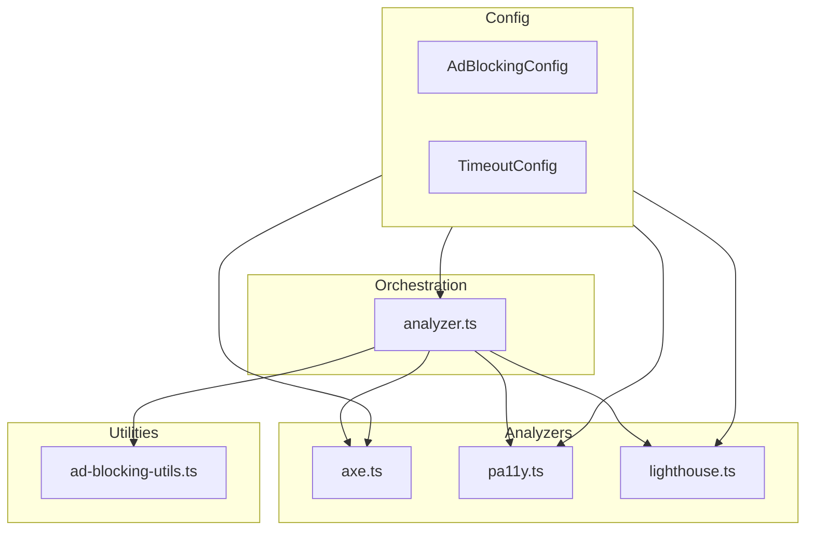
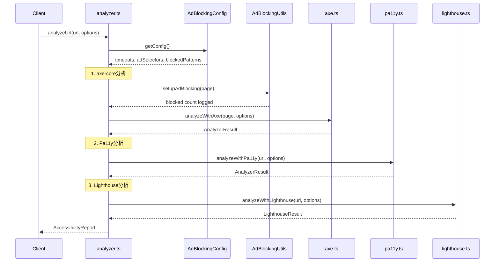

# Technical Design Document

## Overview

**Purpose**: 広告要素が多いWebサイトでのアクセシビリティテスト実行時に発生するタイムアウト問題を解決し、安定したテスト実行を実現する。

**Users**: 開発者・QAエンジニアがCI/CDパイプラインや手動テストで広告サイトを含む幅広いWebサイトのアクセシビリティ検証を行う。

**Impact**: 既存のaxe-core、Pa11y、Lighthouseアナライザーに設定拡張を追加し、タイムアウト耐性と広告除外機能を強化する。

### Goals

- 広告が多いサイトでも安定してアクセシビリティテストを完了する
- 3つのツール（axe-core、Pa11y、Lighthouse）全てでタイムアウト対策を実装する
- 共通設定を一元管理し、保守性を向上させる
- 環境変数による柔軟なカスタマイズを可能にする

### Non-Goals

- 広告ブロック機能自体の提供（あくまでテスト安定化が目的）
- 新しいアクセシビリティツールの追加
- フロントエンドUIの変更

## Architecture

### Existing Architecture Analysis

現在のアーキテクチャ:

- `server/analyzer.ts`: オーケストレーションレイヤー（3ツールの順次実行）
- `server/analyzers/axe.ts`: axe-core分析（Playwright使用）
- `server/analyzers/pa11y.ts`: Pa11y分析（Puppeteer使用）
- `server/analyzers/lighthouse.ts`: Lighthouse分析（chrome-launcher使用）
- `server/analyzers/types.ts`: 共通型定義

制約:

- axe-coreはPlaywrightのページを使用
- Pa11yとLighthouseは独自のブラウザインスタンスを起動
- 認証オプションパターンが既に存在

### Architecture Pattern & Boundary Map



**Architecture Integration**:

- Selected pattern: 設定モジュール + ユーティリティ関数パターン
- Domain/feature boundaries: 設定は`config/`、ユーティリティは`utils/`に分離
- Existing patterns preserved: 認証オプションパターンを踏襲
- New components rationale: 共通設定の一元管理と再利用性向上
- Steering compliance: TypeScript型安全性、関心の分離を維持

### Technology Stack

| Layer | Choice / Version | Role in Feature | Notes |
|-------|------------------|-----------------|-------|
| Backend | TypeScript / Node.js 18+ | 設定モジュール・ユーティリティ実装 | 既存スタック |
| Testing | Playwright 1.x | リソースブロック・タイムアウト制御 | `page.route()`, `setDefaultTimeout()` |
| Testing | @axe-core/playwright 4.11.0 | 広告除外・legacyMode設定 | `.exclude()`, `.setLegacyMode()` |
| Testing | Pa11y 9.0.1 | タイムアウト・要素非表示設定 | `timeout`, `hideElements` |
| Testing | Lighthouse 12.0.0 | タイムアウト・URLブロック設定 | `maxWaitForLoad`, `blockedUrlPatterns` |

## System Flows

### 広告ブロック付きアクセシビリティ分析フロー



**Key Decisions**:

- 広告ブロックはaxe-core用のPlaywrightページにのみ適用（Pa11y/Lighthouseは独自設定を使用）
- 各ツールのタイムアウトは独立して設定可能

## Requirements Traceability

| Requirement | Summary | Components | Interfaces | Flows |
|-------------|---------|------------|------------|-------|
| 1.1-1.5 | axe-core最適化 | AxeAnalyzer, AdBlockingConfig | AxeAnalyzerOptions | 広告ブロック付き分析 |
| 2.1-2.4 | Pa11y最適化 | Pa11yAnalyzer, AdBlockingConfig | Pa11yAnalyzerOptions | 広告ブロック付き分析 |
| 3.1-3.4 | Lighthouse最適化 | LighthouseAnalyzer, AdBlockingConfig | LighthouseAnalyzerOptions | 広告ブロック付き分析 |
| 4.1-4.4 | 共通設定 | AdBlockingConfig, TimeoutConfig | ConfigInterfaces | 全フロー |
| 5.1-5.4 | Playwrightリソースブロック | AdBlockingUtils | setupAdBlocking | axe-core分析 |
| 6.1-6.4 | CLIテスト設定 | playwright.config.ts, accessibility.spec.ts | - | CLIテスト |
| 7.1-7.4 | エラーハンドリング | 全アナライザー | AnalyzerError | 全フロー |

## Components and Interfaces

| Component | Domain/Layer | Intent | Req Coverage | Key Dependencies | Contracts |
|-----------|--------------|--------|--------------|------------------|-----------|
| AdBlockingConfig | Config | 広告除外設定の一元管理 | 4.1-4.3 | - | State |
| TimeoutConfig | Config | タイムアウト設定の一元管理 | 4.2, 4.4 | - | State |
| AdBlockingUtils | Utils | Playwrightリソースブロック | 5.1-5.4 | Playwright Page | Service |
| AxeAnalyzer | Analyzers | axe-core分析拡張 | 1.1-1.5 | AdBlockingConfig | Service |
| Pa11yAnalyzer | Analyzers | Pa11y分析拡張 | 2.1-2.4 | AdBlockingConfig | Service |
| LighthouseAnalyzer | Analyzers | Lighthouse分析拡張 | 3.1-3.4 | AdBlockingConfig | Service |

### Config Layer

#### AdBlockingConfig

| Field | Detail |
|-------|--------|
| Intent | 広告除外に関する共通設定を提供 |
| Requirements | 4.1, 4.3 |

**Responsibilities & Constraints**

- 広告関連CSSセレクタリストの管理
- 広告関連URLパターンリストの管理
- 環境変数による無効化制御

**Dependencies**

- External: process.env — 環境変数読み込み (P2)

**Contracts**: State [x]

##### State Management

```typescript
interface AdBlockingConfig {
  /** 広告ブロックが有効かどうか */
  enabled: boolean;

  /** axe-core/Pa11yで除外するCSSセレクタ */
  adSelectors: readonly string[];

  /** Lighthouse/PlaywrightでブロックするURLパターン */
  blockedUrlPatterns: readonly string[];

  /** ブロックするメディアファイル拡張子 */
  blockedMediaExtensions: readonly string[];
}

const DEFAULT_AD_SELECTORS: readonly string[] = [
  'iframe[src*="ads"]',
  'iframe[src*="doubleclick"]',
  'iframe[src*="googlesyndication"]',
  '[class*="ad-"]',
  '[class*="ads-"]',
  '[id*="ad-"]',
  '[id*="ads-"]',
  '.adsbygoogle',
  '[data-ad-slot]',
  '[data-ad-client]',
  '.ad-container',
  '.advertisement',
] as const;

const DEFAULT_BLOCKED_URL_PATTERNS: readonly string[] = [
  '*doubleclick.net/*',
  '*googlesyndication.com/*',
  '*adservice.google.*',
  '*googleadservices.com/*',
  '*amazon-adsystem.com/*',
  '*ads.yahoo.com/*',
  '**/*ads*/**',
] as const;
```

- Persistence: 環境変数とデフォルト値の組み合わせ
- Consistency: 起動時に一度読み込み、実行中は不変

#### TimeoutConfig

| Field | Detail |
|-------|--------|
| Intent | タイムアウト設定を一元管理 |
| Requirements | 4.2, 4.4 |

**Contracts**: State [x]

##### State Management

```typescript
interface TimeoutConfig {
  /** ページ読み込みタイムアウト（ms） */
  pageLoadTimeout: number;

  /** axe-core分析タイムアウト（ms） */
  axeTimeout: number;

  /** Pa11yタイムアウト（ms） */
  pa11yTimeout: number;

  /** Pa11y安定化待機時間（ms） */
  pa11yWait: number;

  /** Lighthouse maxWaitForLoad（ms） */
  lighthouseMaxWaitForLoad: number;

  /** Lighthouse maxWaitForFcp（ms） */
  lighthouseMaxWaitForFcp: number;
}

const DEFAULT_TIMEOUTS: TimeoutConfig = {
  pageLoadTimeout: 90000,      // 90秒
  axeTimeout: 120000,          // 120秒
  pa11yTimeout: 90000,         // 90秒
  pa11yWait: 3000,             // 3秒
  lighthouseMaxWaitForLoad: 90000,  // 90秒
  lighthouseMaxWaitForFcp: 60000,   // 60秒
} as const;
```

### Utils Layer

#### AdBlockingUtils

| Field | Detail |
|-------|--------|
| Intent | Playwrightページへの広告ブロック設定を適用 |
| Requirements | 5.1-5.4 |

**Responsibilities & Constraints**

- `page.route()`による広告URLのabort
- ブロックしたリクエスト数のカウントとログ出力
- メディアファイルのブロック（オプション）

**Dependencies**

- Inbound: analyzer.ts — Playwrightページの提供 (P0)
- External: Playwright Page API — リクエストインターセプト (P0)

**Contracts**: Service [x]

##### Service Interface

```typescript
interface AdBlockingResult {
  /** ブロックしたリクエスト数 */
  blockedCount: number;
  /** ブロック対象パターン */
  patterns: readonly string[];
}

interface AdBlockingService {
  /**
   * Playwrightページに広告ブロックを設定
   * @param page - Playwrightページインスタンス
   * @param options - ブロック設定オプション
   * @returns ブロック結果（リクエスト数はページクローズまで累積）
   */
  setupAdBlocking(
    page: Page,
    options?: {
      blockMedia?: boolean;
      customPatterns?: readonly string[];
    }
  ): Promise<AdBlockingResult>;
}
```

- Preconditions: pageがnavigation前の状態であること
- Postconditions: page.route()ハンドラが設定される
- Invariants: ブロックパターンは実行中変更不可

**Implementation Notes**

- Integration: analyzer.tsでページ作成直後に呼び出し
- Validation: URLパターンの形式チェック
- Risks: 過度なブロックによるサイト機能の破損（セレクタリストの調整で対応）

### Analyzers Layer

#### AxeAnalyzer（拡張）

| Field | Detail |
|-------|--------|
| Intent | axe-core分析にタイムアウト・広告除外設定を追加 |
| Requirements | 1.1-1.5 |

**Dependencies**

- Inbound: analyzer.ts — 分析呼び出し (P0)
- External: @axe-core/playwright — AxeBuilder API (P0)

**Contracts**: Service [x]

##### Service Interface

```typescript
interface AxeAnalyzerOptions {
  /** legacyModeを有効にするか（デフォルト: true） */
  legacyMode?: boolean;

  /** 広告要素を除外するか（デフォルト: true） */
  excludeAds?: boolean;

  /** 追加の除外セレクタ */
  additionalExcludes?: readonly string[];

  /** color-contrastルールを無効化するか（デフォルト: false） */
  disableColorContrast?: boolean;
}

function analyzeWithAxe(
  page: Page,
  options?: AxeAnalyzerOptions
): Promise<AnalyzerResult>;
```

**Implementation Notes**

- Integration: AxeBuilderに`.setLegacyMode(true)`と`.exclude()`を適用
- Validation: セレクタの形式チェック
- Risks: legacyModeでiframe内の問題を見逃す可能性（トレードオフとして許容）

#### Pa11yAnalyzer（拡張）

| Field | Detail |
|-------|--------|
| Intent | Pa11y分析にタイムアウト・広告非表示設定を追加 |
| Requirements | 2.1-2.4 |

**Contracts**: Service [x]

##### Service Interface

```typescript
interface Pa11yAnalyzerOptions extends Pa11yAuthOptions {
  /** タイムアウト（ms、デフォルト: 90000） */
  timeout?: number;

  /** 安定化待機時間（ms、デフォルト: 3000） */
  wait?: number;

  /** 広告要素を非表示にするか（デフォルト: true） */
  hideAds?: boolean;

  /** 追加の非表示セレクタ */
  additionalHideElements?: readonly string[];
}

function analyzeWithPa11y(
  url: string,
  options?: Pa11yAnalyzerOptions
): Promise<AnalyzerResult>;
```

**Implementation Notes**

- Integration: Pa11yオプションに`hideElements`を追加
- Validation: CSSセレクタの形式チェック

#### LighthouseAnalyzer（拡張）

| Field | Detail |
|-------|--------|
| Intent | Lighthouse分析にタイムアウト・広告ブロック設定を追加 |
| Requirements | 3.1-3.4 |

**Contracts**: Service [x]

##### Service Interface

```typescript
interface LighthouseAnalyzerOptions extends LighthouseAuthOptions {
  /** maxWaitForLoad（ms、デフォルト: 90000） */
  maxWaitForLoad?: number;

  /** maxWaitForFcp（ms、デフォルト: 60000） */
  maxWaitForFcp?: number;

  /** 広告をブロックするか（デフォルト: true） */
  blockAds?: boolean;

  /** 追加のブロックURLパターン */
  additionalBlockedPatterns?: readonly string[];
}

function analyzeWithLighthouse(
  url: string,
  options?: LighthouseAnalyzerOptions
): Promise<LighthouseResult>;
```

**Implementation Notes**

- Integration: Lighthouseオプションに`maxWaitForLoad`と`blockedUrlPatterns`を追加
- Validation: URLパターンの形式チェック

## Data Models

### Domain Model

本機能は設定とオプションのみを扱い、新しいデータエンティティは追加しない。

**Value Objects**:

- `AdBlockingConfig`: 広告ブロック設定（不変）
- `TimeoutConfig`: タイムアウト設定（不変）
- `AxeAnalyzerOptions`: axe-core分析オプション
- `Pa11yAnalyzerOptions`: Pa11y分析オプション
- `LighthouseAnalyzerOptions`: Lighthouse分析オプション

**Business Rules**:

- 環境変数`DISABLE_AD_BLOCKING=true`で広告ブロックを無効化
- タイムアウト値は環境変数で上書き可能
- デフォルト値は常に安全側（広告ブロック有効、適切なタイムアウト）

## Error Handling

### Error Strategy

タイムアウト発生時に詳細な診断情報を提供する。

### Error Categories and Responses

**System Errors (5xx)**:

- ページ読み込みタイムアウト → 「ページの読み込みがタイムアウトしました（90秒）」
- axe-core分析タイムアウト → 「axe-core分析がタイムアウトしました（120秒）」
- Pa11y分析タイムアウト → 「Pa11y分析がタイムアウトしました（90秒）」
- Lighthouse分析タイムアウト → 「Lighthouse分析がタイムアウトしました（90秒）」

### Monitoring

```typescript
interface AnalyzerTiming {
  tool: 'axe-core' | 'pa11y' | 'lighthouse';
  startTime: string;
  endTime: string;
  duration: number;
  status: 'success' | 'timeout' | 'error';
  url: string;
}
```

- 各ツールの分析時間をログに記録
- 60秒超過時に警告ログを出力
- エラー時は構造化ログを出力

## Testing Strategy

### Unit Tests

- `AdBlockingConfig`のデフォルト値と環境変数上書き
- `TimeoutConfig`のデフォルト値と環境変数上書き
- `setupAdBlocking`のパターンマッチングロジック
- 各アナライザーオプションのマージロジック

### Integration Tests

- 広告ブロック有効時のaxe-core分析完了
- `hideElements`設定時のPa11y分析完了
- `blockedUrlPatterns`設定時のLighthouse分析完了
- タイムアウト発生時のエラーメッセージ検証

### E2E Tests

- 広告が多いサイト（例: game8.jp）での分析完了
- CLI テスト（playwright.config.ts設定適用）

### Performance

- 広告ブロックによる分析時間短縮の検証
- タイムアウト値の適切性検証

## Optional Sections

### Security Considerations

- 広告ブロックパターンは固定リストを使用（外部入力なし）
- 環境変数の値は型チェック・バリデーション済み

### Performance & Scalability

- 広告ブロックにより分析時間の短縮を期待
- タイムアウト延長によりCI/CDパイプラインへの影響は限定的（最大180秒）
