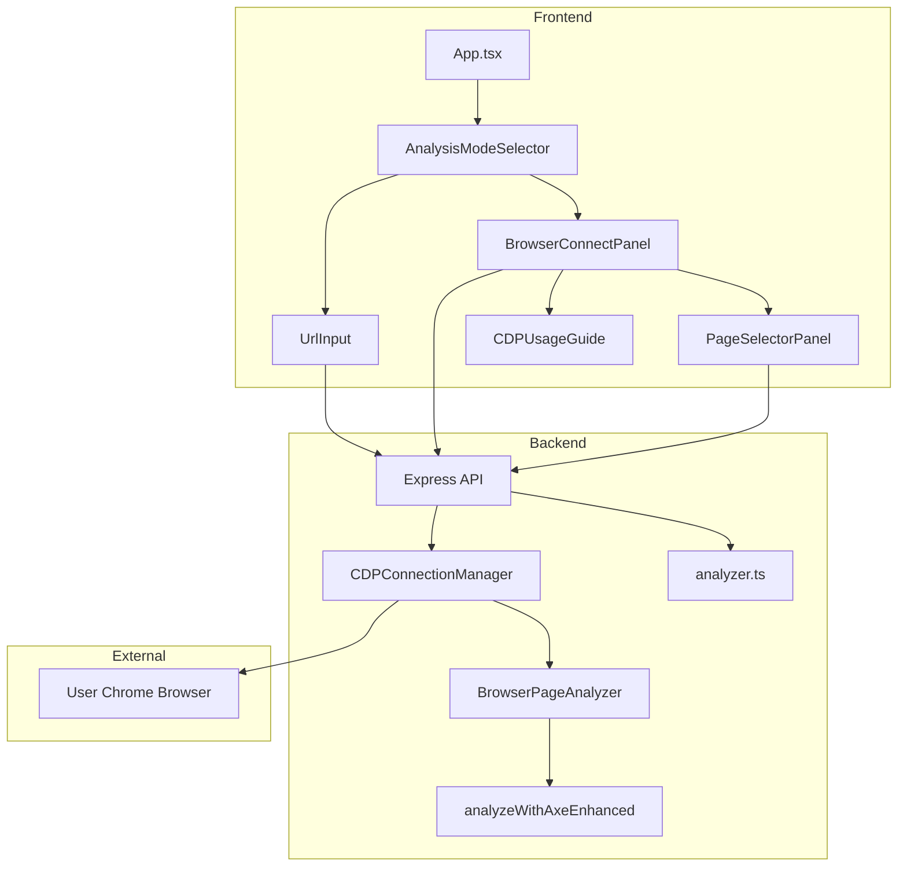
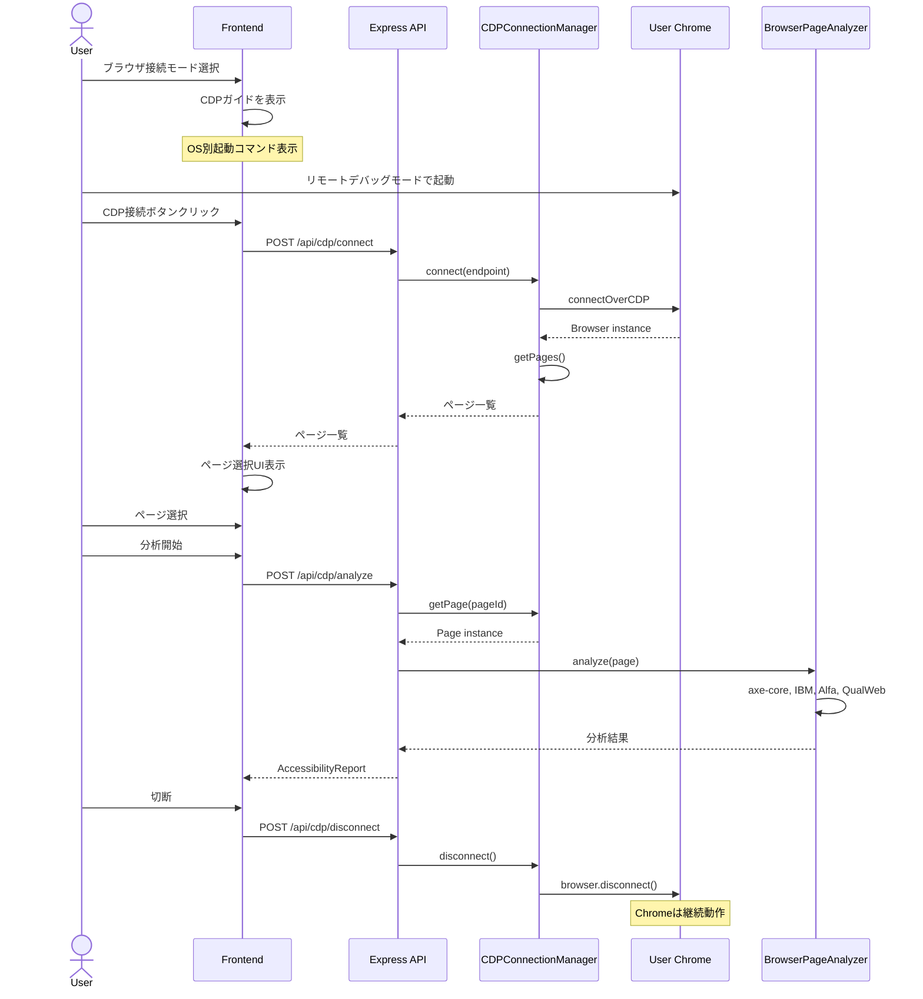
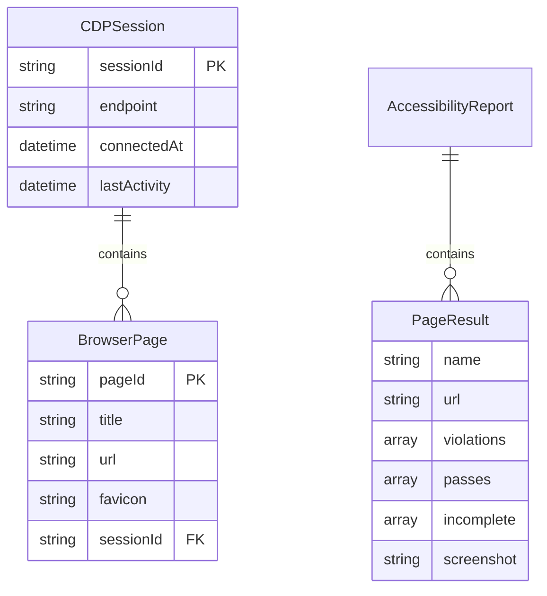

# Design Document: Browser Page Analysis

## Overview

**Purpose**: ユーザーが既に開いているブラウザページに対してアクセシビリティ分析を実行できる機能を提供する。これにより、URLを直接入力できない以下のケースに対応する：

- SPAで動的に生成されるページ
- 複雑な認証（MFA、OAuth、SAML等）が必要なページ
- 特定の操作後にのみ到達可能な状態

**Users**: 開発者、QAエンジニア、アクセシビリティ監査担当者

**Impact**: 既存のURL入力分析機能に加えて、ブラウザ接続分析モードを追加。UIにモード切り替え機能を実装し、バックエンドにCDP接続APIを追加する。

### Goals

- CDPを使用して既存Chromeブラウザへの接続を確立
- 接続中のブラウザから分析対象ページを選択可能にする
- 選択したページに対してマルチエンジン分析を実行
- OS別のリモートデバッグモード起動ガイドを提供
- 操作が複雑なため、使い方をUIに表示する

### Non-Goals

- Firefox、Safari、WebKitへの対応（CDPはChromium系のみ）
- ブラウザ拡張機能としての実装
- リモートホスト（localhost以外）へのCDP接続の推奨
- Pa11y、Lighthouseエンジンのブラウザ接続モード対応（技術的制約）

## Architecture

### Existing Architecture Analysis

現在のシステムは以下の構成：

- **フロントエンド**: React + MUI、`App.tsx`がメインエントリ、`UrlInput`コンポーネントでURL入力
- **バックエンド**: Express + Playwright、`analyzer.ts`がオーケストレーション
- **分析フロー**: `chromium.launch()` → `page.goto(targetUrl)` → `analyzeWithAxeEnhanced(page)`

**統合ポイント**:
- `analyzer.ts`の`analyzeUrlWithOptions`関数は`Page`オブジェクトを内部で生成
- `analyzeWithAxeEnhanced(page)`は外部から`Page`オブジェクトを受け取る設計
- 新機能はCDP接続で取得した`Page`オブジェクトを既存関数に渡す

### Architecture Pattern & Boundary Map



**Architecture Integration**:
- **Selected pattern**: モジュラーアーキテクチャ（既存構造を維持しつつ新モジュールを追加）
- **Domain boundaries**: CDP接続管理をCDPConnectionManagerに集約、分析ロジックは既存関数を再利用
- **Existing patterns preserved**: フロントエンド/バックエンド分離、Playwright統合
- **New components rationale**: CDPConnectorはCDP固有の接続管理を担当、BrowserPageAnalyzerはCDP接続ページの分析を担当
- **Steering compliance**: TypeScript型安全性、分離構成を維持

### Technology Stack

| Layer | Choice / Version | Role in Feature | Notes |
|-------|------------------|-----------------|-------|
| Frontend | React 19 + MUI | モード切り替えUI、ページ選択UI、CDPガイド表示 | 既存スタック |
| Backend | Express 5 + Node.js | CDP接続API、分析API | 既存スタック |
| Browser Automation | Playwright (connectOverCDP) | CDP経由でChromeに接続 | 既存Playwright依存を活用 |
| Accessibility Engine | axe-core, IBM, Alfa, QualWeb | ページ分析 | Pa11y/Lighthouseは使用不可 |

## System Flows

### CDP接続と分析フロー



**Key Decisions**:
- `browser.disconnect()`を使用（`close()`ではなく）してユーザーのブラウザを継続動作させる
- ページ選択後に分析を実行する2段階フロー
- CDPガイドはモード選択時に常に表示

## Requirements Traceability

| Requirement | Summary | Components | Interfaces | Flows |
|-------------|---------|------------|------------|-------|
| 1.1 | CDP接続確立 | CDPConnectionManager | connectToBrowser() | CDP接続フロー |
| 1.2 | タブ一覧取得 | CDPConnectionManager | getOpenPages() | CDP接続フロー |
| 1.3 | 接続エラー表示 | CDPConnectionManager, Frontend | CDPConnectionError | エラーハンドリング |
| 1.4 | 接続タイムアウト | CDPConnectionManager | timeout設定 | CDP接続フロー |
| 1.5 | 切断処理 | CDPConnectionManager | disconnect() | CDP接続フロー |
| 2.1 | タブ一覧表示 | PageSelectorPanel | PageInfo[] | ページ選択フロー |
| 2.2 | ページ選択 | PageSelectorPanel | selectPage() | ページ選択フロー |
| 2.3 | ファビコン表示 | PageSelectorPanel | PageInfo.favicon | ページ選択フロー |
| 2.4 | 一覧更新 | PageSelectorPanel | refreshPages() | ページ選択フロー |
| 2.5 | ページなしエラー | PageSelectorPanel | 空配列ハンドリング | エラーハンドリング |
| 3.1 | マルチエンジン分析 | BrowserPageAnalyzer | analyzeConnectedPage() | 分析フロー |
| 3.2 | 進捗表示 | AnalysisProgress | ProgressCallback | 分析フロー |
| 3.3 | レポート生成 | BrowserPageAnalyzer | AccessibilityReport | 分析フロー |
| 3.4 | スクリーンショット | BrowserPageAnalyzer | page.screenshot() | 分析フロー |
| 3.5 | ページ変更検出 | BrowserPageAnalyzer | page.on('framenavigated') | エラーハンドリング |
| 3.6 | WCAGレベル指定 | BrowserPageAnalyzer | AnalysisOptions | 分析フロー |
| 4.1 | OS別起動コマンド | CDPUsageGuide | 静的コンテンツ | ガイド表示 |
| 4.2 | ポート番号表示 | CDPUsageGuide | 静的コンテンツ | ガイド表示 |
| 4.3 | ガイド表示タイミング | CDPUsageGuide | モード選択時 | ガイド表示 |
| 4.4 | セキュリティ注意事項 | CDPUsageGuide | 静的コンテンツ | ガイド表示 |
| 5.1 | モード選択UI | AnalysisModeSelector | AnalysisMode型 | モード切り替え |
| 5.2 | ブラウザ接続フォーム | BrowserConnectPanel | CDPEndpoint | モード切り替え |
| 5.3 | URL入力フォーム | UrlInput | 既存 | モード切り替え |
| 5.4 | デフォルトモード | AnalysisModeSelector | 初期値 | モード切り替え |
| 5.5 | 結果クリア確認 | AnalysisModeSelector | Dialog | モード切り替え |
| 6.1-6.5 | エラーガイダンス | ErrorHandler | CDPErrorType | エラーハンドリング |
| 7.1-7.5 | セキュリティ制限 | CDPConnectionManager | validation | セキュリティ |

## Components and Interfaces

| Component | Domain/Layer | Intent | Req Coverage | Key Dependencies | Contracts |
|-----------|--------------|--------|--------------|------------------|-----------|
| CDPConnectionManager | Backend/Service | CDP接続の確立・管理 | 1.1-1.5, 7.1-7.5 | Playwright (P0) | Service |
| BrowserPageAnalyzer | Backend/Service | CDP接続ページの分析実行 | 3.1-3.6 | CDPConnectionManager (P0), axe-core (P0) | Service |
| AnalysisModeSelector | Frontend/Component | 分析モード切り替えUI | 5.1, 5.4, 5.5 | None | State |
| BrowserConnectPanel | Frontend/Component | CDP接続設定UI | 5.2, 4.3 | CDPUsageGuide (P1) | State |
| PageSelectorPanel | Frontend/Component | ページ選択UI | 2.1-2.5 | None | State |
| CDPUsageGuide | Frontend/Component | CDP使い方ガイド表示 | 4.1-4.4 | None | - |

### Backend / Service

#### CDPConnectionManager

| Field | Detail |
|-------|--------|
| Intent | CDP接続の確立・管理・ページ取得を担当 |
| Requirements | 1.1, 1.2, 1.3, 1.4, 1.5, 7.1, 7.2, 7.3, 7.5 |

**Responsibilities & Constraints**
- ChromeブラウザへのCDP接続の確立と切断
- 接続中のページ一覧の取得と管理
- localhost接続のみをデフォルトで許可
- セッションタイムアウトの実装（30分）

**Dependencies**
- Outbound: Playwright `chromium.connectOverCDP()` — CDP接続 (P0)
- External: User Chrome Browser — 接続先 (P0)

**Contracts**: Service [x] / API [x] / Event [ ] / Batch [ ] / State [x]

##### Service Interface

```typescript
interface PageInfo {
  id: string;
  title: string;
  url: string;
  favicon?: string;
}

interface CDPConnectionResult {
  success: boolean;
  sessionId?: string;
  pages?: PageInfo[];
  error?: CDPConnectionError;
}

interface CDPConnectionError {
  code: 'CONNECTION_REFUSED' | 'TIMEOUT' | 'INVALID_ENDPOINT' | 'REMOTE_HOST_WARNING';
  message: string;
  helpUrl?: string;
}

interface CDPConnectionManager {
  connect(endpoint: string, options?: CDPConnectOptions): Promise<CDPConnectionResult>;
  getPages(sessionId: string): Promise<PageInfo[]>;
  getPage(sessionId: string, pageId: string): Promise<Page | null>;
  disconnect(sessionId: string): Promise<void>;
  isConnected(sessionId: string): boolean;
}

interface CDPConnectOptions {
  timeout?: number;  // default: 10000ms
  allowRemoteHost?: boolean;  // default: false
}
```

- Preconditions: endpointはhttp://またはws://形式のURL
- Postconditions: 成功時はsessionIdを返却、失敗時はerrorを含む
- Invariants: 1セッションにつき1ブラウザ接続

##### API Contract

| Method | Endpoint | Request | Response | Errors |
|--------|----------|---------|----------|--------|
| POST | /api/cdp/connect | `{ endpoint: string }` | `CDPConnectionResult` | 400, 408, 502 |
| GET | /api/cdp/pages | `sessionId` (query) | `PageInfo[]` | 400, 404 |
| POST | /api/cdp/disconnect | `{ sessionId: string }` | `{ success: boolean }` | 400, 404 |

##### State Management

- State model: `Map<sessionId, { browser: Browser, connectedAt: Date, lastActivity: Date }>`
- Persistence: メモリ内（サーバー再起動で消失）
- Concurrency: セッション単位でロック

**Implementation Notes**
- Integration: Playwright `chromium.connectOverCDP()`を使用、`browser.disconnect()`で切断（closeではない）
- Validation: endpointのURL形式検証、localhostチェック
- Risks: ブラウザがクラッシュした場合の接続切断検出

---

#### BrowserPageAnalyzer

| Field | Detail |
|-------|--------|
| Intent | CDP接続ページに対してアクセシビリティ分析を実行 |
| Requirements | 3.1, 3.2, 3.3, 3.4, 3.5, 3.6, 7.4 |

**Responsibilities & Constraints**
- CDP接続で取得したPageオブジェクトに対して分析を実行
- 使用可能エンジン: axe-core, IBM, Alfa, QualWeb（Pa11y, Lighthouseは不可）
- ページナビゲーション検出時の分析中断
- 既存のAccessibilityReport形式でレポートを生成

**Dependencies**
- Inbound: CDPConnectionManager — Pageオブジェクト取得 (P0)
- Outbound: analyzeWithAxeEnhanced — axe-core分析 (P0)
- Outbound: analyzeWithIBM, analyzeWithAlfa, analyzeWithQualWeb — 追加エンジン (P1)
- External: axe-core — アクセシビリティエンジン (P0)

**Contracts**: Service [x] / API [x] / Event [ ] / Batch [ ] / State [ ]

##### Service Interface

```typescript
interface BrowserAnalysisOptions {
  engines: {
    axeCore: boolean;
    ibm: boolean;
    alfa: boolean;
    qualweb: boolean;
  };
  wcagLevel?: 'A' | 'AA' | 'AAA';
}

interface BrowserPageAnalyzer {
  analyzeConnectedPage(
    page: Page,
    options: BrowserAnalysisOptions,
    onProgress?: ProgressCallback
  ): Promise<AccessibilityReport>;
}
```

- Preconditions: pageは有効なPlaywright Pageオブジェクト、ページがロード済み
- Postconditions: AccessibilityReportを返却
- Invariants: 分析中にページがナビゲーションした場合はエラーをスロー

##### API Contract

| Method | Endpoint | Request | Response | Errors |
|--------|----------|---------|----------|--------|
| POST | /api/cdp/analyze | `{ sessionId, pageId, options }` | `AccessibilityReport` | 400, 404, 409, 500 |
| GET | /api/cdp/analyze/stream | `sessionId, pageId` (query) | SSE stream | 400, 404 |

**Implementation Notes**
- Integration: `page.on('framenavigated')`でナビゲーションを監視
- Validation: pageIdがセッション内に存在するか確認
- Risks: 長時間の分析中にCDP接続が切断される可能性

---

### Frontend / Component

#### AnalysisModeSelector

| Field | Detail |
|-------|--------|
| Intent | URL入力モードとブラウザ接続モードの切り替えUIを提供 |
| Requirements | 5.1, 5.4, 5.5 |

**Responsibilities & Constraints**
- 2つの分析モード（URL入力、ブラウザ接続）の切り替え
- デフォルトはURL入力モード
- モード切り替え時に既存結果のクリア確認

**Dependencies**
- Outbound: UrlInput — URL入力モード表示 (P1)
- Outbound: BrowserConnectPanel — ブラウザ接続モード表示 (P1)

**Contracts**: Service [ ] / API [ ] / Event [ ] / Batch [ ] / State [x]

##### State Management

```typescript
type AnalysisMode = 'url-input' | 'browser-connect';

interface AnalysisModeSelectorState {
  mode: AnalysisMode;
  showClearConfirmDialog: boolean;
}
```

**Implementation Notes**
- Integration: MUI Tabs または ToggleButtonGroup を使用
- Validation: モード切り替え時に未保存の結果がある場合は確認ダイアログ

---

#### BrowserConnectPanel

| Field | Detail |
|-------|--------|
| Intent | CDP接続設定フォームとガイド表示を担当 |
| Requirements | 5.2, 4.3 |

**Responsibilities & Constraints**
- CDPエンドポイントURL入力フィールド
- 接続ボタン
- CDPUsageGuideの表示

**Dependencies**
- Outbound: CDPUsageGuide — ガイド表示 (P1)
- Outbound: PageSelectorPanel — 接続成功後の表示 (P1)
- External: Backend /api/cdp/connect — CDP接続API (P0)

**Contracts**: Service [ ] / API [ ] / Event [ ] / Batch [ ] / State [x]

##### State Management

```typescript
interface BrowserConnectPanelState {
  endpoint: string;
  isConnecting: boolean;
  isConnected: boolean;
  sessionId: string | null;
  pages: PageInfo[];
  error: string | null;
}
```

**Implementation Notes**
- Integration: デフォルト値 `http://localhost:9222`
- Validation: URL形式、localhost推奨警告

---

#### PageSelectorPanel

| Field | Detail |
|-------|--------|
| Intent | 接続中ブラウザのページ一覧表示と選択UIを提供 |
| Requirements | 2.1, 2.2, 2.3, 2.4, 2.5 |

**Responsibilities & Constraints**
- ページ一覧のリスト表示（タイトル、URL、ファビコン）
- ページ選択機能
- 一覧更新機能
- ページなし時のメッセージ表示

**Dependencies**
- Inbound: BrowserConnectPanel — ページ一覧データ (P0)

**Contracts**: Service [ ] / API [ ] / Event [ ] / Batch [ ] / State [x]

##### State Management

```typescript
interface PageSelectorPanelProps {
  pages: PageInfo[];
  selectedPageId: string | null;
  onSelectPage: (pageId: string) => void;
  onRefresh: () => void;
  loading: boolean;
}
```

**Implementation Notes**
- Integration: MUI List または Card コンポーネント
- Validation: chrome://, chrome-extension:// ページは除外して表示

---

#### CDPUsageGuide

| Field | Detail |
|-------|--------|
| Intent | Chromeのリモートデバッグモード起動方法をOS別に表示 |
| Requirements | 4.1, 4.2, 4.3, 4.4 |

**Responsibilities & Constraints**
- OS別（Windows、macOS、Linux）の起動コマンド表示
- コピーボタンの提供
- セキュリティ注意事項の表示

**Contracts**: Service [ ] / API [ ] / Event [ ] / Batch [ ] / State [ ]

**Implementation Notes**
- Integration: MUI Accordion または Tabs でOS別表示
- OS自動検出でデフォルト表示を切り替え

## Data Models

### Domain Model



### Logical Data Model

**CDPSession**
- サーバー側でメモリ内管理
- セッションタイムアウト: 30分の非アクティブで自動削除
- 1ユーザーにつき1セッションのみ許可

**PageInfo**
- CDPから取得したページ情報の軽量表現
- フロントエンドでの表示用

## Error Handling

### Error Strategy

CDP接続固有のエラーを分類し、ユーザーが自己解決できるガイダンスを提供する。

### Error Categories and Responses

**User Errors (4xx)**
- `CONNECTION_REFUSED` (400): エンドポイントに到達不可 → リモートデバッグモード起動手順を表示
- `INVALID_ENDPOINT` (400): 無効なURL形式 → 正しい形式（http://localhost:9222）を提示
- `PAGE_NOT_FOUND` (404): 指定ページが存在しない → ページ一覧の更新を促す

**System Errors (5xx)**
- `TIMEOUT` (408): 接続タイムアウト → 再試行または別ポートの使用を提案
- `CDP_DISCONNECTED` (502): 分析中に接続切断 → 再接続オプションを表示
- `BROWSER_CRASHED` (500): ブラウザプロセス終了 → ブラウザ再起動を促す

**Business Logic Errors (409)**
- `PAGE_NAVIGATED`: 分析中にページがナビゲーション → ページ再選択を促す
- `SESSION_EXPIRED`: セッションタイムアウト → 再接続を促す

### Monitoring

- CDP接続の成功/失敗率をログ出力
- 分析完了時間の計測
- エラー発生時のスタックトレース記録

## Testing Strategy

### Unit Tests
- CDPConnectionManager.connect(): 正常接続、タイムアウト、接続拒否
- CDPConnectionManager.getPages(): ページ一覧取得、空配列
- BrowserPageAnalyzer.analyzeConnectedPage(): 分析実行、ナビゲーション検出
- URL形式バリデーション

### Integration Tests
- CDP接続 → ページ一覧取得 → ページ選択 → 分析実行の一連フロー
- SSEによる進捗通知
- セッションタイムアウト

### E2E Tests
- モード切り替えUI操作
- CDP接続エラー時のエラーメッセージ表示
- 分析結果表示（既存レポートUIの再利用確認）

## Security Considerations

- **localhost制限**: デフォルトでlocalhost（127.0.0.1）へのCDP接続のみ許可
- **リモートホスト警告**: リモートホストへの接続試行時は明示的な警告と確認を表示
- **スクリプト注入**: 分析用スクリプト（axe-core）は分析完了後にページから削除
- **セッション管理**: 30分の非アクティブタイムアウトで自動切断
- **認証情報非アクセス**: CDP接続時にブラウザのCookie/認証情報を読み取らない

## Optional Sections

### Performance & Scalability

- **接続時間目標**: CDP接続確立は10秒以内
- **ページ一覧取得**: 100タブ以上でも1秒以内
- **分析時間**: 既存URL分析と同等（ページ複雑度に依存）
- **同時接続**: サーバーあたり最大10セッション

## Supporting References

### OS別Chrome起動コマンド

**Windows**
```batch
"C:\Program Files\Google\Chrome\Application\chrome.exe" ^
  --remote-debugging-port=9222 ^
  --user-data-dir="%TEMP%\chrome-cdp-profile"
```

**macOS**
```bash
/Applications/Google\ Chrome.app/Contents/MacOS/Google\ Chrome \
  --remote-debugging-port=9222 \
  --user-data-dir=/tmp/chrome-cdp-profile
```

**Linux**
```bash
google-chrome \
  --remote-debugging-port=9222 \
  --user-data-dir=/tmp/chrome-cdp-profile
```

### エンジン制限

| エンジン | ブラウザ接続モード対応 | 理由 |
|---------|----------------------|------|
| axe-core | 対応 | Playwright Pageオブジェクトを使用 |
| IBM | 対応 | Playwright Pageオブジェクトを使用 |
| Alfa | 対応 | Playwright Pageオブジェクトを使用 |
| QualWeb | 対応 | HTML文字列を使用 |
| Pa11y | 非対応 | 内部でpuppeteerを起動 |
| Lighthouse | 非対応 | 独自ブラウザプロセスを使用 |
| WAVE | 非対応 | API経由でURLを送信 |
