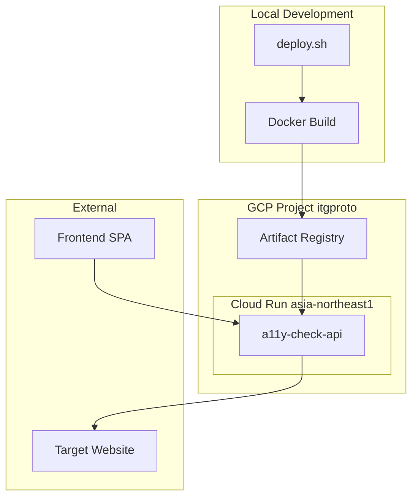
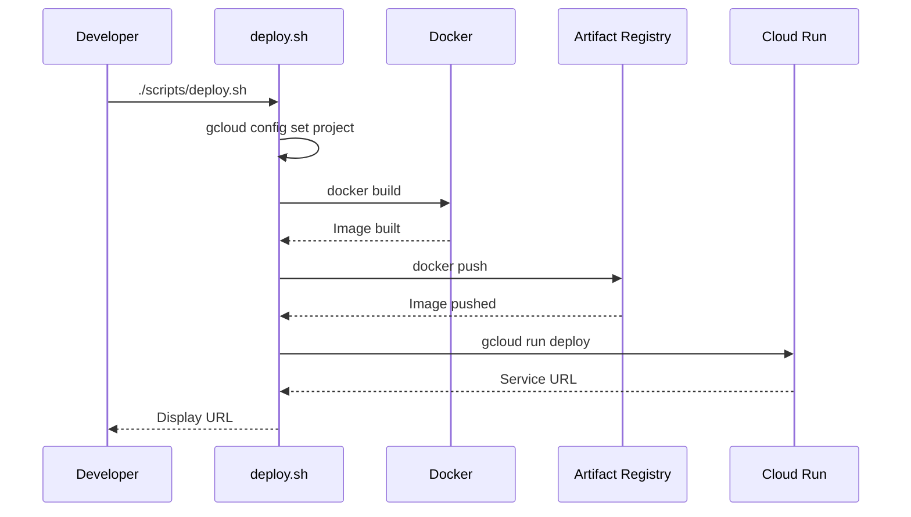

# Technical Design Document: Cloud Run Deployment

## Overview

**Purpose**: バックエンドAPIをGoogle Cloud Runにデプロイし、クラウド上でアクセシビリティ分析サービスを提供する。

**Users**: 開発者がデプロイスクリプトを実行し、エンドユーザーがWeb UI経由でAPIを利用する。

**Impact**: ローカル開発環境からクラウド本番環境への移行。Dockerコンテナ化とCI/CD対応のデプロイ自動化を実現。

### Goals
- バックエンドAPIのDockerコンテナ化
- GCPプロジェクト「itgproto」へのCloud Runデプロイ
- シェルスクリプトによる再現性のあるデプロイ自動化
- 環境変数による本番/開発環境の切り替え

### Non-Goals
- フロントエンドのCloud Runデプロイ（別途対応）
- CI/CDパイプライン（GitHub Actions等）の構築
- カスタムドメインの設定
- VPCコネクタによるプライベートネットワーク接続

## Architecture

### Existing Architecture Analysis

現在のシステムはローカル開発環境で動作する構成：

- **バックエンド**: Express 5 + TypeScript（`server/`ディレクトリ）
- **分析エンジン**: axe-core、Pa11y、Lighthouse（それぞれChromiumを使用）
- **フロントエンド**: React 19 + Vite（`frontend/`ディレクトリ）

既存の対応状況：
- `PORT`環境変数: 対応済み（`server/index.ts:6`）
- ヘルスチェック: `/api/health`実装済み（`server/index.ts:52-54`）
- CORS: 全オリジン許可状態（要変更）

### Architecture Pattern & Boundary Map



**Architecture Integration**:
- **Selected Pattern**: コンテナ化されたモノリスサービス
- **Domain Boundaries**: バックエンドAPIのみをCloud Run化、フロントエンドは別途対応
- **Existing Patterns Preserved**: Express APIエンドポイント、分析オーケストレーション
- **New Components**: Dockerfile、.dockerignore、deploy.sh
- **Steering Compliance**: TypeScript使用、ESLint準拠を維持

### Technology Stack

| Layer | Choice / Version | Role in Feature | Notes |
|-------|------------------|-----------------|-------|
| Base Image | mcr.microsoft.com/playwright:v1.57.0-noble | Chromium + 依存関係プリインストール | Ubuntu 24.04 LTS |
| Runtime | Node.js 20 LTS | サーバー実行環境 | Playwrightイメージに含まれる |
| Container Registry | Artifact Registry (asia-northeast1) | Dockerイメージ保存 | GCP推奨 |
| Compute | Cloud Run (asia-northeast1) | サーバーレスコンテナ実行 | メモリ2GB、タイムアウト300秒 |
| Deploy Tool | gcloud CLI | デプロイ自動化 | deploy.sh経由 |

## System Flows

### デプロイフロー



## Requirements Traceability

| Requirement | Summary | Components | Interfaces | Flows |
|-------------|---------|------------|------------|-------|
| 1.1-1.5 | Dockerコンテナ化 | Dockerfile, .dockerignore | - | Deploy |
| 2.1-2.6 | Cloud Run設定 | deploy.sh | gcloud CLI | Deploy |
| 3.1-3.7 | デプロイスクリプト | deploy.sh | Shell | Deploy |
| 4.1-4.4 | 環境変数管理 | server/index.ts, deploy.sh | ENV | - |
| 5.1-5.3 | ヘルスチェック | server/index.ts (既存) | HTTP GET | - |
| 6.1-6.3 | CORS設定 | server/index.ts | ENV | - |

## Components and Interfaces

| Component | Domain/Layer | Intent | Req Coverage | Key Dependencies | Contracts |
|-----------|--------------|--------|--------------|------------------|-----------|
| Dockerfile | Infrastructure | コンテナイメージ定義 | 1.1-1.5 | playwright image (P0) | - |
| .dockerignore | Infrastructure | ビルド除外ファイル定義 | 1.4 | - | - |
| deploy.sh | Infrastructure | デプロイ自動化 | 2.1-2.6, 3.1-3.7 | gcloud CLI (P0) | Shell |
| server/analyzers/lighthouse.ts (変更) | Backend | Chromiumパス動的取得 | 1.3 | playwright (P0) | - |
| server/index.ts (変更) | Backend | CORS環境変数対応 | 4.1-4.3, 6.1-6.3 | cors (P0) | ENV |

### Infrastructure

#### Dockerfile

| Field | Detail |
|-------|--------|
| Intent | バックエンドサーバーのコンテナ化 |
| Requirements | 1.1, 1.2, 1.3, 1.4, 1.5 |

**Responsibilities & Constraints**
- Playwright公式イメージをベースに使用
- Node.js依存関係のインストール
- ポート8080でのリッスン設定
- TypeScriptのランタイム実行（tsx使用）

**Dependencies**
- External: mcr.microsoft.com/playwright:v1.57.0-noble — ベースイメージ (P0)
- External: npm — 依存関係インストール (P0)

**Contracts**: Service [ ] / API [ ] / Event [ ] / Batch [ ] / State [ ]

**Implementation Notes**
- `WORKDIR /app` でアプリケーションディレクトリを設定
- `COPY package*.json` 後に `npm ci --only=production` でプロダクション依存のみインストール
- `EXPOSE 8080` でCloud Run標準ポートを公開
- Chromiumパスはコード側で`chromium.executablePath()`から動的に取得

##### Dockerfile Structure

```dockerfile
FROM mcr.microsoft.com/playwright:v1.57.0-noble

WORKDIR /app

# 依存関係インストール
COPY package*.json ./
RUN npm ci

# ソースコードコピー
COPY server/ ./server/
COPY tsconfig.json ./

# 環境変数設定
ENV PORT=8080
ENV NODE_ENV=production
# Note: CHROME_PATHはコード側でPlaywright APIから動的に取得

# ポート公開
EXPOSE 8080

# サーバー起動
CMD ["npx", "tsx", "server/index.ts"]
```

#### .dockerignore

| Field | Detail |
|-------|--------|
| Intent | ビルドコンテキストから不要ファイルを除外 |
| Requirements | 1.4 |

**Implementation Notes**
- `node_modules/` — コンテナ内で再インストール
- `frontend/` — バックエンドのみコンテナ化
- `tests/` — テストファイルは不要
- `.git/` — Git履歴は不要
- `test-results/` — テスト結果は不要

#### deploy.sh

| Field | Detail |
|-------|--------|
| Intent | デプロイ処理の自動化 |
| Requirements | 2.1, 2.2, 2.3, 2.4, 2.5, 2.6, 3.1, 3.2, 3.3, 3.4, 3.5, 3.6, 3.7 |

**Responsibilities & Constraints**
- GCPプロジェクト設定（itgproto）
- Dockerイメージのビルドとプッシュ
- Cloud Runへのデプロイ
- エラーハンドリングと終了コード管理

**Dependencies**
- External: gcloud CLI — GCP操作 (P0)
- External: docker CLI — イメージビルド (P0)

**Contracts**: Service [ ] / API [ ] / Event [ ] / Batch [ ] / State [ ]

##### Shell Script Structure

```bash
#!/bin/bash
set -e  # エラー時に即終了

# 設定
PROJECT_ID="itgproto"
REGION="asia-northeast1"
SERVICE_NAME="a11y-check-api"
IMAGE_NAME="a11y-check-api"
REGISTRY="${REGION}-docker.pkg.dev/${PROJECT_ID}/cloud-run-source-deploy"

# GCPプロジェクト設定
gcloud config set project ${PROJECT_ID}

# Artifact Registryリポジトリ作成（存在しない場合）
gcloud artifacts repositories create cloud-run-source-deploy \
    --repository-format=docker \
    --location=${REGION} \
    --description="Cloud Run deployment images" || true

# Docker認証設定
gcloud auth configure-docker ${REGION}-docker.pkg.dev --quiet

# イメージビルド
docker build -t ${REGISTRY}/${IMAGE_NAME}:latest .

# イメージプッシュ
docker push ${REGISTRY}/${IMAGE_NAME}:latest

# Cloud Runデプロイ
gcloud run deploy ${SERVICE_NAME} \
    --image ${REGISTRY}/${IMAGE_NAME}:latest \
    --region ${REGION} \
    --platform managed \
    --allow-unauthenticated \
    --memory 2Gi \
    --timeout 300 \
    --min-instances 0 \
    --max-instances 10 \
    --set-env-vars "NODE_ENV=production"

# デプロイ結果表示
echo "Deployment completed!"
gcloud run services describe ${SERVICE_NAME} --region ${REGION} --format='value(status.url)'
```

### Backend

#### server/analyzers/lighthouse.ts (変更)

| Field | Detail |
|-------|--------|
| Intent | Playwright APIを使用してChromiumパスを動的に取得 |
| Requirements | 1.3 |

**Responsibilities & Constraints**
- `chromium.executablePath()` を使用してChromiumパスを取得
- `chromeLauncher.launch()` に `chromePath` オプションを追加
- Playwrightイメージ内蔵のChromiumをLighthouseでも使用

**Dependencies**
- External: playwright — Chromiumパス取得 (P0)
- External: chrome-launcher — Chrome起動 (P0)

**Contracts**: Service [ ] / API [ ] / Event [ ] / Batch [ ] / State [ ]

**Implementation Notes**
```typescript
import { chromium } from 'playwright';

// chrome-launcher起動時にPlaywrightのChromiumを使用
chrome = await chromeLauncher.launch({
  chromePath: chromium.executablePath(),
  chromeFlags: ['--headless', '--no-sandbox', '--disable-gpu'],
});
```

#### server/index.ts (変更)

| Field | Detail |
|-------|--------|
| Intent | CORS設定を環境変数対応に変更 |
| Requirements | 4.1, 4.2, 4.3, 6.1, 6.2, 6.3 |

**Responsibilities & Constraints**
- `ALLOWED_ORIGINS`環境変数でCORS許可オリジンを制御
- 未設定時はデフォルトでlocalhost:5173を許可
- 複数オリジンをカンマ区切りで指定可能

**Dependencies**
- Inbound: Frontend SPA — API呼び出し (P0)
- External: cors package — CORS処理 (P0)

**Contracts**: API [x] / State [ ]

##### API Contract

| Method | Endpoint | Request | Response | Errors |
|--------|----------|---------|----------|--------|
| GET | /api/health | - | `{ status: 'ok' }` | 500 |
| POST | /api/analyze | `{ url: string, auth?: AuthConfig }` | `{ status: 'completed', report: AccessibilityReport }` | 400, 500 |

##### Environment Variables

| Variable | Description | Default | Required |
|----------|-------------|---------|----------|
| PORT | リッスンポート | 3001 | No |
| NODE_ENV | 実行環境 | development | No |
| ALLOWED_ORIGINS | CORS許可オリジン（カンマ区切り） | http://localhost:5173 | No |

##### CORS Configuration Logic

```typescript
interface CorsConfig {
  origin: string | string[] | boolean;
  credentials: boolean;
}

function getCorsConfig(): CorsConfig {
  const allowedOrigins = process.env.ALLOWED_ORIGINS;

  if (!allowedOrigins) {
    // 開発環境デフォルト
    return {
      origin: ['http://localhost:5173'],
      credentials: true,
    };
  }

  // カンマ区切りでパース
  const origins = allowedOrigins.split(',').map(o => o.trim());
  return {
    origin: origins,
    credentials: true,
  };
}
```

## Error Handling

### Error Strategy

デプロイスクリプトは`set -e`で即時終了し、エラー箇所を明確化。

### Error Categories and Responses

**Deploy Script Errors**:
- gcloud認証エラー → `gcloud auth login`を案内
- Docker build失敗 → ビルドログを表示
- イメージプッシュ失敗 → Artifact Registry権限を確認
- Cloud Runデプロイ失敗 → サービスアカウント権限を確認

**Runtime Errors** (既存):
- 4xx: URL未指定、無効なURL形式
- 5xx: 分析処理エラー、タイムアウト

### Monitoring

- Cloud Run標準ログ: Cloud Loggingに自動出力
- ヘルスチェック: `/api/health`でスタートアッププローブ

## Testing Strategy

### Unit Tests
- CORS設定ロジック: 環境変数パース、デフォルト値適用
- 環境変数バリデーション

### Integration Tests
- Dockerイメージビルド: `docker build`が成功すること
- コンテナ起動: ポート8080でリッスン開始すること
- ヘルスチェック: `/api/health`が200を返すこと

### E2E Tests
- デプロイスクリプト実行: Cloud Runにデプロイ成功
- API呼び出し: デプロイ後のURLで分析APIが動作

## Security Considerations

- **未認証アクセス**: パブリックAPIとして公開（要件2.3）
- **CORS制限**: 環境変数で許可オリジンを明示的に指定
- **シークレット管理**: 現時点でシークレット不要（将来的にはSecret Manager検討）
- **コンテナセキュリティ**: `--no-sandbox`フラグ使用（Cloud Run環境では安全）

## Performance & Scalability

- **メモリ**: 2GB（Playwright/Lighthouse並列実行を想定）
- **タイムアウト**: 300秒（分析処理の最大時間）
- **スケーリング**: 最小0、最大10インスタンス
- **コールドスタート**: 10-20秒（ブラウザ起動含む）
