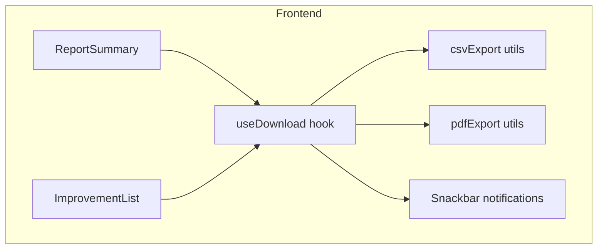
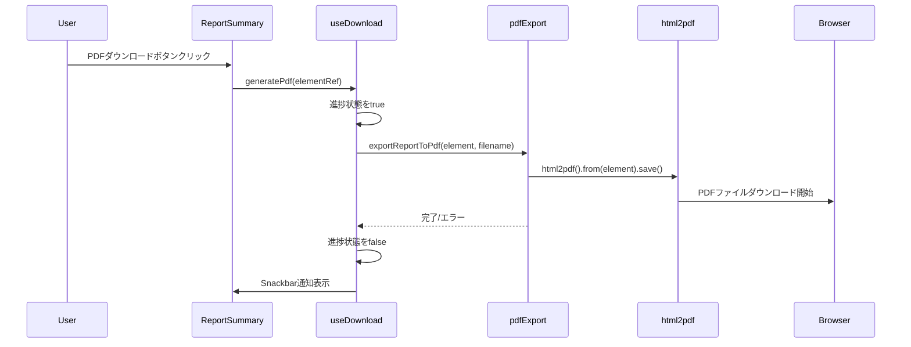

# Design Document: download-enhancements

## Overview

**Purpose**: 本機能は、アクセシビリティ分析結果のエクスポート機能を拡張し、開発者・QAエンジニアが分析結果を多様な形式で保存・共有できるようにする。

**Users**: 開発者およびQAエンジニアが、アクセシビリティ監査結果のチーム共有、タスク管理ツールへのインポート、ドキュメント化に本機能を使用する。

**Impact**: 既存の詳細結果CSVダウンロード機能に加え、AI総評CSVダウンロードとレポート全体PDFダウンロード機能を追加する。

### Goals

- AI総評の問題点・修正方法をCSV形式でエクスポート可能にする
- レポート全体を印刷向けPDFとしてダウンロード可能にする
- 既存のダウンロードボタンと統一されたUI/UXを提供する
- 成功・失敗通知による一貫したフィードバックを実現する

### Non-Goals

- サーバーサイドでのPDF生成（クライアントサイド完結）
- PDF内テキストの検索・選択機能（画像ベースPDFのため）
- 複数ページレポートの一括PDF出力最適化（将来検討）
- レポートのカスタムテンプレート機能

## Architecture

### Existing Architecture Analysis

- **既存CSV出力パターン**: `csvExport.ts`にBOM付きUTF-8 CSV生成、Blob経由ダウンロードが実装済み
- **レポート表示**: `ReportSummary.tsx`がメインコンポーネント、`ImprovementList.tsx`がAI総評を表示
- **状態管理**: 親コンポーネントからpropsでデータ受け渡し（Reduxなし）
- **通知UI**: 未実装（本機能で導入）

### Architecture Pattern & Boundary Map



**Architecture Integration**:

- **Selected pattern**: ユーティリティ関数 + カスタムフック（既存パターン踏襲）
- **Domain/feature boundaries**: エクスポート機能は`utils/`に集約、UIコンポーネントは呼び出し元に追加
- **Existing patterns preserved**: Blob URL + aタグダウンロード、BOM付きCSV出力
- **New components rationale**:
  - `pdfExport.ts`: PDF生成は独自の複雑さがあるため分離
  - `useDownload.ts`: 通知・エラーハンドリングの共通化
- **Steering compliance**: `structure.md`のディレクトリパターン（utils/にユーティリティ）に準拠

### Technology Stack

| Layer | Choice / Version | Role in Feature | Notes |
|-------|------------------|-----------------|-------|
| Frontend | React 19 + Vite | コンポーネントUI | 既存 |
| UI Library | MUI 7.3 | ボタン・Snackbar | 既存 |
| PDF生成 | html2pdf.js ^0.10.3 | HTML→PDF変換 | **新規依存** |
| CSV生成 | 既存実装 | AI総評CSV出力 | 拡張 |

> html2pdf.jsは内部でhtml2canvas + jsPDFを使用。詳細な選定理由は`research.md`参照。

## System Flows

### PDF生成フロー



**Key Decisions**:

- 進捗インジケーターはPDF生成開始〜完了まで表示
- エラー時は再試行オプション付きSnackbarを表示
- 背景除外は`html2pdf`オプションで実現（DOM変更不要）

## Requirements Traceability

| Requirement | Summary | Components | Interfaces | Flows |
|-------------|---------|------------|------------|-------|
| 1.1 | AI総評CSVダウンロードボタンクリックでダウンロード開始 | ImprovementList, csvExport | exportAISummaryToCsv | - |
| 1.2 | CSVカラム: 問題番号, 何が起きているか, 修正に必要なもの, どう修正するか | csvExport | generateAISummaryCsvContent | - |
| 1.3 | UTF-8 BOM付きエンコーディング | csvExport | - | - |
| 1.4 | AI総評データ未存在時はボタン非活性 | ImprovementList | - | - |
| 1.5 | ダウンロードボタンはAI総評セクション内に配置 | ImprovementList | - | - |
| 1.6 | ファイル名に分析対象URLと日時を含む | csvExport | generateAISummaryFileName | - |
| 2.1 | PDFダウンロードボタンクリックでダウンロード開始 | ReportSummary, pdfExport | exportReportToPdf | PDF生成フロー |
| 2.2 | PDFに画面表示のすべての要素を含む | pdfExport | - | - |
| 2.3 | 背景色を除外し印刷スタイルで出力 | pdfExport | - | - |
| 2.4 | PDF生成中に進行状況インジケーター表示 | ReportSummary, useDownload | - | PDF生成フロー |
| 2.5 | PDF生成失敗時にエラーメッセージと再試行オプション | useDownload | - | - |
| 2.6 | ファイル名に分析対象URLと日時を含む | pdfExport | generatePdfFileName | - |
| 2.7 | PDFダウンロードボタンはレポートヘッダー付近に配置 | ReportSummary | - | - |
| 3.1 | すべてのダウンロードボタンに統一されたアイコン・スタイル | ImprovementList, ReportSummary | - | - |
| 3.2 | ダウンロード完了時に成功通知表示 | useDownload | - | - |
| 3.3 | モバイルブラウザでも正常動作 | pdfExport, csvExport | - | - |
| 3.4 | ブラウザがダウンロードをブロック時にガイダンス表示 | useDownload | - | - |

## Components and Interfaces

| Component | Domain/Layer | Intent | Req Coverage | Key Dependencies | Contracts |
|-----------|--------------|--------|--------------|------------------|-----------|
| csvExport.ts | Utils | AI総評CSV生成・ダウンロード | 1.1-1.6 | - | Service |
| pdfExport.ts | Utils | レポートPDF生成・ダウンロード | 2.1-2.6 | html2pdf.js (P0) | Service |
| useDownload.ts | Hooks | ダウンロード状態管理・通知 | 2.4, 2.5, 3.2, 3.4 | MUI Snackbar (P1) | State |
| ImprovementList.tsx | Components | AI総評CSVボタン追加 | 1.1, 1.4, 1.5, 3.1 | csvExport (P0) | - |
| ReportSummary.tsx | Components | PDFダウンロードボタン追加 | 2.1, 2.7, 3.1 | useDownload (P0) | - |

### Utils

#### csvExport.ts（拡張）

| Field | Detail |
|-------|--------|
| Intent | AI総評データをCSV形式でエクスポート |
| Requirements | 1.1, 1.2, 1.3, 1.6 |

**Responsibilities & Constraints**

- AI総評の`DetectedIssue[]`をCSV形式に変換
- 既存の`escapeForCsv`関数を再利用
- UTF-8 BOM付きで出力（Excel互換）

**Dependencies**

- Inbound: ImprovementList — CSV生成呼び出し (P0)
- External: なし（純粋TypeScript関数）

**Contracts**: Service [x]

##### Service Interface

```typescript
interface AISummaryCsvRow {
  issueNumber: number;
  whatIsHappening: string;
  whatIsNeeded: string;
  howToFix: string;
}

/**
 * AI総評CSVコンテンツを生成
 */
function generateAISummaryCsvContent(issues: DetectedIssue[]): string;

/**
 * AI総評CSV用のファイル名を生成
 * 形式: ai-summary_{domain}_{YYYY-MM-DD}.csv
 */
function generateAISummaryFileName(targetUrl: string, date?: Date): string;

/**
 * AI総評をCSVファイルとしてダウンロード
 */
function exportAISummaryToCsv(
  issues: DetectedIssue[],
  targetUrl: string
): void;
```

- Preconditions: `issues`は有効な`DetectedIssue[]`（空配列可）
- Postconditions: ブラウザがCSVファイルのダウンロードを開始
- Invariants: 出力CSVは常にBOM付きUTF-8

**Implementation Notes**

- Integration: 既存の`escapeForCsv`、`generateFileName`パターンを踏襲
- Validation: 空配列時はヘッダーのみのCSVを出力
- Risks: 特になし（既存パターンの拡張）

---

#### pdfExport.ts（新規）

| Field | Detail |
|-------|--------|
| Intent | レポート全体をPDF形式でエクスポート |
| Requirements | 2.1, 2.2, 2.3, 2.6 |

**Responsibilities & Constraints**

- DOM要素をhtml2pdf.jsでPDF化
- 背景色を除外（白背景）
- 高解像度出力（scale: 2）

**Dependencies**

- Inbound: useDownload — PDF生成呼び出し (P0)
- External: html2pdf.js ^0.10.3 — HTML→PDF変換 (P0)

**Contracts**: Service [x]

##### Service Interface

```typescript
interface PdfExportOptions {
  filename: string;
  margin?: number;
  imageQuality?: number;
  scale?: number;
}

interface PdfExportResult {
  success: boolean;
  error?: string;
}

/**
 * PDF用のファイル名を生成
 * 形式: a11y-report_{domain}_{YYYY-MM-DD}.pdf
 */
function generatePdfFileName(targetUrl: string, date?: Date): string;

/**
 * DOM要素をPDFとしてダウンロード
 * @param element - PDF化対象のHTML要素
 * @param options - PDF出力オプション
 * @returns Promise<PdfExportResult>
 */
function exportReportToPdf(
  element: HTMLElement,
  options: PdfExportOptions
): Promise<PdfExportResult>;
```

- Preconditions: `element`はDOM内に存在する有効なHTMLElement
- Postconditions: 成功時はPDFダウンロード開始、失敗時はエラー情報を返却
- Invariants: 生成PDFの背景は常に白色

**Implementation Notes**

- Integration: html2pdf.jsの`set()`メソッドでオプション設定
- Validation: 要素が存在しない場合はエラーを返却
- Risks: 大きなDOM（4ページ超）でメモリ使用量増加の可能性

---

### Hooks

#### useDownload.ts（新規）

| Field | Detail |
|-------|--------|
| Intent | ダウンロード処理の状態管理と通知表示 |
| Requirements | 2.4, 2.5, 3.2, 3.4 |

**Responsibilities & Constraints**

- ダウンロード進行中状態の管理
- 成功・失敗時のSnackbar通知
- 再試行機能の提供

**Dependencies**

- Inbound: ReportSummary, ImprovementList — フック使用 (P0)
- Outbound: csvExport, pdfExport — エクスポート実行 (P0)
- External: MUI Snackbar — 通知表示 (P1)

**Contracts**: State [x]

##### State Management

```typescript
interface DownloadState {
  isGenerating: boolean;
  error: string | null;
}

interface UseDownloadReturn {
  state: DownloadState;
  downloadAISummaryCsv: (issues: DetectedIssue[], targetUrl: string) => void;
  downloadReportPdf: (elementRef: React.RefObject<HTMLElement>, targetUrl: string) => Promise<void>;
  clearError: () => void;
  // Snackbar制御用
  snackbarProps: {
    open: boolean;
    message: string;
    severity: 'success' | 'error';
    onClose: () => void;
    action?: React.ReactNode;  // 再試行ボタン
  };
}

function useDownload(): UseDownloadReturn;
```

- State model: `isGenerating`でローディング状態、`error`でエラーメッセージを保持
- Persistence: なし（インメモリ状態のみ）
- Concurrency: 同時に複数ダウンロードを防止（`isGenerating`フラグ）

**Implementation Notes**

- Integration: MUI `Snackbar` + `Alert`コンポーネントを使用
- Validation: 既にダウンロード中の場合は新規リクエストを無視
- Risks: なし

---

### Components

#### ImprovementList.tsx（拡張）

| Field | Detail |
|-------|--------|
| Intent | AI総評セクションにCSVダウンロードボタンを追加 |
| Requirements | 1.1, 1.4, 1.5, 3.1 |

**Implementation Notes**

- ボタン配置: AI総評ヘッダー右側（「AI総評」タイトルとGemini Flashチップの右隣）
- 非活性条件: `aiSummary`がundefinedまたは`detectedIssues`が空配列
- アイコン: `DownloadIcon`（既存の詳細結果CSVボタンと統一）
- スタイル: `Button variant="outlined" size="small"`（既存パターン踏襲）

---

#### ReportSummary.tsx（拡張）

| Field | Detail |
|-------|--------|
| Intent | レポートヘッダーにPDFダウンロードボタンを追加 |
| Requirements | 2.1, 2.7, 3.1 |

**Implementation Notes**

- ボタン配置: ヘッダー右側、「閉じる」ボタンの左隣
- レポート領域へのref: `useRef<HTMLDivElement>`でCardContent全体を参照
- アイコン: `PictureAsPdfIcon`（PDFであることを明示）
- スタイル: `Button variant="outlined" size="small"`
- 進捗表示: ボタン内に`CircularProgress`を表示（`useDownload.state.isGenerating`時）

## Data Models

### Domain Model

本機能は新規データモデルを導入しない。既存の`DetectedIssue`型を使用する。

```typescript
// 既存型（accessibility.ts）
interface DetectedIssue {
  ruleId: string;
  whatIsHappening: string;
  whatIsNeeded: string;
  howToFix: string;
}
```

### Data Contracts & Integration

#### CSV出力形式

```csv
問題番号,何が起きているか,修正に必要なもの,どう修正するか
1,"コントラスト比が不足しています","テキストと背景のコントラスト比を4.5:1以上に","CSSでcolor値を調整するか背景色を変更"
2,...
```

## Error Handling

### Error Categories and Responses

| カテゴリ | エラー | レスポンス |
|----------|--------|------------|
| User Errors | ブラウザがダウンロードをブロック | Snackbar + ブロック解除ガイダンス |
| System Errors | PDF生成失敗（html2pdf内部エラー） | Snackbar + 再試行ボタン |
| System Errors | メモリ不足（大きなDOM） | Snackbar + ページ分割の提案 |

### Monitoring

- エラー発生時は`console.error`で詳細ログ出力
- 将来的なエラートラッキング（Sentry等）への拡張を考慮した設計

## Testing Strategy

### Unit Tests

1. `generateAISummaryCsvContent` - 空配列、複数件、特殊文字を含むケース
2. `escapeForCsv` - カンマ、改行、ダブルクォート、複合ケース
3. `generateAISummaryFileName` - 様々なURLパターン
4. `generatePdfFileName` - 様々なURLパターン

### Integration Tests

1. AI総評CSVダウンロード - ボタンクリックからダウンロード完了まで
2. PDFダウンロード - ボタンクリックからダウンロード完了まで
3. エラーハンドリング - PDF生成失敗時のSnackbar表示

### E2E Tests

1. AI総評CSV - ダウンロードされたCSVの内容検証
2. レポートPDF - ダウンロードされたPDFの生成確認
3. モバイルブラウザ - レスポンシブ動作確認

## Performance & Scalability

### Performance Targets

| メトリクス | 目標値 | 測定方法 |
|------------|--------|----------|
| CSV生成時間 | < 100ms | performance.now() |
| PDF生成時間（1ページ相当） | < 3秒 | performance.now() |
| PDF生成時間（4ページ相当） | < 10秒 | performance.now() |

### Optimization Techniques

- html2canvasの`scale: 2`で高画質と生成速度のバランス
- 不要な装飾要素（GridBackground）をPDF対象から除外
- PDF生成中はUIをブロックしない（非同期処理）

## Supporting References

### html2pdf.jsオプション設定

```typescript
const opt = {
  margin: 10,
  filename: 'report.pdf',
  image: { type: 'jpeg', quality: 0.95 },
  html2canvas: {
    scale: 2,
    useCORS: true,
    backgroundColor: '#ffffff',
  },
  jsPDF: {
    unit: 'mm',
    format: 'a4',
    orientation: 'portrait',
  },
};
```

詳細な選定理由・比較は`research.md`参照。
