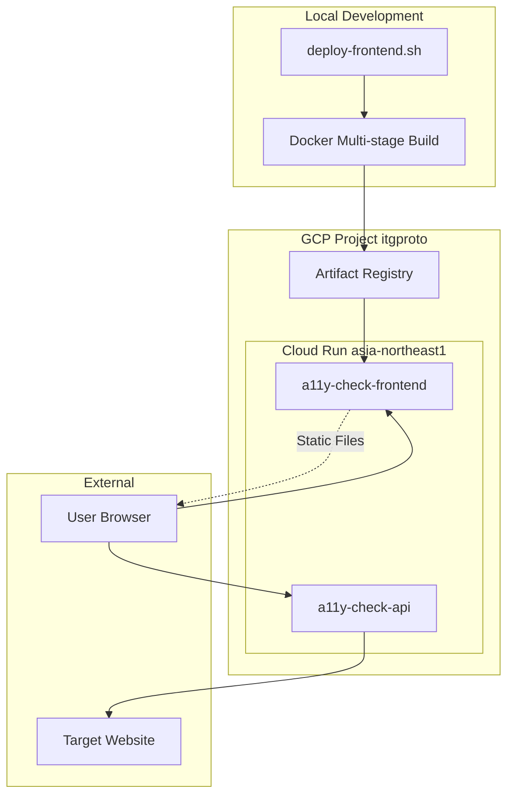
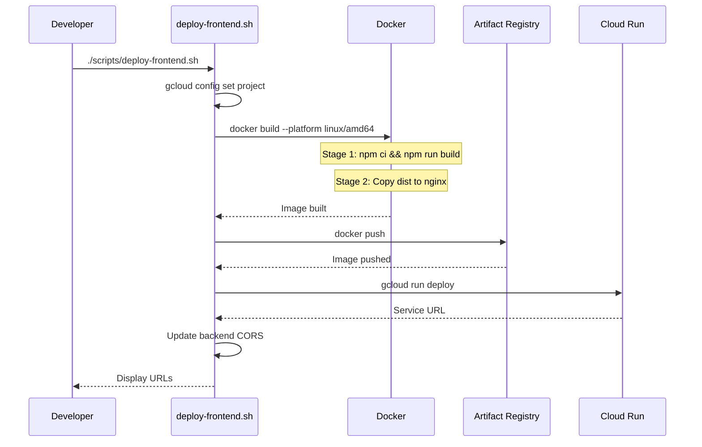
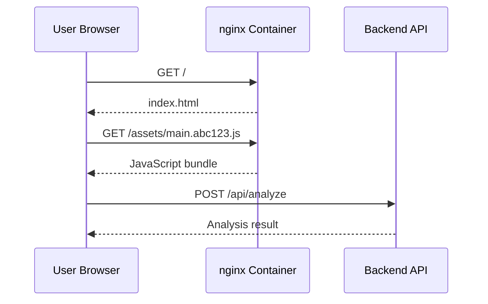

# Technical Design Document: Frontend Cloud Run Deployment

## Overview

**Purpose**: フロントエンドSPA（React 19 + Vite + MUI）をGoogle Cloud Runにデプロイし、エンドユーザーがWebブラウザからアクセシビリティ分析ツールを利用できるようにする。

**Users**: 開発者がデプロイスクリプトを実行し、エンドユーザーがWebブラウザでSPAにアクセスする。

**Impact**: ローカル開発環境からクラウド本番環境への移行。マルチステージDockerビルドとnginxによる静的ファイル配信を実現。

### Goals
- フロントエンドSPAのDockerコンテナ化（マルチステージビルド）
- GCPプロジェクト「itgproto」へのCloud Runデプロイ
- シェルスクリプト（`scripts/deploy-frontend.sh`）による再現性のあるデプロイ自動化
- nginxによるSPA対応静的ファイル配信

### Non-Goals
- CI/CDパイプライン（GitHub Actions等）の構築
- カスタムドメインの設定
- CDN（Cloud CDN）の導入
- SSR（サーバーサイドレンダリング）対応

## Architecture

### Existing Architecture Analysis

バックエンドのCloud Runデプロイが完了済み：

- **バックエンドAPI**: `https://a11y-check-api-pazgfztcsa-an.a.run.app`
- **デプロイスクリプト**: `scripts/deploy.sh`
- **Dockerfile**: プロジェクトルートに配置（バックエンド用）

フロントエンドの現状：

- **ビルド設定**: Vite + TypeScript（`frontend/vite.config.ts`）
- **API接続**: `VITE_API_URL`環境変数で設定（`frontend/src/services/api.ts:3`）
- **本番設定**: `frontend/.env.production`にバックエンドURL設定済み

### Architecture Pattern & Boundary Map



**Architecture Integration**:
- **Selected Pattern**: マルチステージビルドによるコンテナ化静的ファイルサーバー
- **Domain Boundaries**: フロントエンドとバックエンドは独立したCloud Runサービス
- **Existing Patterns Preserved**: バックエンドデプロイスクリプトの構造を踏襲
- **New Components**: `frontend/Dockerfile`、`frontend/nginx.conf`、`scripts/deploy-frontend.sh`
- **Steering Compliance**: TypeScript使用、分離構成を維持

### Technology Stack

| Layer | Choice / Version | Role in Feature | Notes |
|-------|------------------|-----------------|-------|
| Build Stage | node:22-alpine | Viteビルド実行 | 軽量Alpineイメージ |
| Runtime Stage | nginx:alpine-slim | 静的ファイル配信 | 約8MBの超軽量イメージ |
| Container Registry | Artifact Registry (asia-northeast1) | Dockerイメージ保存 | GCP推奨 |
| Compute | Cloud Run (asia-northeast1) | サーバーレスコンテナ実行 | メモリ256MB |
| Deploy Tool | gcloud CLI | デプロイ自動化 | deploy-frontend.sh経由 |

## System Flows

### デプロイフロー



### リクエストフロー



## Requirements Traceability

| Requirement | Summary | Components | Interfaces | Flows |
|-------------|---------|------------|------------|-------|
| 1.1-1.6 | Dockerコンテナ化 | frontend/Dockerfile | - | Deploy |
| 2.1-2.4 | 本番ビルド設定 | frontend/package.json (既存) | npm | Deploy |
| 3.1-3.6 | Cloud Run設定 | deploy-frontend.sh | gcloud CLI | Deploy |
| 4.1-4.8 | デプロイスクリプト | deploy-frontend.sh | Shell | Deploy |
| 5.1-5.4 | API接続設定 | frontend/src/services/api.ts (既存) | VITE_API_URL | Request |
| 6.1-6.4 | Webサーバー設定 | frontend/nginx.conf | HTTP | Request |
| 7.1-7.2 | ヘルスチェック | frontend/nginx.conf | HTTP GET | - |

## Components and Interfaces

| Component | Domain/Layer | Intent | Req Coverage | Key Dependencies | Contracts |
|-----------|--------------|--------|--------------|------------------|-----------|
| frontend/Dockerfile | Infrastructure | マルチステージビルド定義 | 1.1-1.6 | node:22-alpine (P0), nginx:alpine-slim (P0) | - |
| frontend/nginx.conf | Infrastructure | Webサーバー設定 | 6.1-6.4, 7.1-7.2 | - | HTTP |
| deploy-frontend.sh | Infrastructure | デプロイ自動化 | 3.1-3.6, 4.1-4.8 | gcloud CLI (P0), docker CLI (P0) | Shell |

### Infrastructure

#### frontend/Dockerfile

| Field | Detail |
|-------|--------|
| Intent | マルチステージビルドによるフロントエンドコンテナ化 |
| Requirements | 1.1, 1.2, 1.3, 1.4, 1.5, 1.6 |

**Responsibilities & Constraints**
- Stage 1（build）: Node.js環境でViteビルドを実行
- Stage 2（production）: nginxで静的ファイルを配信
- 最終イメージサイズを最小化（〜25MB以下）
- ポート8080でCloud Run互換

**Dependencies**
- External: node:22-alpine — ビルドステージ (P0)
- External: nginx:alpine-slim — 実行ステージ (P0)

**Contracts**: Service [ ] / API [ ] / Event [ ] / Batch [ ] / State [ ]

##### Dockerfile Structure

```dockerfile
# Stage 1: Build
FROM node:22-alpine AS build

WORKDIR /app

# 依存関係インストール
COPY package*.json ./
RUN npm ci

# ソースコードコピーとビルド
COPY . .
RUN npm run build

# Stage 2: Production
FROM nginx:alpine-slim

# nginx設定をコピー
COPY nginx.conf /etc/nginx/nginx.conf

# ビルド成果物をコピー
COPY --from=build /app/dist /usr/share/nginx/html

# Cloud Run用ポート
EXPOSE 8080

# nginx起動
CMD ["nginx", "-g", "daemon off;"]
```

**Implementation Notes**
- `npm ci`で再現性のある依存関係インストール
- `.dockerignore`で不要ファイルを除外（node_modules, .git等）
- nginx.confは同ディレクトリに配置

---

#### frontend/nginx.conf

| Field | Detail |
|-------|--------|
| Intent | SPA対応の静的ファイル配信設定 |
| Requirements | 6.1, 6.2, 6.3, 6.4, 7.1, 7.2 |

**Responsibilities & Constraints**
- SPAルーティング対応（try_files）
- gzip圧縮有効化
- キャッシュヘッダー設定
- ポート8080でリッスン

**Dependencies**
- なし

**Contracts**: API [x] / State [ ]

##### HTTP Contract

| Method | Path | Response | Cache |
|--------|------|----------|-------|
| GET | / | index.html | no-cache |
| GET | /assets/* | 静的ファイル | 1年 |
| GET | /* (SPA routes) | index.html | no-cache |

##### nginx.conf Structure

```nginx
worker_processes auto;
error_log /var/log/nginx/error.log warn;
pid /tmp/nginx.pid;

events {
    worker_connections 1024;
}

http {
    include /etc/nginx/mime.types;
    default_type application/octet-stream;

    # ログ設定
    log_format main '$remote_addr - $remote_user [$time_local] "$request" '
                    '$status $body_bytes_sent "$http_referer" '
                    '"$http_user_agent"';
    access_log /var/log/nginx/access.log main;

    # パフォーマンス設定
    sendfile on;
    keepalive_timeout 65;

    # gzip圧縮
    gzip on;
    gzip_types text/plain text/css application/json application/javascript text/xml application/xml;
    gzip_min_length 1000;

    server {
        listen 8080;
        server_name _;
        root /usr/share/nginx/html;
        index index.html;

        # SPAルーティング対応
        location / {
            try_files $uri $uri/ /index.html;
        }

        # 静的アセットのキャッシュ（ハッシュ付きファイル）
        location /assets/ {
            expires 1y;
            add_header Cache-Control "public, immutable";
        }

        # index.htmlはキャッシュしない
        location = /index.html {
            expires -1;
            add_header Cache-Control "no-cache, no-store, must-revalidate";
        }

        # ヘルスチェック
        location = /health {
            access_log off;
            return 200 "OK";
            add_header Content-Type text/plain;
        }
    }
}
```

**Implementation Notes**
- `try_files $uri $uri/ /index.html;`でクライアントサイドルーティング対応
- `/assets/`は1年キャッシュ（Viteがハッシュ付きファイル名を生成）
- `/health`はCloud Runのヘルスチェック用

---

#### scripts/deploy-frontend.sh

| Field | Detail |
|-------|--------|
| Intent | フロントエンドデプロイの自動化 |
| Requirements | 3.1, 3.2, 3.3, 3.4, 3.5, 3.6, 4.1, 4.2, 4.3, 4.4, 4.5, 4.6, 4.7, 4.8 |

**Responsibilities & Constraints**
- GCPプロジェクト設定（itgproto）
- Dockerイメージのビルドとプッシュ（linux/amd64プラットフォーム）
- Cloud Runへのデプロイ
- エラーハンドリングと終了コード管理
- デプロイ後のURL表示

**Dependencies**
- External: gcloud CLI — GCP操作 (P0)
- External: docker CLI — イメージビルド (P0)

**Contracts**: Service [ ] / API [ ] / Event [ ] / Batch [ ] / State [ ]

##### Shell Script Structure

```bash
#!/bin/bash
# Frontend Cloud Run デプロイスクリプト
# GCPプロジェクト「itgproto」にフロントエンドをデプロイする

set -e  # エラー時に即終了

# 設定
PROJECT_ID="itgproto"
REGION="asia-northeast1"
SERVICE_NAME="a11y-check-frontend"
IMAGE_NAME="a11y-check-frontend"
REGISTRY="${REGION}-docker.pkg.dev/${PROJECT_ID}/cloud-run-source-deploy"

echo "=========================================="
echo "Frontend Cloud Run デプロイ開始"
echo "=========================================="
echo "プロジェクト: ${PROJECT_ID}"
echo "リージョン: ${REGION}"
echo "サービス名: ${SERVICE_NAME}"
echo "=========================================="

# GCPプロジェクト設定
echo "GCPプロジェクトを設定中..."
gcloud config set project ${PROJECT_ID}

# Artifact Registryリポジトリ作成（存在しない場合）
echo "Artifact Registryリポジトリを確認中..."
gcloud artifacts repositories create cloud-run-source-deploy \
    --repository-format=docker \
    --location=${REGION} \
    --description="Cloud Run deployment images" 2>/dev/null || true

# Docker認証設定
echo "Docker認証を設定中..."
gcloud auth configure-docker ${REGION}-docker.pkg.dev --quiet

# frontendディレクトリに移動してビルド
echo "Dockerイメージをビルド中（linux/amd64）..."
cd frontend
docker build --platform linux/amd64 -t ${REGISTRY}/${IMAGE_NAME}:latest .

# イメージプッシュ
echo "Dockerイメージをプッシュ中..."
docker push ${REGISTRY}/${IMAGE_NAME}:latest

# Cloud Runデプロイ
echo "Cloud Runにデプロイ中..."
gcloud run deploy ${SERVICE_NAME} \
    --image ${REGISTRY}/${IMAGE_NAME}:latest \
    --region ${REGION} \
    --platform managed \
    --allow-unauthenticated \
    --memory 256Mi \
    --timeout 60 \
    --min-instances 0 \
    --max-instances 10 \
    --port 8080

# デプロイ結果表示
echo ""
echo "=========================================="
echo "Deployment completed!"
echo "=========================================="
echo ""
echo "フロントエンドURL:"
FRONTEND_URL=$(gcloud run services describe ${SERVICE_NAME} --region ${REGION} --format='value(status.url)')
echo "  ${FRONTEND_URL}"
echo ""
echo "バックエンドAPI URL:"
echo "  https://a11y-check-api-pazgfztcsa-an.a.run.app"
echo ""
echo "=========================================="
echo "NOTE: バックエンドのCORS設定を更新する場合:"
echo "  FRONTEND_ORIGIN=${FRONTEND_URL} ./scripts/deploy.sh"
echo "=========================================="
```

**Implementation Notes**
- `--platform linux/amd64`でCloud Run互換のイメージをビルド
- `--memory 256Mi`は静的ファイル配信に十分
- `--timeout 60`はnginxの高速レスポンスを前提
- フロントエンドURLとバックエンドURLを両方表示

## Data Models

本機能ではデータモデルの変更なし。

## Error Handling

### Error Strategy

デプロイスクリプトは`set -e`で即時終了し、エラー箇所を明確化。

### Error Categories and Responses

**Deploy Script Errors**:
- gcloud認証エラー → `gcloud auth login`を案内
- Docker build失敗 → ビルドログを表示、TypeScriptエラーを確認
- イメージプッシュ失敗 → Artifact Registry権限を確認
- Cloud Runデプロイ失敗 → サービスアカウント権限を確認

**Runtime Errors**:
- 404エラー → nginxのtry_filesが動作していない可能性
- CORS エラー → バックエンドのALLOWED_ORIGINSを確認

### Monitoring

- Cloud Run標準ログ: Cloud Loggingに自動出力
- nginxアクセスログ: コンテナ内で出力（Cloud Loggingで閲覧可能）

## Testing Strategy

### Unit Tests
- なし（インフラ構成のため）

### Integration Tests
- Dockerイメージビルド: `docker build`が成功すること
- コンテナ起動: ポート8080でリッスン開始すること
- SPAルーティング: `/any-path`にアクセスしてindex.htmlが返ること
- ヘルスチェック: `/health`が200を返すこと

### E2E Tests
- デプロイスクリプト実行: Cloud Runにデプロイ成功
- ブラウザアクセス: デプロイ後のURLでSPAが表示される
- API呼び出し: 分析リクエストが正常に動作する

### Performance Tests
- コールドスタート時間: 2秒以内
- 静的ファイルレスポンス: 100ms以内

## Security Considerations

- **未認証アクセス**: パブリックWebアプリとして公開（要件3.3）
- **CORS**: フロントエンド→バックエンドはCORS設定で制御（バックエンド側）
- **コンテンツセキュリティ**: nginxがContent-Typeを適切に設定
- **機密情報**: フロントエンドにはシークレットを含まない

## Performance & Scalability

- **イメージサイズ**: 〜25MB（nginx:alpine-slim + dist）
- **メモリ**: 256MB（静的ファイル配信のため軽量）
- **タイムアウト**: 60秒
- **スケーリング**: 最小0、最大10インスタンス
- **コールドスタート**: 1-2秒（nginxの起動は高速）
- **キャッシュ戦略**: ハッシュ付きアセットは1年キャッシュ、index.htmlはno-cache
