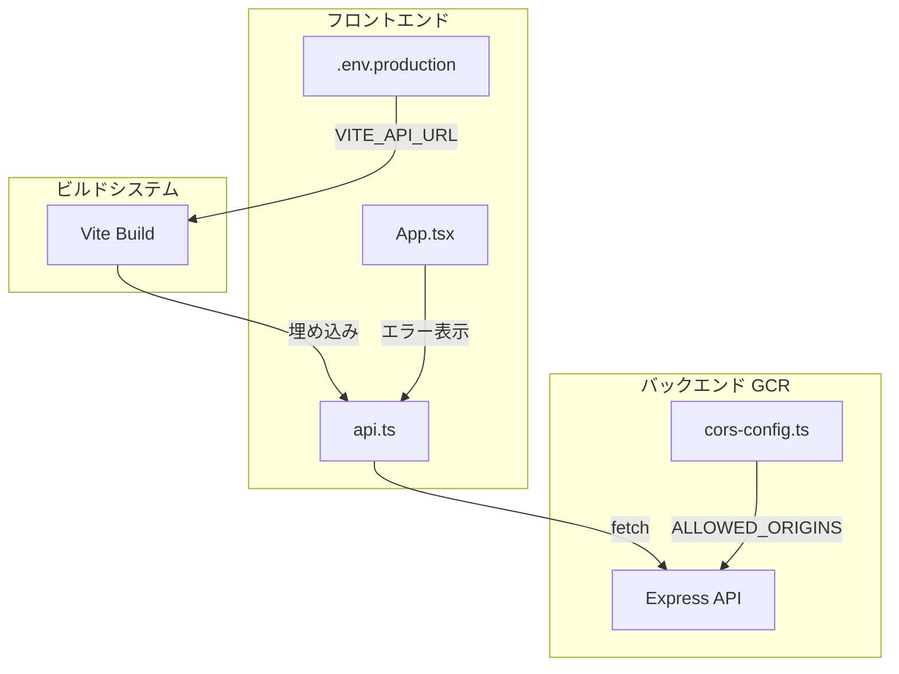
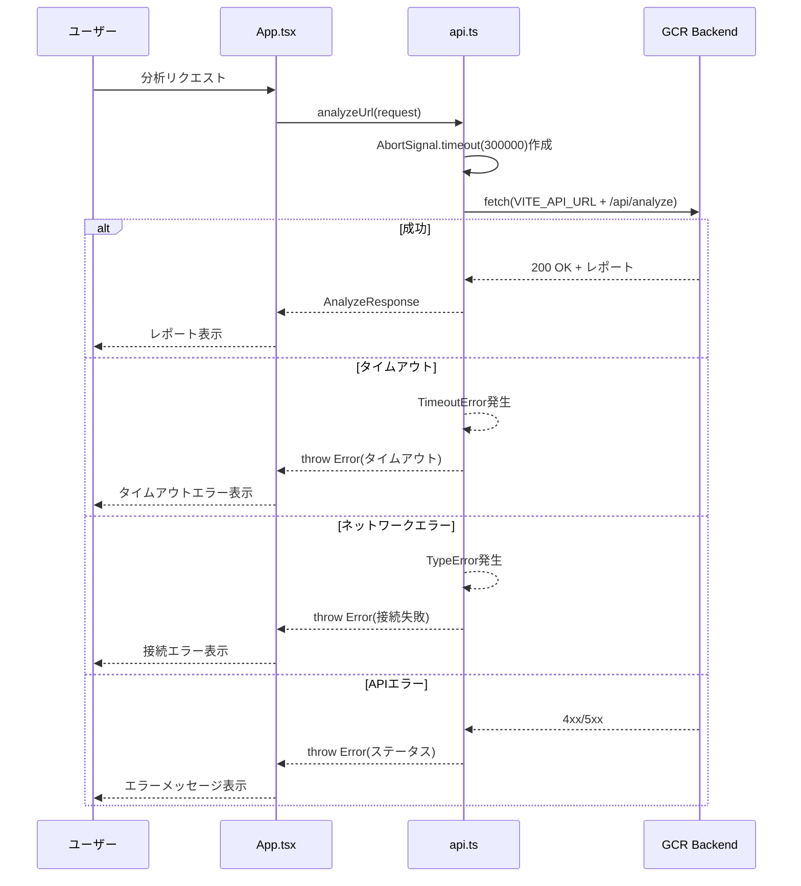

# Design Document: frontend-gcr-integration

## Overview

**Purpose**: フロントエンドアプリケーションをGoogle Cloud Run（GCR）にデプロイされたバックエンドAPIに正しく接続できるようにする。

**Users**: 開発者・デプロイ担当者・運用担当者がこの設定を通じて、ローカル開発から本番環境まで一貫したAPI接続を実現する。

**Impact**: 既存の環境変数パターン（`VITE_API_URL`、`ALLOWED_ORIGINS`）を活用し、最小限の変更で本番環境対応を実現する。

### Goals
- フロントエンドが環境に応じて適切なバックエンドAPIに接続できる
- 本番ビルドでGCRバックエンドのURLが正しく埋め込まれる
- API通信エラー時にユーザーに分かりやすいフィードバックを提供する

### Non-Goals
- フロントエンドのホスティング環境構築（本設計のスコープ外）
- 認証・認可の追加実装
- API クライアントの大幅な再設計

## Requirements Traceability

| Requirement | Summary | Components | Interfaces | Flows |
|-------------|---------|------------|------------|-------|
| 1.1, 1.2, 1.3 | 環境変数によるAPIエンドポイント設定 | api.ts, .env.* | - | API通信フロー |
| 2.1, 2.2, 2.3 | 本番環境用ビルド設定 | .env.production, vite.config.ts | - | ビルドフロー |
| 3.1, 3.2, 3.3 | CORS対応 | cors-config.ts, deploy.sh | CorsConfig | CORS設定フロー |
| 4.1, 4.2, 4.3 | APIエラーハンドリング | api.ts, App.tsx | ApiError | エラーハンドリングフロー |
| 5.1, 5.2, 5.3 | 環境設定ドキュメント | docs/deployment-guide.md | - | - |

## Architecture

### Existing Architecture Analysis

現在のシステムは以下のパターンで構成されている：

- **フロントエンド**: `VITE_API_URL`環境変数でAPIベースURLを設定（`api.ts`）
- **開発環境**: Viteプロキシで`/api`リクエストをlocalhost:3001に転送
- **バックエンド**: `ALLOWED_ORIGINS`環境変数でCORS許可オリジンを設定（`cors-config.ts`）
- **デプロイ**: `scripts/deploy.sh`でCloud Runにデプロイ

これらの既存パターンを活用し、設定ファイルの追加と軽微なコード修正で要件を満たす。

### Architecture Pattern & Boundary Map



**Architecture Integration**:
- Selected pattern: 既存パターン拡張（環境変数ベースの設定管理）
- Domain boundaries: フロントエンド設定 / バックエンドCORS設定 / ドキュメント
- Existing patterns preserved: `VITE_*`環境変数、`ALLOWED_ORIGINS`環境変数
- New components rationale: 設定ファイル追加のみ、新規ロジックは最小限
- Steering compliance: TypeScript使用、fetch API活用

### Technology Stack

| Layer | Choice / Version | Role in Feature | Notes |
|-------|------------------|-----------------|-------|
| Frontend | Vite 7 + React 19 | 環境変数埋め込み、ビルド | 既存 |
| API Client | fetch + AbortSignal | タイムアウト付きAPI通信 | 標準API使用 |
| Backend | Express 5 + cors | CORS設定 | 既存 |
| Infrastructure | Cloud Run | バックエンドホスティング | 既存 |

## System Flows

### API通信フロー（タイムアウト付き）



## Components and Interfaces

| Component | Domain/Layer | Intent | Req Coverage | Key Dependencies | Contracts |
|-----------|--------------|--------|--------------|------------------|-----------|
| api.ts | Frontend/Services | API通信とエラーハンドリング | 1.1-1.3, 4.1-4.3 | fetch API (P0) | Service |
| .env.production | Frontend/Config | 本番環境変数設定 | 2.1-2.3 | Vite (P0) | - |
| .env.example | Frontend/Config | 環境変数テンプレート | 5.1-5.3 | - | - |
| cors-config.ts | Backend/Config | CORS許可オリジン設定 | 3.1, 3.3 | cors (P0) | Service |
| deploy.sh | Infrastructure | ALLOWED_ORIGINS設定追加 | 3.1, 3.3 | gcloud (P0) | - |
| deployment-guide.md | Documentation | 環境設定手順 | 5.1-5.3 | - | - |

### Frontend / Services

#### api.ts（拡張）

| Field | Detail |
|-------|--------|
| Intent | GCRバックエンドへのAPI通信とタイムアウト・エラーハンドリング |
| Requirements | 1.1, 1.2, 1.3, 4.1, 4.2, 4.3 |

**Responsibilities & Constraints**
- `VITE_API_URL`環境変数からベースURLを取得
- `AbortSignal.timeout()`によるリクエストタイムアウト制御
- エラー種別に応じた適切なエラーメッセージ生成

**Dependencies**
- Outbound: GCR Backend API — API通信 (P0)
- External: fetch API, AbortSignal — HTTP通信 (P0)

**Contracts**: Service [x]

##### Service Interface

```typescript
interface ApiService {
  analyzeUrl(request: AnalyzeRequest): Promise<AnalyzeResponse>;
}

// エラー分類
type ApiErrorType = 'timeout' | 'network' | 'server' | 'client';

interface ApiError extends Error {
  type: ApiErrorType;
  statusCode?: number;
}
```

- Preconditions: `request.url`が有効なURL形式
- Postconditions: 成功時は`AnalyzeResponse`、失敗時は`ApiError`をthrow
- Invariants: タイムアウト値は300秒固定（将来的に設定可能化も検討）

**Implementation Notes**
- Integration: `AbortSignal.timeout(300000)`でタイムアウト設定
- Validation: `err.name === 'TimeoutError'`でタイムアウト判定
- Risks: なし（標準APIのみ使用）

### Frontend / Config

#### .env.production

| Field | Detail |
|-------|--------|
| Intent | 本番環境用のAPIエンドポイント設定 |
| Requirements | 2.1, 2.2, 2.3 |

**File Content**

```bash
# 本番環境用API設定
VITE_API_URL=https://a11y-check-api-<hash>-an.a.run.app
```

**Implementation Notes**
- Integration: `vite build`実行時に自動読み込み
- Validation: ビルド後に`dist/assets/*.js`でURL埋め込み確認

#### .env.example

| Field | Detail |
|-------|--------|
| Intent | 環境変数のテンプレート（ドキュメント用） |
| Requirements | 5.1, 5.2 |

**File Content**

```bash
# APIエンドポイント設定
# 開発環境: 空欄（Viteプロキシ使用）
# 本番環境: GCR URLを設定
VITE_API_URL=
```

### Backend / Config

#### cors-config.ts（既存・設定変更のみ）

| Field | Detail |
|-------|--------|
| Intent | フロントエンドオリジンからのCORSリクエスト許可 |
| Requirements | 3.1, 3.3 |

**Contracts**: Service [x]

##### Service Interface（既存）

```typescript
interface CorsConfig {
  origin: string[];
  credentials: boolean;
}

function getCorsConfig(): CorsConfig;
```

**Implementation Notes**
- Integration: `deploy.sh`で`ALLOWED_ORIGINS`環境変数を設定
- Validation: Cloud Runデプロイ後にフロントエンドからのリクエストで確認

### Infrastructure

#### deploy.sh（拡張）

| Field | Detail |
|-------|--------|
| Intent | バックエンドデプロイ時のCORS設定 |
| Requirements | 3.1, 3.3 |

**変更内容**

```bash
# 既存の --set-env-vars に ALLOWED_ORIGINS を追加
--set-env-vars "NODE_ENV=production,ALLOWED_ORIGINS=https://your-frontend-domain.com"
```

**Implementation Notes**
- Integration: フロントエンドホスティングURL確定後に設定
- Risks: フロントエンドURL未定のため、プレースホルダーで実装

### Documentation

#### deployment-guide.md

| Field | Detail |
|-------|--------|
| Intent | フロントエンド環境設定とGCR接続手順のドキュメント |
| Requirements | 5.1, 5.2, 5.3 |

**ドキュメント構成**
1. 環境変数の概要
2. ローカル開発環境のセットアップ
3. 本番環境用ビルド手順
4. GCRバックエンドへの接続設定
5. トラブルシューティング

## Error Handling

### Error Strategy

エラーを4つのカテゴリに分類し、ユーザーに適切なメッセージを表示する。

### Error Categories and Responses

| エラー種別 | 判定条件 | ユーザーメッセージ |
|-----------|---------|------------------|
| タイムアウト | `err.name === 'TimeoutError'` | 「分析がタイムアウトしました。ページの読み込みに時間がかかっている可能性があります。」 |
| ネットワーク | `err instanceof TypeError` | 「サーバーに接続できません。ネットワーク接続を確認してください。」 |
| クライアントエラー (4xx) | `response.status >= 400 && < 500` | ステータスに応じたメッセージ（400: 無効なリクエスト、404: ページが見つからない等） |
| サーバーエラー (5xx) | `response.status >= 500` | 「サーバーエラーが発生しました。しばらく経ってから再度お試しください。」 |

## Testing Strategy

### Unit Tests
- `api.ts`: タイムアウト発生時のエラーハンドリング
- `api.ts`: ネットワークエラー時のエラーハンドリング
- `api.ts`: HTTPステータスに応じたエラー分類

### Integration Tests
- フロントエンド → GCRバックエンド間のAPI通信
- CORS設定の動作確認
- `.env.production`の環境変数埋め込み確認

### E2E Tests
- 分析リクエスト成功フロー
- タイムアウトエラー表示フロー
- ネットワークエラー表示フロー

## Security Considerations

- **環境変数の機密性**: `VITE_API_URL`はパブリックURLのため機密情報ではない
- **CORSの厳格な設定**: `ALLOWED_ORIGINS`で許可するオリジンを明示的に指定
- **APIキーの非使用**: 現時点でAPIキー認証は不要（将来的に追加可能）
