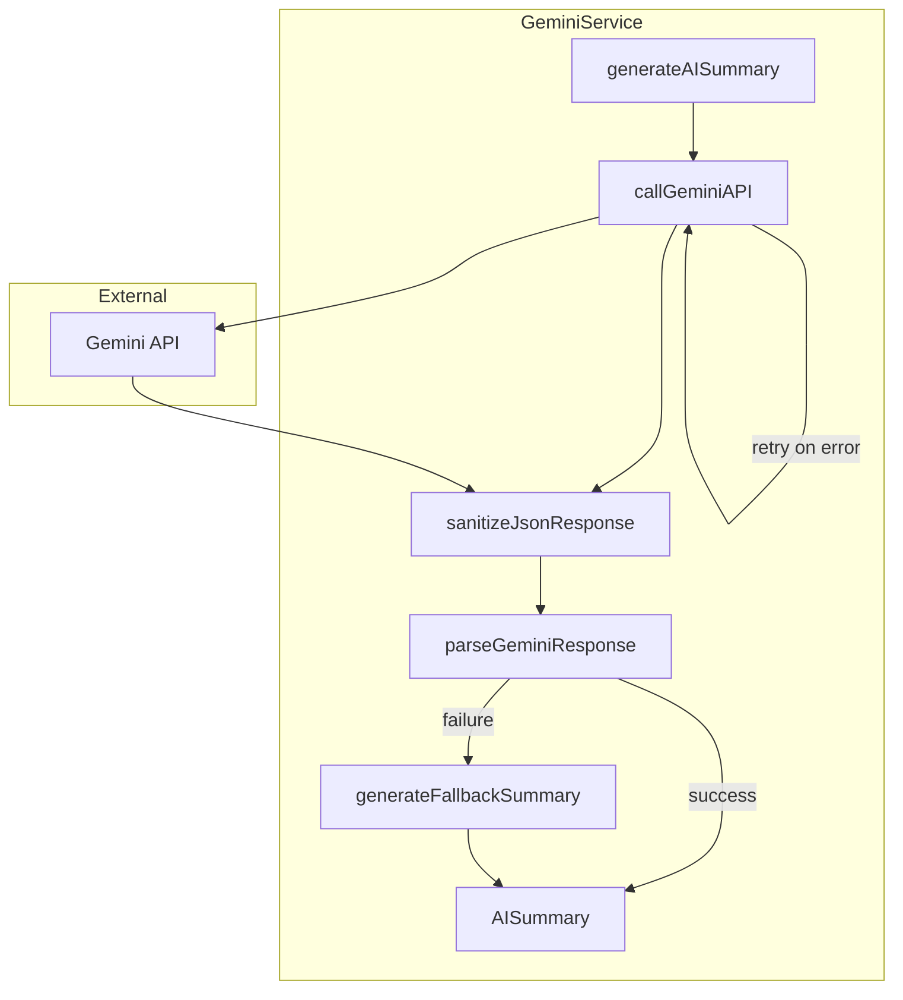
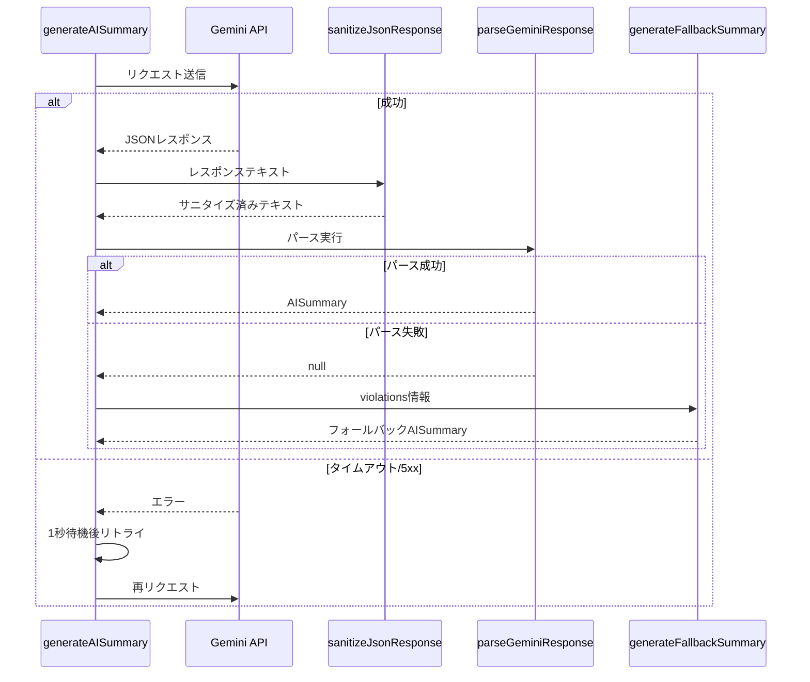

# Design Document: gemini-json-parse-fix

## Overview

**Purpose**: 本機能は、Gemini APIからのJSONレスポンスパースエラーを解消し、GeminiServiceの堅牢性を向上させる。

**Users**: バックエンドシステム（GeminiService）を介してAI総評を利用するエンドユーザーおよび運用担当者。

**Impact**: 既存の`server/services/gemini.ts`を拡張し、パース前のサニタイズ処理、フォールバック生成、リトライ機構を追加する。

### Goals

- Gemini APIレスポンスのJSONパースエラーを防止する
- パース失敗時にもフォールバックAISummaryを返却し、システム継続性を維持する
- エラー発生時の原因特定を容易にする詳細ログを提供する
- maxOutputTokens増加によるレスポンストランケーションを防止する

### Non-Goals

- Gemini API以外のLLMサービス対応
- 汎用JSONサニタイザーやリトライユーティリティの作成
- フロントエンドのエラー表示変更

## Architecture

### Existing Architecture Analysis

**現行アーキテクチャ**:
- `GeminiService`は単一ファイル（`gemini.ts`）で完結
- `Result<T, E>`型パターンでエラーを呼び出し元に返却
- `GeminiError`型は3種類（`api_error`, `timeout`, `rate_limit`）を定義
- `parseGeminiResponse`関数で`JSON.parse`を直接実行

**制約**:
- 外部依存の追加は最小限に抑える
- 既存のエラーハンドリングパターンを維持する

### Architecture Pattern & Boundary Map



**Architecture Integration**:
- Selected pattern: 既存ファイル拡張（ハイブリッドアプローチ）
- Domain/feature boundaries: GeminiService内で完結、外部への影響なし
- Existing patterns preserved: Result型、GeminiError型、定数定義パターン
- New components rationale: サニタイズ・フォールバック・リトライはGemini固有のため分離不要
- Steering compliance: TypeScript型安全性、エラーハンドリング原則を維持

### Technology Stack

| Layer | Choice / Version | Role in Feature | Notes |
|-------|------------------|-----------------|-------|
| Backend | Node.js + TypeScript | GeminiService拡張 | 既存スタック |
| Runtime | Cloud Run | 本番環境 | ログ出力先 |

## System Flows

### JSONパース処理フロー



**Key Decisions**:
- サニタイズはパース前に必ず実行
- パース失敗時はフォールバック生成で継続
- リトライは1回のみ、対象はタイムアウト・ネットワークエラー・5xxエラー

## Requirements Traceability

| Requirement | Summary | Components | Interfaces | Flows |
|-------------|---------|------------|------------|-------|
| 1.1, 1.2, 1.3, 1.4 | JSONサニタイズ | sanitizeJsonResponse | SanitizeResult | パース処理フロー |
| 2.1, 2.2 | maxOutputTokens増加 | MAX_OUTPUT_TOKENS定数 | - | - |
| 3.1, 3.2, 3.3, 3.4 | フォールバック処理 | generateFallbackSummary | AISummary | パース処理フロー |
| 4.1, 4.2, 4.3, 4.4 | エラー処理強化 | GeminiError, retryLogic | GeminiError | パース処理フロー |
| 5.1, 5.2, 5.3, 5.4 | テスト追加 | gemini.test.ts | - | - |

## Components and Interfaces

| Component | Domain/Layer | Intent | Req Coverage | Key Dependencies | Contracts |
|-----------|--------------|--------|--------------|------------------|-----------|
| sanitizeJsonResponse | Service/Utility | JSON文字列のサニタイズ | 1.1-1.4 | なし | Service |
| generateFallbackSummary | Service/Utility | フォールバックAISummary生成 | 3.1-3.4 | countByImpact (P0) | Service |
| retryWithBackoff | Service/Utility | リトライ機構 | 4.2, 4.3 | なし | Service |
| GeminiError | Type | エラー型拡張 | 4.4 | なし | - |
| MAX_OUTPUT_TOKENS | Constant | トークン上限定数 | 2.1, 2.2 | なし | - |

### Service Layer

#### sanitizeJsonResponse

| Field | Detail |
|-------|--------|
| Intent | Gemini APIレスポンス内のJSON文字列値に含まれる制御文字をエスケープする |
| Requirements | 1.1, 1.2, 1.3, 1.4 |

**Responsibilities & Constraints**
- JSON文字列値内の未エスケープ制御文字を検出・修正
- 有効なJSON構造を破壊しない
- Markdownバッククォートの除去（存在する場合）

**Dependencies**
- Inbound: parseGeminiResponse — サニタイズ済みテキストを提供 (P0)
- External: なし

**Contracts**: Service [x]

##### Service Interface

```typescript
/**
 * JSON文字列値内の制御文字をエスケープする
 * @param text - Gemini APIからの生レスポンステキスト
 * @returns サニタイズ済みテキスト
 */
function sanitizeJsonResponse(text: string): string;
```

- Preconditions: textはnull/undefinedでない
- Postconditions: 返却値はJSON.parseで解析可能な形式に近づく（保証はしない）
- Invariants: 有効なJSONは変更されない

**Implementation Notes**
- Integration: parseGeminiResponse内でJSON.parse前に呼び出し
- Validation: Markdownバッククォート（```json ... ```）の除去を最初に実行
- Risks: 過剰なサニタイズによる有効JSONの破壊 → テストで検証

---

#### generateFallbackSummary

| Field | Detail |
|-------|--------|
| Intent | パース失敗時に違反情報からデフォルトAISummaryを生成する |
| Requirements | 3.1, 3.2, 3.3, 3.4 |

**Responsibilities & Constraints**
- 違反件数と影響度サマリーから基本的な評価文を生成
- `isFallback: true`フラグを設定
- 日本語で評価文を出力

**Dependencies**
- Inbound: generateAISummary — パース失敗時に呼び出し (P0)
- Internal: countByImpact — 影響度集計 (P0)

**Contracts**: Service [x]

##### Service Interface

```typescript
/**
 * フォールバック用のAISummaryを生成する
 * @param violations - 検出された違反情報
 * @returns フォールバックAISummary
 */
function generateFallbackSummary(violations: RuleResult[]): AISummary;
```

- Preconditions: violationsは有効な配列
- Postconditions: isFallback: trueが設定されたAISummaryを返却
- Invariants: generatedAtは現在時刻

**Implementation Notes**
- Integration: parseGeminiResponseがnullを返した場合に呼び出し
- Validation: 違反が0件の場合も適切なメッセージを生成
- Risks: フォールバック頻発時のユーザー体験低下 → ログ監視

---

#### retryWithBackoff（generateAISummary内部実装）

| Field | Detail |
|-------|--------|
| Intent | 一時的なエラー時に1回のリトライを実行する |
| Requirements | 4.2, 4.3 |

**Responsibilities & Constraints**
- リトライ対象: タイムアウト、ネットワークエラー、5xxエラー
- リトライ回数: 最大1回
- バックオフ: 1秒固定

**Dependencies**
- Inbound: generateAISummary — API呼び出しのラッパー (P0)

**Contracts**: Service [x]

##### Service Interface

```typescript
// generateAISummary内部で実装（外部公開なし）
// リトライ対象エラーの判定
function isRetryableError(error: GeminiError): boolean;
```

- Preconditions: GeminiError型のエラー
- Postconditions: リトライ可能な場合true
- Invariants: rate_limitはリトライ対象外

**Implementation Notes**
- Integration: fetch呼び出しのtry-catch内で実装
- Validation: リトライ回数は1回のみ
- Risks: リトライによるレイテンシ増加 → 許容範囲内

## Data Models

### Domain Model

#### AISummary型の拡張

```typescript
// 既存のAISummary型に追加
interface AISummary {
  // ... 既存フィールド
  overallAssessment: string;
  detectedIssues: DetectedIssue[];
  prioritizedImprovements: string[];
  specificRecommendations: string[];
  impactSummary: ImpactSummary;
  generatedAt: string;

  // 新規追加（オプショナル）
  isFallback?: boolean;  // フォールバック生成の場合true
}
```

#### GeminiError型の拡張

```typescript
// 既存の3種類に追加
export type GeminiError =
  | { type: 'api_error'; message: string; statusCode: number }
  | { type: 'timeout'; message: string }
  | { type: 'rate_limit'; message: string; retryAfter: number }
  | { type: 'parse_error'; message: string; position?: number; excerpt?: string };  // 新規追加
```

### Logical Data Model

**定数定義**:

```typescript
// トークン上限（2048 → 4096に変更）
const MAX_OUTPUT_TOKENS = 4096;

// リトライ設定
const RETRY_DELAY_MS = 1000;  // 1秒
const MAX_RETRIES = 1;        // 1回
```

## Error Handling

### Error Strategy

| エラー種別 | 対応 | リトライ |
|-----------|------|---------|
| api_error (4xx) | エラー返却 | なし |
| api_error (5xx) | リトライ後エラー返却 | あり（1回） |
| timeout | リトライ後エラー返却 | あり（1回） |
| rate_limit | Retry-After後にユーザー再試行 | なし |
| parse_error | フォールバック生成 | なし |
| network_error | リトライ後エラー返却 | あり（1回） |

### Error Categories and Responses

**System Errors (5xx)**:
- タイムアウト → 1回リトライ後、timeoutエラー返却
- ネットワークエラー → 1回リトライ後、api_errorエラー返却
- Gemini 5xx → 1回リトライ後、api_errorエラー返却

**Business Logic Errors**:
- JSONパースエラー → フォールバックAISummary生成、parse_error詳細をログ出力

### Monitoring

**ログ出力**:
- パースエラー時: エラー位置（行/列）、問題文字列の一部（最大100文字）
- フォールバック発動時: 警告ログ
- リトライ実行時: 情報ログ

```typescript
// パースエラーログ例
console.error('Gemini: JSONパースエラー', {
  position: 5035,
  line: 48,
  column: 154,
  excerpt: '..."howToFix": "以下のコード例を参照...',
});
```

## Testing Strategy

### Unit Tests

1. **sanitizeJsonResponse**:
   - 未エスケープ改行を含む入力 → 正しくエスケープ
   - 未エスケープタブを含む入力 → 正しくエスケープ
   - 未エスケープバックスラッシュを含む入力 → 二重バックスラッシュに変換
   - 有効なJSONを入力 → 変更なし
   - Markdownバッククォートで囲まれた入力 → 除去

2. **generateFallbackSummary**:
   - 違反あり入力 → 違反件数を含む評価文
   - 違反なし入力 → 適切なメッセージ
   - isFallback: trueが設定されること

3. **retryWithBackoff**:
   - タイムアウトエラー → 1回リトライ実行
   - 5xxエラー → 1回リトライ実行
   - 4xxエラー → リトライなし
   - rate_limitエラー → リトライなし

4. **parseGeminiResponse（拡張）**:
   - 不正JSON入力 → フォールバック生成
   - parse_errorの詳細情報確認

### Integration Tests

1. Gemini API呼び出し → サニタイズ → パース → 成功の一連フロー
2. パース失敗 → フォールバック生成 → 成功応答の一連フロー
3. タイムアウト → リトライ → 成功の一連フロー

### Coverage Target

- 新規追加コードのカバレッジ: 80%以上
