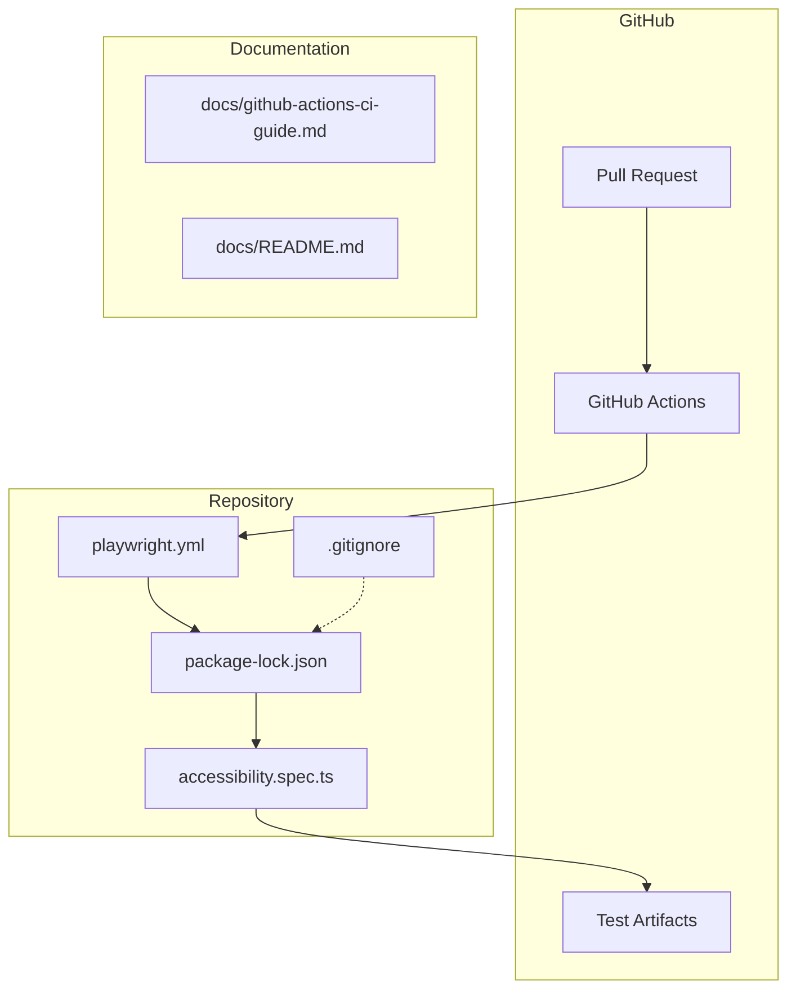
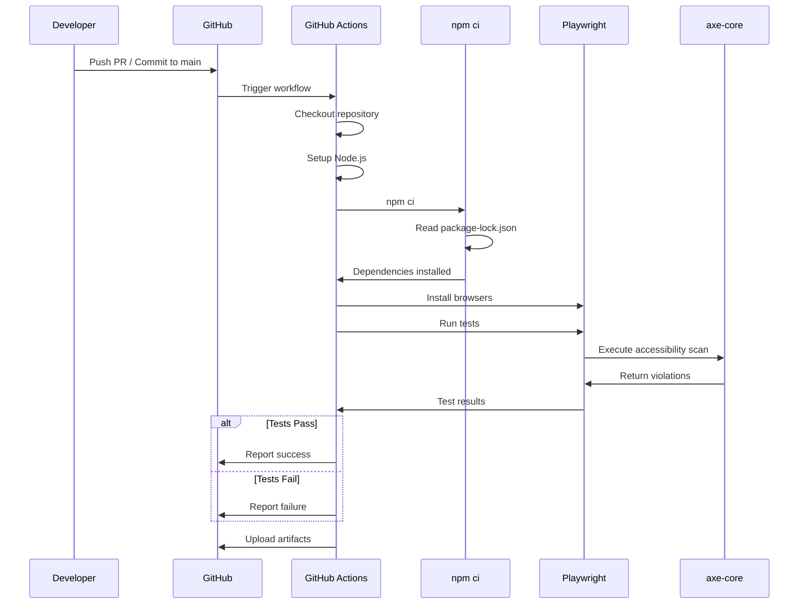

# Design Document: GitHub Actions Accessibility CI

## Overview
**Purpose**: GitHub ActionsでのCI/CDパイプラインを修正し、PRごとにアクセシビリティテストを自動実行できるようにする。

**Users**: 開発者、QAエンジニア、CI管理者がPRレビュー時のアクセシビリティ検証に活用する。

**Impact**: 現在失敗している`npm ci`コマンドを修正し、自動テストが正常に実行される状態に復旧する。

### Goals
- `npm ci`エラーを解決し、GitHub Actionsが正常に動作すること
- PRごとにアクセシビリティテストが自動実行されること
- 新規開発者が導入・運用できるドキュメントを提供すること

### Non-Goals
- フロントエンドアプリケーション自体のアクセシビリティテスト追加（既存テストを使用）
- GitHub Actionsワークフローの大幅な変更（既存構成を維持）
- npmキャッシュ等のパフォーマンス最適化

## Architecture

### Existing Architecture Analysis
現在のCI/CDパイプラインは以下の構成：
- **GitHub Actionsワークフロー**: `.github/workflows/playwright.yml`
- **テストフレームワーク**: Playwright + axe-core
- **依存関係管理**: npm（ルート + フロントエンド）

問題点：
- `.gitignore`が`package-lock.json`を除外しているため、`npm ci`が失敗

### Architecture Pattern & Boundary Map

**Architecture Integration**:
- Selected pattern: 既存パターン維持（設定修正のみ）
- Domain/feature boundaries: CI/CD設定とドキュメントの2領域
- Existing patterns preserved: Playwright + axe-coreによるテスト構成
- New components rationale: 新規ドキュメント1件のみ追加
- Steering compliance: 日本語ドキュメント、既存ディレクトリ構造を維持

### Technology Stack

| Layer | Choice / Version | Role in Feature | Notes |
|-------|------------------|-----------------|-------|
| CI/CD | GitHub Actions | ワークフロー実行環境 | 既存構成維持 |
| Testing | Playwright ^1.57.0 | ブラウザ自動化 | 既存 |
| Accessibility | @axe-core/playwright ^4.11.0 | WCAG準拠チェック | 既存 |
| Runtime | Node.js LTS | 実行環境 | ワークフローで指定済み |

## Requirements Traceability

| Requirement | Summary | Components | Interfaces | Flows |
|-------------|---------|------------|------------|-------|
| 1.1 | package-lock.jsonをリポジトリに含める | Gitignore | - | - |
| 1.2 | npm ciでエラーなくインストール | PackageLock, Workflow | - | CI Flow |
| 1.3 | .gitignoreからpackage-lock.jsonを削除 | Gitignore | - | - |
| 2.1 | PRでPlaywrightテスト実行 | Workflow | - | CI Flow |
| 2.2 | mainへのpushでテスト実行 | Workflow | - | CI Flow |
| 2.3 | テスト失敗時にステータス報告 | Workflow | GitHub Status API | CI Flow |
| 2.4 | テストレポートをアーティファクト保存 | Workflow | Artifacts | CI Flow |
| 3.1 | axe-coreによるアクセシビリティテスト | Tests | - | - |
| 3.2 | WCAG 2.0/2.1 Level A/AA検証 | Tests | - | - |
| 3.3 | 違反詳細とガイダンス出力 | Tests | - | - |
| 3.4 | accessibility.spec.ts実行 | Workflow, Tests | - | CI Flow |
| 4.1 | 前提条件の記載 | Documentation | - | - |
| 4.2 | セットアップ手順 | Documentation | - | - |
| 4.3 | ワークフロー設定の説明 | Documentation | - | - |
| 4.4 | トラブルシューティング | Documentation | - | - |
| 4.5 | 日本語でdocs/に配置 | Documentation | - | - |
| 5.1 | ローカルとCIで同一バージョン | PackageLock | - | - |
| 5.2 | package.jsonとpackage-lock.json両方コミット | Documentation | - | - |
| 5.3 | package-lock.jsonの重要性説明 | Documentation | - | - |

## Components and Interfaces

| Component | Domain/Layer | Intent | Req Coverage | Key Dependencies | Contracts |
|-----------|--------------|--------|--------------|------------------|-----------|
| Gitignore | Configuration | package-lock.json除外の解除 | 1.1, 1.3 | - | - |
| PackageLock | Configuration | 依存関係のロック | 1.2, 5.1 | package.json (P0) | - |
| Workflow | CI/CD | テスト自動実行 | 2.1-2.4, 3.4 | PackageLock (P0), Tests (P0) | - |
| Tests | Testing | アクセシビリティ検証 | 3.1-3.3 | axe-core (P0), Playwright (P0) | - |
| Documentation | Docs | 導入ガイド | 4.1-4.5, 5.2, 5.3 | - | - |

### Configuration Layer

#### Gitignore

| Field | Detail |
|-------|--------|
| Intent | package-lock.jsonをバージョン管理に含めるための設定変更 |
| Requirements | 1.1, 1.3 |

**Responsibilities & Constraints**
- `.gitignore`から`package-lock.json`行を削除
- 他の除外設定には影響を与えない

**Dependencies**
- なし

**Implementation Notes**
- Integration: 単純な行削除
- Validation: `git status`でpackage-lock.jsonが追跡対象になることを確認
- Risks: なし

#### PackageLock

| Field | Detail |
|-------|--------|
| Intent | 依存関係バージョンの固定と再現性確保 |
| Requirements | 1.2, 5.1 |

**Responsibilities & Constraints**
- ルートとフロントエンド両方の`package-lock.json`をコミット
- 依存関係更新時は必ず両ファイルをコミット

**Dependencies**
- Inbound: package.json — 依存関係定義 (P0)

**Implementation Notes**
- Integration: `git add package-lock.json frontend/package-lock.json`
- Validation: GitHub Actionsで`npm ci`が成功することを確認
- Risks: マージコンフリクトの可能性（依存関係更新時）

### Documentation Layer

#### GitHub Actions CI Guide

| Field | Detail |
|-------|--------|
| Intent | GitHub Actionsでのアクセシビリティテスト導入・運用ガイド |
| Requirements | 4.1-4.5, 5.2, 5.3 |

**Responsibilities & Constraints**
- 日本語で記述
- `docs/github-actions-ci-guide.md`に配置
- `docs/README.md`のドキュメント一覧を更新

**Dependencies**
- External: GitHub Actions公式ドキュメント — 参照 (P2)
- External: Playwright CIドキュメント — 参照 (P2)

**Contents**
1. 前提条件（Node.js、npm、GitHub Actions設定）
2. セットアップ手順（リポジトリ設定、ワークフローファイル）
3. ワークフロー設定の説明（トリガー、ジョブ、ステップ）
4. テスト結果の確認方法
5. トラブルシューティング
   - `npm ci`エラーと解決方法
   - Playwrightブラウザインストールエラー
   - テスト失敗時の対応
6. ベストプラクティス
   - `package-lock.json`のコミット重要性
   - 依存関係更新時の手順

**Implementation Notes**
- Integration: 既存のドキュメント構造に従う
- Validation: ドキュメント通りの手順で動作確認
- Risks: なし

## System Flows

### CI Flow

## Testing Strategy

### Integration Tests
- GitHub Actionsワークフローが正常に起動すること
- `npm ci`がエラーなく完了すること
- Playwrightブラウザがインストールされること
- アクセシビリティテストが実行されること
- テストレポートがアーティファクトとして保存されること

### Validation Steps
1. `.gitignore`から`package-lock.json`を削除
2. `package-lock.json`をコミット
3. PRを作成
4. GitHub Actionsが正常に完了することを確認
5. アーティファクトからレポートをダウンロードして確認

## Error Handling

### Error Categories and Responses
**npm ci エラー**:
- 原因: `package-lock.json`がリポジトリにない
- 解決: `.gitignore`から削除し、ファイルをコミット

**Playwright Browser Install エラー**:
- 原因: ネットワーク問題またはディスク容量不足
- 解決: ワークフロー再実行、またはGitHub Actionsランナーの確認

**Accessibility Test 失敗**:
- 原因: WCAG違反が検出された
- 解決: テストレポートを確認し、違反を修正

### Monitoring
- GitHub Actions実行結果はPRのステータスチェックで確認
- テストレポートはアーティファクトとして30日間保持

