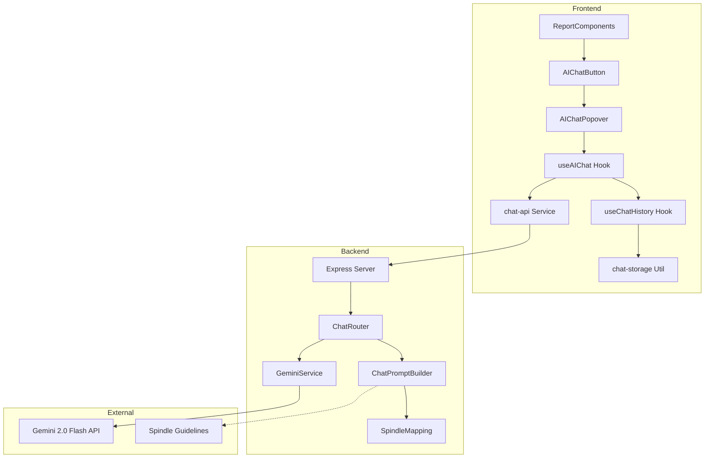
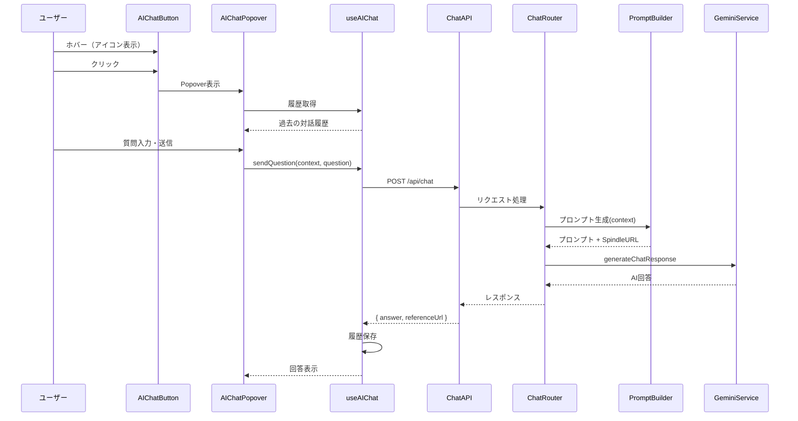
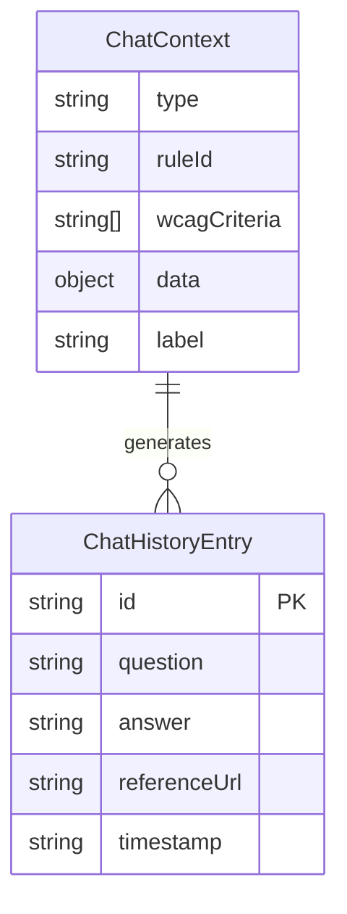

# Technical Design: inline-ai-discussion

## Overview

**Purpose**: 本機能は、アクセシビリティレポート画面にインラインAI対話機能を追加し、開発者・QAエンジニアがレポート内の各項目（スコア、違反、推奨事項など）について、画面遷移なしにAIへ質問できる体験を提供する。

**Users**: 開発者、QAエンジニア、アクセシビリティ担当者が、レポート確認中にWCAG基準や違反の意味、修正方法を即座に確認するために利用する。

**Impact**: 既存のレポート表示コンポーネント（ScoreCard, ViolationsTable等）に対話ポイントを追加し、新規のチャットAPI（`POST /api/chat`）とSpindleマッピングデータを導入する。

### Goals

- レポート内の全ての主要項目（スコア、違反、推奨事項など）に対話ポイントを設置
- FigmaコメントのようなコンパクトなポップオーバーUIで質問・回答を表示
- Spindleガイドラインを参照元としてAIハルシネーションを防止
- キーボード操作・スクリーンリーダー対応によるアクセシビリティ確保

### Non-Goals

- 対話履歴の永続化（ブラウザセッション内のみ）
- リアルタイムストリーミング応答（同期応答のみ）
- 画像・スクリーンショットを含む質問対応
- 複数レポート間での対話履歴共有

## Architecture

### Existing Architecture Analysis

- **現在のパターン**: フロントエンド（React + MUI）とバックエンド（Express）の分離構成
- **既存ドメイン境界**: `analyzers/`がアクセシビリティツールラッパー、`services/gemini.ts`がAI統合
- **維持する統合ポイント**: GeminiService、既存のAPI通信パターン（fetch + ApiError）
- **対処する技術的課題**: MUI Popover未使用（Dialogパターンを参考に実装）

### Architecture Pattern & Boundary Map



**Architecture Integration**:

- **Selected pattern**: 関心分離型コンポーネント設計 - 対話機能を独立したコンポーネント群として実装
- **Domain boundaries**: 対話UI（AIChatButton, AIChatPopover）、対話ロジック（useAIChat, useChatHistory）、API通信（chat-api）、ストレージ（chat-storage）を明確に分離
- **Existing patterns preserved**: GeminiService拡張、Express Router追加、MUIコンポーネント使用
- **New components rationale**: 既存レポートコンポーネントの肥大化を防ぎ、テスト容易性を確保
- **Steering compliance**: TypeScript型安全性、フロントエンド・バックエンド分離構成を維持

### Technology Stack

| Layer | Choice / Version | Role in Feature | Notes |
|-------|------------------|-----------------|-------|
| Frontend | React 19 + MUI 6 | Popover UI、状態管理 | 既存スタック活用 |
| Frontend Storage | sessionStorage API | 対話履歴の一時保存 | ブラウザ標準API |
| Backend | Express 5 | `/api/chat`エンドポイント | 既存サーバー拡張 |
| AI | Gemini 2.0 Flash | 対話応答生成 | 既存GeminiService拡張 |
| Data | TypeScript Object | Spindleマッピングデータ | JSONファイルでも可 |

## System Flows

### 対話フロー



**Key Decisions**:

- Popoverは`onClose`でフォーカスをトリガー要素に戻す
- API呼び出し中はローディング状態を表示し、送信ボタンを無効化
- エラー時は再試行ボタンを表示

## Requirements Traceability

| Requirement | Summary | Components | Interfaces | Flows |
|-------------|---------|------------|------------|-------|
| 1.1-1.6 | インラインコメントUI | AIChatButton, AIChatPopover | - | 対話フロー |
| 2.1-2.6 | コンテキスト付きAI対話 | useAIChat, ChatRouter, PromptBuilder | ChatRequest, ChatResponse | 対話フロー |
| 3.1-3.5 | 対話履歴管理 | useChatHistory, chat-storage | ChatHistory | - |
| 4.1-4.12 | 対話可能ポイント実装 | AIChatButton（各コンポーネントに配置） | ChatContext | - |
| 5.1-5.5 | ローディング・エラー状態 | AIChatPopover, useAIChat | - | 対話フロー |
| 6.1-6.6 | アクセシビリティ対応 | AIChatButton, AIChatPopover | - | - |
| 7.1-7.6 | バックエンドAPI | ChatRouter | ChatRequest, ChatResponse | 対話フロー |
| 8.1-8.6 | Spindleマッピング | SpindleMapping, PromptBuilder | SpindleMap | - |
| 9.1-9.8 | プロンプトエンジニアリング | PromptBuilder | PromptTemplate | - |

## Components and Interfaces

| Component | Domain/Layer | Intent | Req Coverage | Key Dependencies | Contracts |
|-----------|--------------|--------|--------------|-----------------|-----------|
| AIChatButton | Frontend/UI | 対話ポイントのトリガーボタン | 1.1, 1.5, 4.1-4.12, 6.1 | AIChatPopover (P0) | State |
| AIChatPopover | Frontend/UI | 対話UI（入力・履歴・回答表示） | 1.2-1.6, 5.1-5.5, 6.2-6.6 | useAIChat (P0) | State |
| useAIChat | Frontend/Hook | 対話状態・API呼び出し管理 | 2.1, 5.1-5.5 | chat-api (P0), useChatHistory (P1) | Service |
| useChatHistory | Frontend/Hook | 履歴管理（sessionStorage） | 3.1-3.5 | chat-storage (P0) | State |
| chat-api | Frontend/Service | バックエンドAPI呼び出し | 2.1 | - | API |
| chat-storage | Frontend/Util | sessionStorage操作 | 3.1, 3.4, 3.5 | - | - |
| ChatRouter | Backend/Route | `/api/chat`エンドポイント | 7.1-7.6 | PromptBuilder (P0), GeminiService (P0) | API |
| PromptBuilder | Backend/Service | コンテキスト別プロンプト生成 | 9.1-9.8 | SpindleMapping (P0) | Service |
| SpindleMapping | Backend/Data | WCAG・ルールID→URL対応表 | 8.1-8.6 | - | - |

### Frontend / UI Layer

#### AIChatButton

| Field | Detail |
|-------|--------|
| Intent | 対話可能な項目にホバー時表示するコメントアイコンボタン |
| Requirements | 1.1, 1.5, 4.1-4.12, 6.1 |

**Responsibilities & Constraints**

- ホバー時にアイコン表示、クリックでPopover開閉
- 対話履歴件数のバッジ表示
- `aria-label`, `aria-expanded`, `aria-controls`の設定
- キーボードフォーカス・Enterキー対応

**Dependencies**

- Outbound: AIChatPopover — Popover表示制御 (P0)
- Outbound: useChatHistory — 履歴件数取得 (P1)

**Contracts**: State [x]

##### Props Interface

```typescript
interface ChatContext {
  type: 'score' | 'lighthouse' | 'violation' | 'pass' | 'incomplete' | 'improvement' | 'recommendation' | 'issue' | 'wcag';
  ruleId?: string;
  wcagCriteria?: string[];
  data: Record<string, unknown>;
  label: string;  // 表示用ラベル（例：「コントラスト比」）
}

interface AIChatButtonProps {
  context: ChatContext;
  size?: 'small' | 'medium';
  className?: string;
}
```

**Implementation Notes**

- Integration: 各レポートコンポーネント（ScoreCard, ViolationsTable等）内でインライン配置
- Validation: `context.type`が有効な値かチェック
- Risks: 対話ポイントが多すぎるとUI煩雑化 → ホバー時のみ表示で対応

#### AIChatPopover

| Field | Detail |
|-------|--------|
| Intent | 質問入力・履歴表示・回答表示を行うポップオーバーUI |
| Requirements | 1.2-1.6, 5.1-5.5, 6.2-6.6 |

**Responsibilities & Constraints**

- MUI Popoverを使用し、アンカー要素の近くに表示
- 質問入力フィールド、送信ボタン、閉じるボタンを含む
- 最大幅400px、最大高さ500px、オーバーフロー時スクロール
- 外側クリック・Escapeキーで閉じる
- 開閉時のフォーカス管理（開: 入力フィールド、閉: トリガー）

**Dependencies**

- Inbound: AIChatButton — 開閉制御 (P0)
- Outbound: useAIChat — 質問送信・回答取得 (P0)

**Contracts**: State [x]

##### Props Interface

```typescript
interface AIChatPopoverProps {
  open: boolean;
  anchorEl: HTMLElement | null;
  context: ChatContext;
  onClose: () => void;
}
```

**Implementation Notes**

- Integration: `aria-labelledby`, `aria-describedby`, `role="dialog"`, `aria-modal="true"`を設定
- Validation: 空の質問は送信不可
- Risks: 画面端での表示位置 → MUIの`anchorOrigin`/`transformOrigin`で自動調整

### Frontend / Hook Layer

#### useAIChat

| Field | Detail |
|-------|--------|
| Intent | 対話API呼び出しと状態管理（ローディング、エラー、回答） |
| Requirements | 2.1, 5.1-5.5 |

**Responsibilities & Constraints**

- `sendQuestion`関数でAPI呼び出し
- ローディング状態、エラー状態、回答の管理
- 再試行機能の提供
- 履歴への追加（useChatHistoryと連携）

**Dependencies**

- Outbound: chat-api — API呼び出し (P0)
- Outbound: useChatHistory — 履歴保存 (P1)

**Contracts**: Service [x]

##### Service Interface

```typescript
interface UseAIChatResult {
  isLoading: boolean;
  error: ChatError | null;
  lastAnswer: ChatAnswer | null;
  sendQuestion: (context: ChatContext, question: string) => Promise<void>;
  retry: () => Promise<void>;
  clearError: () => void;
}

interface ChatAnswer {
  answer: string;
  referenceUrl?: string;
  generatedAt: string;
}

interface ChatError {
  type: 'timeout' | 'rate_limit' | 'server' | 'network';
  message: string;
  retryAfter?: number;  // rate_limit時のみ
}
```

#### useChatHistory

| Field | Detail |
|-------|--------|
| Intent | 項目ごとの対話履歴管理（sessionStorage） |
| Requirements | 3.1-3.5 |

**Responsibilities & Constraints**

- `contextKey`（type + ruleId等から生成）ごとに履歴を管理
- 最大20件、超過時は古い履歴から削除
- sessionStorageへの保存・読み込み

**Dependencies**

- Outbound: chat-storage — ストレージ操作 (P0)

**Contracts**: State [x]

##### State Interface

```typescript
interface ChatHistoryEntry {
  id: string;
  question: string;
  answer: string;
  referenceUrl?: string;
  timestamp: string;
}

interface UseChatHistoryResult {
  history: ChatHistoryEntry[];
  historyCount: number;
  addEntry: (question: string, answer: ChatAnswer) => void;
  clearHistory: () => void;
}
```

### Frontend / Service Layer

#### chat-api

| Field | Detail |
|-------|--------|
| Intent | バックエンドチャットAPIへのHTTPリクエスト |
| Requirements | 2.1 |

**Dependencies**

- External: Backend `/api/chat` (P0)

**Contracts**: API [x]

##### API Contract

| Method | Endpoint | Request | Response | Errors |
|--------|----------|---------|----------|--------|
| POST | /api/chat | ChatRequest | ChatResponse | 400, 429, 500, 504 |

```typescript
interface ChatRequest {
  context: {
    type: string;
    ruleId?: string;
    wcagCriteria?: string[];
    data: Record<string, unknown>;
  };
  question: string;
}

interface ChatResponse {
  answer: string;
  referenceUrl?: string;
  generatedAt: string;
}
```

### Backend / Route Layer

#### ChatRouter

| Field | Detail |
|-------|--------|
| Intent | `/api/chat`エンドポイントの提供 |
| Requirements | 7.1-7.6 |

**Responsibilities & Constraints**

- リクエストバリデーション（context, question必須）
- PromptBuilderでプロンプト生成
- GeminiServiceで回答生成
- エラーハンドリング（タイムアウト、レート制限）

**Dependencies**

- Outbound: PromptBuilder — プロンプト生成 (P0)
- Outbound: GeminiService — AI呼び出し (P0)

**Contracts**: API [x]

##### API Contract

| Method | Endpoint | Request | Response | Errors |
|--------|----------|---------|----------|--------|
| POST | /api/chat | ChatRequest | ChatResponse | 400 (validation), 429 (rate limit), 504 (timeout), 500 (server) |

**Implementation Notes**

- Integration: `server/index.ts`に`app.use('/api/chat', createChatRouter())`を追加
- Validation: `context.type`が許可リストに含まれるか確認
- Risks: Geminiレート制限 → エラーメッセージで再試行待機時間を案内

### Backend / Service Layer

#### PromptBuilder

| Field | Detail |
|-------|--------|
| Intent | コンテキストタイプに応じたプロンプトテンプレート生成 |
| Requirements | 9.1-9.8 |

**Responsibilities & Constraints**

- タイプ別プロンプトテンプレート（violation, score, wcag等）
- Spindle参照URLの埋め込み
- 回答制約（日本語、300文字以内、推測禁止）の指示

**Dependencies**

- Outbound: SpindleMapping — URL取得 (P0)

**Contracts**: Service [x]

##### Service Interface

```typescript
interface PromptBuilderService {
  buildPrompt(context: ChatContext, question: string): BuiltPrompt;
}

interface BuiltPrompt {
  systemPrompt: string;
  userPrompt: string;
  referenceUrl: string;
}
```

**Prompt Template Example** (violation type):

```
あなたはWebアクセシビリティの専門家です。
以下のSpindleガイドラインを参照元として回答してください: {referenceUrl}

ユーザーは「{ruleId}」（WCAG {wcagCriteria}）という違反について質問しています。
違反の説明: {description}

質問: {question}

回答のルール:
- 日本語で300文字以内で簡潔に回答してください
- 参照元に記載のない情報は推測せず、「詳細はガイドラインをご確認ください」と案内してください
- 具体的な修正例を含めてください
- 回答の最後に参照元のURLを記載してください
```

### Backend / Data Layer

#### SpindleMapping

| Field | Detail |
|-------|--------|
| Intent | WCAG基準・ルールIDとSpindle URLの対応表 |
| Requirements | 8.1-8.6 |

**Responsibilities & Constraints**

- WCAG基準（1.1.1, 1.4.3等）→ Spindle URL
- ルールID（color-contrast, image-alt等）→ Spindle URL
- マッピングがない場合はフォールバックURL（トップページ）を返却

**Contracts**: Service [x]

##### Data Structure

```typescript
interface SpindleMappingService {
  getUrlForWcag(criterion: string): string;
  getUrlForRuleId(ruleId: string): string;
  getUrlForContext(context: ChatContext): string;
}

const SPINDLE_BASE_URL = 'https://a11y-guidelines.ameba.design';
const SPINDLE_FALLBACK_URL = SPINDLE_BASE_URL;

// 初期マッピングデータ（段階的に拡充）
const wcagToSpindleMap: Record<string, string> = {
  '1.1.1': `${SPINDLE_BASE_URL}/1/non-text-content/`,
  '1.4.3': `${SPINDLE_BASE_URL}/1/contrast-minimum/`,
  '2.4.4': `${SPINDLE_BASE_URL}/2/link-purpose/`,
  // ... 他のマッピング
};

const ruleIdToSpindleMap: Record<string, string> = {
  'color-contrast': `${SPINDLE_BASE_URL}/1/contrast-minimum/`,
  'image-alt': `${SPINDLE_BASE_URL}/1/non-text-content/`,
  // ... 他のマッピング
};
```

## Data Models

### Domain Model



**Aggregates**: `ChatHistory`（sessionStorageに保存される履歴集合、contextKeyで識別）

**Invariants**:

- 各contextKeyにつき最大20件の履歴
- 履歴はタイムスタンプ降順でソート

### Logical Data Model

**sessionStorage Structure**:

```
Key: `a11y_chat_history_{contextKey}`
Value: JSON.stringify(ChatHistoryEntry[])
```

**contextKey生成ルール**:

```typescript
function generateContextKey(context: ChatContext): string {
  const parts = [context.type];
  if (context.ruleId) parts.push(context.ruleId);
  if (context.wcagCriteria?.length) parts.push(context.wcagCriteria.join('-'));
  return parts.join('_');
}
// 例: "violation_color-contrast_1.4.3"
```

## Error Handling

### Error Strategy

- **フェイルファスト**: 入力バリデーションは送信前にチェック
- **グレースフルデグラデーション**: API障害時も履歴閲覧は可能
- **ユーザーコンテキスト**: 技術詳細を隠し、アクション可能なメッセージを表示

### Error Categories and Responses

| Error Type | HTTP Status | User Message | Recovery Action |
|------------|-------------|--------------|-----------------|
| Validation Error | 400 | 「質問を入力してください」 | 入力を促す |
| Timeout | 504 | 「回答の生成に時間がかかっています。再度お試しください」 | 再試行ボタン |
| Rate Limit | 429 | 「リクエストが多すぎます。{n}秒後にお試しください」 | 待機後再試行 |
| Server Error | 500 | 「サーバーエラーが発生しました。しばらくしてからお試しください」 | 再試行ボタン |
| Network Error | - | 「ネットワーク接続を確認してください」 | 再試行ボタン |

### Monitoring

- Gemini API呼び出しの成功/失敗率をログ
- タイムアウト・レート制限発生頻度を監視
- 平均応答時間の計測

## Testing Strategy

### Unit Tests

- `PromptBuilder.buildPrompt`: 各タイプのプロンプト生成確認
- `SpindleMapping.getUrlForContext`: マッピング・フォールバック確認
- `useChatHistory`: 履歴追加・上限・削除の動作
- `generateContextKey`: キー生成ロジック

### Integration Tests

- `ChatRouter` + `PromptBuilder` + `GeminiService`: エンドツーエンド対話フロー
- `useAIChat` + `chat-api`: フロントエンドからのAPI呼び出し
- sessionStorage保存・復元の動作確認

### E2E/UI Tests

- 対話ボタンのホバー表示・クリック開閉
- 質問入力・送信・回答表示のフロー
- キーボードナビゲーション（Tab, Enter, Escape）
- スクリーンリーダーでの読み上げ確認

## Security Considerations

- **入力サニタイズ**: 質問文のXSS対策（React標準のエスケープ）
- **APIレート制限**: Gemini API側の制限に加え、フロントエンドでの連続送信防止
- **セッションストレージ**: 機密情報は保存しない（質問・回答のみ）

## Performance & Scalability

- **Target Metrics**: API応答時間 < 5秒（Gemini依存）
- **Optimization**: 履歴はsessionStorageでローカル管理、サーバー負荷なし
- **Lazy Loading**: 対話ポップオーバーは開かれるまでDOMに追加しない
