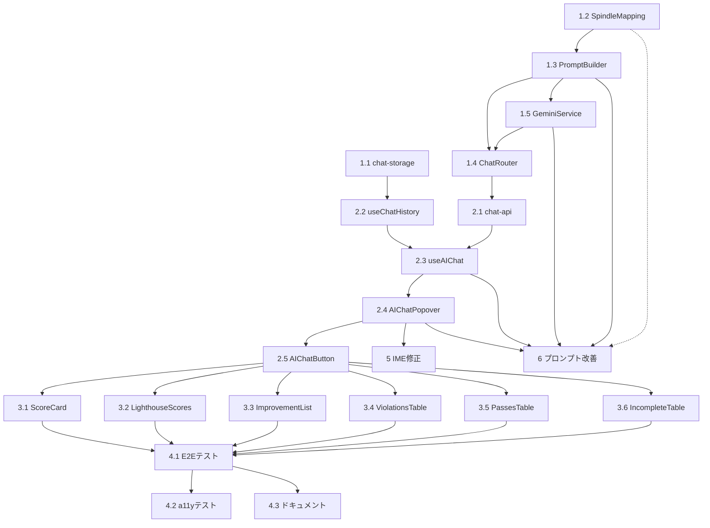

# Implementation Tasks: inline-ai-discussion

## Overview

本タスクリストは、インラインAI対話機能の実装を段階的に進めるためのチェックリストです。各タスクはTDD（テスト駆動開発）手法に従い、テストファーストで実装します。

### Task Execution Guidelines

- 各タスクは「テスト作成 → 実装 → リファクタリング」のサイクルで進める
- (P)マーカーのタスクは並列実行可能
- 依存関係のあるタスクは順次実行
- 各タスクの完了後、関連するE2Eテストで動作確認

---

## Phase 1: 基盤コンポーネント

### Task 1.1: sessionStorageユーティリティ実装 (P)

**Requirements Covered**: 3.1, 3.4, 3.5

**File**: `frontend/src/utils/chat-storage.ts`

**Acceptance Criteria**:

- [x] 1.1.1: `generateContextKey(context: ChatContext): string`関数を実装し、コンテキストから一意のキーを生成する
- [x] 1.1.2: `getHistory(contextKey: string): ChatHistoryEntry[]`関数を実装し、sessionStorageから履歴を取得する
- [x] 1.1.3: `saveHistory(contextKey: string, history: ChatHistoryEntry[]): void`関数を実装し、履歴を保存する
- [x] 1.1.4: 履歴が20件を超える場合、古いエントリから削除する機能を実装
- [x] 1.1.5: キー名は`a11y_chat_history_{contextKey}`形式とする
- [x] 1.1.6: 単体テストで全関数の動作を検証

**Tests**:

```typescript
// frontend/src/utils/chat-storage.test.ts
describe('chat-storage', () => {
  describe('generateContextKey', () => {
    it('should generate key from type only');
    it('should include ruleId when present');
    it('should include wcagCriteria when present');
  });
  describe('getHistory', () => {
    it('should return empty array when no history');
    it('should return parsed history from sessionStorage');
  });
  describe('saveHistory', () => {
    it('should save history to sessionStorage');
    it('should truncate to 20 entries when exceeding limit');
  });
});
```

---

### Task 1.2: Spindleマッピングデータ実装 (P)

**Requirements Covered**: 8.1, 8.2, 8.3, 8.5

**File**: `server/data/spindle-mapping.ts`

**Acceptance Criteria**:

- [x] 1.2.1: `SPINDLE_BASE_URL`定数を定義（`https://a11y-guidelines.ameba.design`）
- [x] 1.2.2: `wcagToSpindleMap: Record<string, string>`でWCAG基準→URLマッピングを定義（主要10基準以上）
- [x] 1.2.3: `ruleIdToSpindleMap: Record<string, string>`でルールID→URLマッピングを定義（主要15ルール以上）
- [x] 1.2.4: `getUrlForWcag(criterion: string): string`関数を実装
- [x] 1.2.5: `getUrlForRuleId(ruleId: string): string`関数を実装
- [x] 1.2.6: `getUrlForContext(context: ChatContext): string`関数を実装（ruleId優先、なければwcag、なければフォールバック）
- [x] 1.2.7: マッピングがない場合はフォールバックURL（トップページ）を返却
- [x] 1.2.8: 単体テストで全関数の動作を検証

**Tests**:

```typescript
// server/data/spindle-mapping.test.ts
describe('SpindleMapping', () => {
  describe('getUrlForWcag', () => {
    it('should return mapped URL for known WCAG criterion');
    it('should return fallback URL for unknown criterion');
  });
  describe('getUrlForRuleId', () => {
    it('should return mapped URL for known rule ID');
    it('should return fallback URL for unknown rule ID');
  });
  describe('getUrlForContext', () => {
    it('should prioritize ruleId over wcagCriteria');
    it('should use wcagCriteria when ruleId not present');
    it('should return fallback when neither present');
  });
});
```

---

### Task 1.3: プロンプトビルダー実装 (P)

**Requirements Covered**: 9.1, 9.2, 9.3, 9.4, 9.5, 9.6, 9.7, 9.8

**File**: `server/services/chat-prompt.ts`

**Acceptance Criteria**:

- [x] 1.3.1: `PromptBuilder`クラスまたは関数を作成
- [x] 1.3.2: `buildPrompt(context: ChatContext, question: string): BuiltPrompt`関数を実装
- [x] 1.3.3: 違反（violation）用テンプレートを実装（ルールID、WCAG基準、修正例指示を含む）
- [x] 1.3.4: スコア（score, lighthouse）用テンプレートを実装（算出根拠、改善アドバイス指示を含む）
- [x] 1.3.5: WCAG基準（wcag）用テンプレートを実装（達成基準の説明指示を含む）
- [x] 1.3.6: 改善提案（improvement, recommendation, issue）用テンプレートを実装
- [x] 1.3.7: 共通指示（日本語、300文字以内、推測禁止、参照URL必須）を全テンプレートに含める
- [x] 1.3.8: SpindleMappingと連携してreferenceUrlを取得
- [x] 1.3.9: 単体テストで各タイプのプロンプト生成を検証

**Tests**:

```typescript
// server/services/chat-prompt.test.ts
describe('PromptBuilder', () => {
  describe('buildPrompt', () => {
    it('should generate violation prompt with ruleId and WCAG criteria');
    it('should generate score prompt with improvement advice instruction');
    it('should generate wcag prompt with criterion explanation instruction');
    it('should include common instructions in all prompts');
    it('should include reference URL from SpindleMapping');
  });
});
```

---

### Task 1.4: チャットAPI（バックエンド）実装

**Requirements Covered**: 7.1, 7.2, 7.3, 7.4, 7.5, 7.6, 2.2, 2.3, 2.4, 2.5, 2.6

**File**: `server/routes/chat.ts`

**Dependencies**: Task 1.2, Task 1.3

**Acceptance Criteria**:

- [x] 1.4.1: `POST /api/chat`エンドポイントを作成
- [x] 1.4.2: リクエストボディのバリデーション（context, question必須）を実装
- [x] 1.4.3: `context.type`が許可リスト（score, lighthouse, violation, pass, incomplete, improvement, recommendation, issue, wcag）に含まれるか検証
- [x] 1.4.4: PromptBuilderでプロンプトを生成
- [x] 1.4.5: GeminiServiceの新関数`generateChatResponse`を呼び出し
- [x] 1.4.6: レスポンス形式`{ answer, referenceUrl, generatedAt }`を返却
- [x] 1.4.7: タイムアウト（30秒）時は504を返却
- [x] 1.4.8: レート制限時は429と`retryAfter`を返却
- [x] 1.4.9: バリデーションエラー時は400を返却
- [x] 1.4.10: `server/index.ts`にルートを登録
- [x] 1.4.11: 統合テストでエンドツーエンドフローを検証

**Tests**:

```typescript
// server/routes/chat.test.ts
describe('ChatRouter', () => {
  describe('POST /api/chat', () => {
    it('should return 400 when context is missing');
    it('should return 400 when question is missing');
    it('should return 400 when context.type is invalid');
    it('should return answer with referenceUrl on success');
    it('should return 504 on timeout');
    it('should return 429 with retryAfter on rate limit');
  });
});
```

---

### Task 1.5: GeminiService拡張

**Requirements Covered**: 2.2, 7.5

**File**: `server/services/gemini.ts`

**Dependencies**: Task 1.3

**Acceptance Criteria**:

- [x] 1.5.1: `generateChatResponse(systemPrompt: string, userPrompt: string): Promise<string>`関数を追加
- [x] 1.5.2: 既存のタイムアウト設定（30秒）、リトライ設定（3回）を再利用
- [x] 1.5.3: 既存のエラーハンドリング（GeminiError）を再利用
- [x] 1.5.4: レート制限エラー時に`retryAfter`情報を含める
- [x] 1.5.5: 単体テストで成功・エラーケースを検証

**Tests**:

```typescript
// server/services/gemini.test.ts (追加)
describe('GeminiService', () => {
  describe('generateChatResponse', () => {
    it('should return response on success');
    it('should throw GeminiError on timeout');
    it('should throw GeminiError with retryAfter on rate limit');
  });
});
```

---

## Phase 2: フロントエンドコアコンポーネント

### Task 2.1: チャットAPIクライアント実装 (P)

**Requirements Covered**: 2.1

**File**: `frontend/src/services/chat-api.ts`

**Acceptance Criteria**:

- [x] 2.1.1: `sendChatRequest(request: ChatRequest): Promise<ChatResponse>`関数を実装
- [x] 2.1.2: 既存のAPI通信パターン（fetch + AbortSignal.timeout）を使用
- [x] 2.1.3: エラー時はApiErrorをスロー（type: timeout, rate_limit, server, network）
- [x] 2.1.4: レート制限時は`retryAfter`をエラーに含める
- [x] 2.1.5: 単体テストでモックAPIを使用して検証

**Tests**:

```typescript
// frontend/src/services/chat-api.test.ts
describe('chat-api', () => {
  describe('sendChatRequest', () => {
    it('should return response on success');
    it('should throw ApiError with type timeout on 504');
    it('should throw ApiError with type rate_limit and retryAfter on 429');
    it('should throw ApiError with type server on 500');
  });
});
```

---

### Task 2.2: useChatHistoryフック実装 (P)

**Requirements Covered**: 3.1, 3.2, 3.3, 3.4, 3.5

**File**: `frontend/src/hooks/useChatHistory.ts`

**Dependencies**: Task 1.1

**Acceptance Criteria**:

- [x] 2.2.1: `useChatHistory(context: ChatContext)`フックを実装
- [x] 2.2.2: `history: ChatHistoryEntry[]`を返却（時系列順）
- [x] 2.2.3: `historyCount: number`を返却
- [x] 2.2.4: `addEntry(question: string, answer: ChatAnswer): void`関数を返却
- [x] 2.2.5: `clearHistory(): void`関数を返却
- [x] 2.2.6: コンテキスト変更時に履歴を再読み込み
- [x] 2.2.7: 単体テストで全機能を検証

**Tests**:

```typescript
// frontend/src/hooks/useChatHistory.test.ts
describe('useChatHistory', () => {
  it('should return empty history initially');
  it('should add entry to history');
  it('should return correct historyCount');
  it('should reload history when context changes');
  it('should clear history');
});
```

---

### Task 2.3: useAIChatフック実装

**Requirements Covered**: 2.1, 5.1, 5.2, 5.3, 5.4

**File**: `frontend/src/hooks/useAIChat.ts`

**Dependencies**: Task 2.1, Task 2.2

**Acceptance Criteria**:

- [x] 2.3.1: `useAIChat(context: ChatContext)`フックを実装
- [x] 2.3.2: `isLoading: boolean`状態を管理
- [x] 2.3.3: `error: ChatError | null`状態を管理
- [x] 2.3.4: `lastAnswer: ChatAnswer | null`状態を管理
- [x] 2.3.5: `sendQuestion(question: string): Promise<void>`関数を実装
- [x] 2.3.6: `retry(): Promise<void>`関数を実装（前回の質問を再送信）
- [x] 2.3.7: `clearError(): void`関数を実装
- [x] 2.3.8: 送信成功時にuseChatHistoryの`addEntry`を呼び出し
- [x] 2.3.9: 単体テストで全状態遷移を検証

**Tests**:

```typescript
// frontend/src/hooks/useAIChat.test.ts
describe('useAIChat', () => {
  it('should set isLoading true while sending');
  it('should set lastAnswer on success');
  it('should set error on failure');
  it('should retry with previous question');
  it('should add entry to history on success');
  it('should clear error');
});
```

---

### Task 2.4: AIChatPopoverコンポーネント実装

**Requirements Covered**: 1.2, 1.3, 1.4, 1.6, 5.1, 5.2, 5.3, 5.4, 5.5, 6.2, 6.3, 6.4, 6.5, 6.6

**File**: `frontend/src/components/AIChatPopover.tsx`

**Dependencies**: Task 2.3

**Acceptance Criteria**:

- [x] 2.4.1: MUI Popoverを使用してコンポーネントを作成
- [x] 2.4.2: 質問入力フィールド（TextField）を実装
- [x] 2.4.3: 送信ボタン（IconButton）を実装
- [x] 2.4.4: 閉じるボタンを実装
- [x] 2.4.5: 対話履歴を時系列で表示（ユーザー質問とAI回答を視覚的に区別）
- [x] 2.4.6: ローディング中はスピナーと「回答を生成中...」を表示
- [x] 2.4.7: ローディング中は送信ボタンを無効化
- [x] 2.4.8: エラー時はエラーメッセージと再試行ボタンを表示
- [x] 2.4.9: 最大幅400px、最大高さ500pxを設定
- [x] 2.4.10: オーバーフロー時はスクロール可能に設定
- [x] 2.4.11: 外側クリックで閉じる（`onClose`呼び出し）
- [x] 2.4.12: Escapeキーで閉じる
- [x] 2.4.13: 開いた時に入力フィールドにフォーカス
- [x] 2.4.14: 閉じた時にトリガー要素にフォーカスを戻す（`onClose`で処理）
- [x] 2.4.15: `role="dialog"`, `aria-modal="true"`, `aria-labelledby`を設定
- [x] 2.4.16: AI回答に`aria-live="polite"`を設定
- [x] 2.4.17: 参照URLをリンクとして表示
- [x] 2.4.18: 単体テストで全UI動作を検証

**Tests**:

```typescript
// frontend/src/components/AIChatPopover.test.tsx
describe('AIChatPopover', () => {
  it('should render input field, send button, and close button');
  it('should display chat history');
  it('should show loading state while sending');
  it('should disable send button while loading');
  it('should show error message and retry button on error');
  it('should close on outside click');
  it('should close on Escape key');
  it('should focus input field when opened');
  it('should have correct ARIA attributes');
  it('should display reference URL as link');
});
```

---

### Task 2.5: AIChatButtonコンポーネント実装

**Requirements Covered**: 1.1, 1.5, 6.1, 4.12

**File**: `frontend/src/components/AIChatButton.tsx`

**Dependencies**: Task 2.4

**Acceptance Criteria**:

- [x] 2.5.1: ホバー時にコメントアイコン（CommentIcon）を表示
- [x] 2.5.2: クリックでAIChatPopoverを開閉
- [x] 2.5.3: 対話履歴がある場合はバッジ（Badge）で件数を表示
- [x] 2.5.4: キーボードフォーカス可能（tabIndex=0）
- [x] 2.5.5: Enterキーで開閉
- [x] 2.5.6: `aria-label="この項目についてAIに質問する"`を設定
- [x] 2.5.7: `aria-expanded`と`aria-controls`を設定
- [x] 2.5.8: `size`プロパティ（small/medium）に対応
- [x] 2.5.9: Popover閉じた時にフォーカスを戻す
- [x] 2.5.10: 単体テストで全動作を検証

**Tests**:

```typescript
// frontend/src/components/AIChatButton.test.tsx
describe('AIChatButton', () => {
  it('should show icon on hover');
  it('should open popover on click');
  it('should close popover on second click');
  it('should show badge with history count');
  it('should be keyboard focusable');
  it('should open/close on Enter key');
  it('should have correct aria-label');
  it('should have correct aria-expanded and aria-controls');
  it('should return focus on popover close');
});
```

---

## Phase 3: コンポーネント統合

### Task 3.1: ScoreCard統合

**Requirements Covered**: 4.1, 4.2

**File**: `frontend/src/components/ScoreCard.tsx`

**Dependencies**: Task 2.5

**Acceptance Criteria**:

- [x] 3.1.1: 総合スコア表示部にAIChatButtonを追加
- [x] 3.1.2: 各カテゴリ別スコア（WCAG基準別）にAIChatButtonを追加
- [x] 3.1.3: コンテキストに`type: 'score'`と該当データを設定
- [x] 3.1.4: 既存のスタイルを崩さない配置
- [x] 3.1.5: 統合テストで対話フローを検証

---

### Task 3.2: LighthouseScores統合

**Requirements Covered**: 4.3

**File**: `frontend/src/components/LighthouseScores.tsx`

**Dependencies**: Task 2.5

**Acceptance Criteria**:

- [x] 3.2.1: Performance行にAIChatButtonを追加
- [x] 3.2.2: Accessibility行にAIChatButtonを追加
- [x] 3.2.3: Best Practices行にAIChatButtonを追加
- [x] 3.2.4: SEO行にAIChatButtonを追加
- [x] 3.2.5: コンテキストに`type: 'lighthouse'`と該当スコアデータを設定
- [x] 3.2.6: 統合テストで対話フローを検証

---

### Task 3.3: ImprovementList統合

**Requirements Covered**: 4.4, 4.5, 4.6, 4.7

**File**: `frontend/src/components/ImprovementList.tsx`

**Dependencies**: Task 2.5

**Acceptance Criteria**:

- [x] 3.3.1: 全体評価（overallAssessment）にAIChatButtonを追加
- [x] 3.3.2: 各優先改善ポイント項目にAIChatButtonを追加（`type: 'improvement'`）
- [x] 3.3.3: 各具体的な推奨事項にAIChatButtonを追加（`type: 'recommendation'`）
- [x] 3.3.4: 各検出問題（detectedIssue）にAIChatButtonを追加（`type: 'issue'`）
- [x] 3.3.5: 各項目のコンテキストに該当データを設定
- [x] 3.3.6: 統合テストで対話フローを検証

---

### Task 3.4: ViolationsTable統合

**Requirements Covered**: 4.8, 4.11

**File**: `frontend/src/components/ViolationsTable.tsx`

**Dependencies**: Task 2.5

**Acceptance Criteria**:

- [x] 3.4.1: 各違反行にAIChatButtonを追加
- [x] 3.4.2: コンテキストに`type: 'violation'`、`ruleId`、`wcagCriteria`を設定
- [x] 3.4.3: WCAG基準表示部分に個別のAIChatButtonを追加（`type: 'wcag'`）
- [x] 3.4.4: テーブルレイアウトを崩さない配置
- [x] 3.4.5: 統合テストで対話フローを検証

---

### Task 3.5: PassesTable統合 (P)

**Requirements Covered**: 4.9

**File**: `frontend/src/components/PassesTable.tsx`

**Dependencies**: Task 2.5

**Acceptance Criteria**:

- [x] 3.5.1: 各パス行にAIChatButtonを追加
- [x] 3.5.2: コンテキストに`type: 'pass'`、`ruleId`を設定
- [x] 3.5.3: テーブルレイアウトを崩さない配置
- [x] 3.5.4: 統合テストで対話フローを検証

---

### Task 3.6: IncompleteTable統合 (P)

**Requirements Covered**: 4.10

**File**: `frontend/src/components/IncompleteTable.tsx`

**Dependencies**: Task 2.5

**Acceptance Criteria**:

- [x] 3.6.1: 各要確認行にAIChatButtonを追加
- [x] 3.6.2: コンテキストに`type: 'incomplete'`、`ruleId`を設定
- [x] 3.6.3: テーブルレイアウトを崩さない配置
- [x] 3.6.4: 統合テストで対話フローを検証

---

## Phase 4: E2Eテスト・仕上げ

### Task 4.1: E2Eテスト作成

**Requirements Covered**: 全要件

**File**: `tests/e2e/ai-chat.spec.ts`

**Dependencies**: Phase 1-3完了

**Acceptance Criteria**:

- [x] 4.1.1: 違反行での対話フロー（ホバー→クリック→質問入力→送信→回答表示→閉じる）をテスト
- [x] 4.1.2: スコア項目での対話フローをテスト
- [x] 4.1.3: 履歴の保持と再表示をテスト
- [x] 4.1.4: エラー時の再試行フローをテスト
- [x] 4.1.5: キーボードナビゲーション（Tab, Enter, Escape）をテスト
- [x] 4.1.6: 複数対話ポイント間の遷移をテスト

---

### Task 4.2: アクセシビリティテスト

**Requirements Covered**: 6.1-6.6

**File**: `tests/accessibility/ai-chat-a11y.spec.ts`

**Dependencies**: Phase 1-3完了

**Acceptance Criteria**:

- [x] 4.2.1: axe-coreでAIChatButton、AIChatPopoverの自動テスト
- [x] 4.2.2: ARIA属性の正確性を検証
- [x] 4.2.3: フォーカス管理（開閉時のフォーカス移動）を検証
- [x] 4.2.4: スクリーンリーダー用の`aria-live`通知を検証

---

### Task 4.3: ドキュメント更新

**Requirements Covered**: -

**File**: `docs/features/ai-chat.md`（新規）

**Dependencies**: Phase 1-3完了

**Acceptance Criteria**:

- [x] 4.3.1: 機能概要の記載
- [x] 4.3.2: 使用方法の記載
- [x] 4.3.3: 対話ポイント一覧の記載
- [x] 4.3.4: Spindleマッピングの拡充方法の記載
- [x] 4.3.5: トラブルシューティングの記載

---

## Phase 5: バグ修正・改善

### Task 5: IME composing問題の修正

**Requirements Covered**: 11.1, 11.2

**File**: `frontend/src/components/AIChatPopover.tsx`

**Acceptance Criteria**:

- [x] 5.1: `handleInputKeyDown`に`e.nativeEvent.isComposing`チェックを追加
- [x] 5.2: `e.key === 'Process'`チェックを追加してIME状態を確実に検出
- [x] 5.3: IME変換中はEnterキーで送信しないことをテストで検証
- [x] 5.4: IME変換完了後にEnterキーで送信できることをテストで検証

**Implementation**:

```typescript
const handleInputKeyDown = (e: KeyboardEvent<HTMLInputElement>) => {
  // IME変換中は送信しない
  if (e.nativeEvent.isComposing || e.key === 'Process') {
    return;
  }
  if (e.key === 'Enter' && !e.shiftKey) {
    e.preventDefault();
    handleSubmit();
  }
};
```

**Tests**:

```typescript
// frontend/src/components/__tests__/AIChatPopover.test.tsx (追加)
describe('AIChatPopover IME handling', () => {
  it('should not submit when isComposing is true');
  it('should not submit when key is Process');
  it('should submit when isComposing is false and Enter is pressed');
});
```

---

### Task 6: プロンプト改善

**Requirements Covered**: 8.1-8.5, 9.1-9.5, 10.1-10.4

**Files**:

- `server/services/chat-prompt.ts`（改修）
- `server/services/gemini.ts`（Grounding対応）
- `server/data/spindle-mapping.ts`（削除）
- `frontend/src/components/AIChatPopover.tsx`（初期メッセージ表示）
- `frontend/src/hooks/useAIChat.ts`（初期メッセージ取得）

**Acceptance Criteria**:

- [x] 6.1: 5要素（前提、状況、目的、動機、制約）を含むプロンプトテンプレートを作成
- [x] 6.2: 「あなたは専門家です」型のロールプレイを削除
- [x] 6.3: Gemini Grounding（`tools: [{ googleSearch: {} }]`）を使用したWeb検索機能を実装
- [x] 6.4: `groundingMetadata.groundingChunks`から参照URLを取得
- [x] 6.5: SpindleMappingモジュールを削除
- [x] 6.6: `buildInitialMessagePrompt`関数を追加（ユーザーインパクト説明生成用）
- [x] 6.7: チャットを開いた瞬間にユーザーインパクト説明を自動取得・表示
- [x] 6.8: 「質問を入力してください」の代わりにユーザーインパクト説明を表示
- [x] 6.9: 単体テストを更新（SpindleMapping依存を削除、Grounding対応を追加）

**Tests**:

```typescript
// server/services/__tests__/chat-prompt.test.ts (更新)
describe('PromptBuilder (認知設計)', () => {
  it('should include 5 elements (前提、状況、目的、動機、制約)');
  it('should NOT include "あなたは専門家です" pattern');
  it('should build initial message prompt for user impact');
});

// server/services/__tests__/gemini.test.ts (追加)
describe('GeminiService Grounding', () => {
  it('should enable grounding with googleSearch tool');
  it('should extract reference URLs from groundingChunks');
  it('should handle missing grounding metadata');
});

// frontend/src/hooks/useAIChat.test.ts (追加)
describe('useAIChat initial message', () => {
  it('should fetch initial message when chat opens');
  it('should display user impact explanation');
});
```

---

### Task 7: プロンプトコンテキスト拡充

**Requirements Covered**: 9.1-9.5（プロンプトエンジニアリング）

**File**: `server/services/chat-prompt.ts`

**Background**:

- データソースaxe-core、pa11y、Lighthouseの分析であるという記述がプロンプトになかったため、AIが一般論で回答してしまう問題があった
- フロントエンドからバックエンドに渡されている`context.data`には`toolSource`、`impact`、`nodeCount`、`helpUrl`などの情報が含まれていたが、プロンプトで活用されていなかった

**Changes Made**:

1. `COMMON_PREMISE`にデータソース情報を追加
2. `buildSituationSection`を拡張してツールレスポンスの情報を含める
3. 各プロンプトビルダーでツール名を目的に明記

**Acceptance Criteria**:

- [x] 7.1: COMMON_PREMISEにデータソース情報（axe-core、pa11y、Lighthouse）を追加
- [x] 7.2: buildSituationSectionにtoolSource（検出ツール名）を含める
- [x] 7.3: buildSituationSectionにimpact（影響度）を含める（日本語変換付き）
- [x] 7.4: buildSituationSectionにnodeCount（検出ノード数）を含める
- [x] 7.5: buildSituationSectionにhelpUrl（参照ドキュメント）を含める
- [x] 7.6: buildViolationPromptでツール名を目的に明記
- [x] 7.7: buildInitialMessagePromptにデータソース情報を含める
- [x] 7.8: buildPassPromptとbuildIncompletePromptでツール名を目的に明記
- [x] 7.9: 単体テストを実行（53テストパス）

**Impact Mapping**:

| 英語 | 日本語 |
|------|--------|
| critical | 致命的 |
| serious | 深刻 |
| moderate | 中程度 |
| minor | 軽微 |

---

### Task 6.10: Grounding機能の根本修正（2026-01-25発見・修正完了）

**Root Cause Analysis（実際のAPI検証5回実施）**:

| 問題 | 原因（実際の検証結果） | 対策 |
|------|------|------|
| 参照URLがvertexaisearch表示 | `domain`フィールドは常にundefined、`targetOriginUrl`パラメータも存在しない | **`title`フィールドにドメイン名が入っているので、これをフォールバックとして使用** |
| セッションがリセットされない | `chat-storage.ts`に関数を定義したが、`App.tsx`で呼び出していない | `handleAnalyze`でURL変更検知・履歴クリア処理を追加 |

**実際のAPIレスポンス検証結果（5回実施）**:

| # | 質問 | referenceLinks件数 |
|---|------|-------------------|
| 1 | WCAGとは何ですか？ | 7件 |
| 2 | アクセシビリティの基本原則を教えてください | 7件 |
| 3 | スクリーンリーダーとは何ですか？ | 0件（空） |
| 4 | 色覚異常に配慮したデザインとは？ | 12件 |
| 5 | キーボードナビゲーションの重要性は？ | 6件 |

**各フィールドの状況**:

| フィールド | 状況 | 例 |
|-----------|------|-----|
| `uri` | 常に存在 | `vertexaisearch.cloud.google.com/grounding-api-redirect/...` |
| `domain` | **常にundefined（存在しない）** | - |
| `title` | **常に存在（ドメイン名が入る）** | `waic.jp`, `w3.org`, `mozilla.org` |

**修正内容**:

1. **問題1（vertexaiリンク）**: `AIChatPopover.tsx`の268行目を修正
   - 修正前: `{link.domain || getDisplayDomain(link.uri)}`
   - 修正後: `{link.domain || link.title || getDisplayDomain(link.uri)}`
   - 理由: `domain`がundefinedなので`title`をフォールバックとして使用

2. **問題2（セッションリセット）**: `App.tsx`に履歴クリア処理を追加
   - `handleAnalyze`の先頭でURL変更を検知し、履歴をクリア
   - `hasTargetUrlChanged`、`clearAllChatHistory`、`setCurrentTargetUrl`を呼び出し

**Files**:

- `frontend/src/App.tsx`（履歴クリア処理を追加）
- `frontend/src/components/AIChatPopover.tsx`（表示ロジック修正）

**Acceptance Criteria**:

- [x] 6.10.1: `server/services/gemini.ts`でツール名を`googleSearch`→`google_search`に修正（済）
- [x] 6.10.2: `extractOriginalUrl`関数を実装（済・ただし実際は`title`を使用）
- [x] 6.10.3: `getDisplayDomain`関数を実装（済・フォールバック用）
- [x] 6.10.4: 単体テストを作成（済）
- [x] 6.10.5: `AIChatPopover.tsx`で`link.title`をフォールバックとして使用
- [x] 6.10.6: 実際のレスポンスで`waic.jp`、`mozilla.org`等が表示されることを確認
- [x] 6.10.7: `App.tsx`に履歴クリア処理を追加
- [x] 6.10.8: URL変更時にチャット履歴がクリアされることを確認

---

## Summary

| Phase | Tasks | Parallel (P) | Status |
|-------|-------|--------------|--------|
| Phase 1: 基盤 | 1.1-1.5 | 1.1, 1.2, 1.3 | ✅ 完了 |
| Phase 2: フロントエンドコア | 2.1-2.5 | 2.1, 2.2 | ✅ 完了 |
| Phase 3: 統合 | 3.1-3.6 | 3.5, 3.6 | ✅ 完了 |
| Phase 4: E2E・仕上げ | 4.1-4.3 | - | ✅ 完了 |
| Phase 5: バグ修正・改善 | 5, 6, 6.10, 7 | - | ✅ 完了 |

**Total Tasks**: 21

**Estimated Effort**: L（1-2週間）

---

## Dependencies Graph


