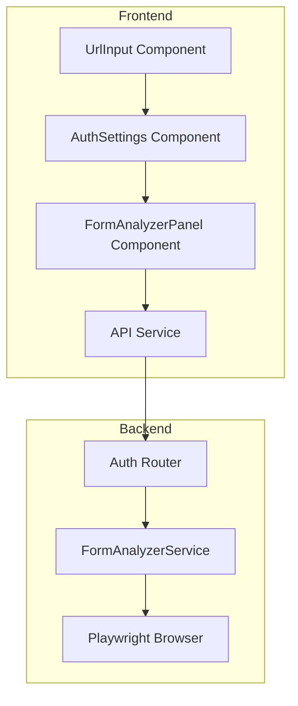
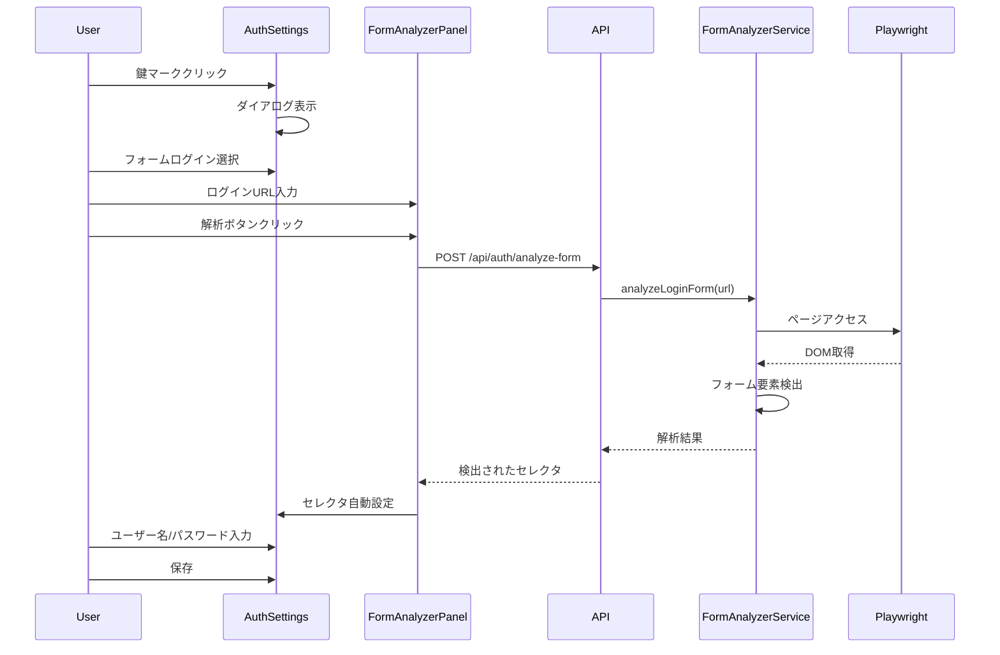
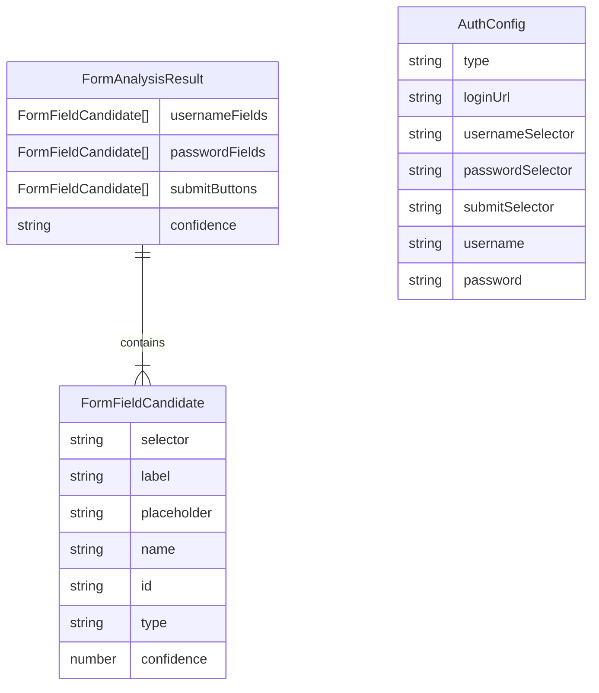

# Technical Design Document: login-form-analyzer

## Overview

**Purpose**: ログイン認証設定の複雑さを解消し、ユーザーがURLを入力するだけでフォーム要素を自動検出できる機能を提供する。

**Users**: QAエンジニア、開発者がフォーム認証を必要とするページのアクセシビリティテストを設定する際に使用。

**Impact**: 既存の`AuthSettings`コンポーネントのフォームログイン設定セクションを拡張し、手動セレクタ入力の代わりに自動解析オプションを追加する。

### Goals
- ログインURLを入力し「解析」ボタンをクリックするだけでフォーム要素を自動検出
- ユーザー名・パスワードの入力のみで認証設定を完了
- 自動解析が失敗した場合の手動設定へのフォールバック

### Non-Goals
- JavaScript SPA向けの複雑な動的フォーム検出（将来課題）
- 多要素認証（MFA）対応
- キャプチャ対応

## Architecture

### Existing Architecture Analysis

既存システムの認証フローは以下の構造:
- **フロントエンド**: `AuthSettings.tsx` → `UrlInput.tsx`経由で認証設定を管理
- **バックエンド**: `server/auth/manager.ts`でPlaywrightを使用してフォームログインを実行
- **型定義**: `server/auth/types.ts`に`AuthConfig`、`usernameSelector`等が定義済み

### Architecture Pattern & Boundary Map



**Architecture Integration**:
- Selected pattern: 既存のフロントエンド・バックエンド分離パターンを維持
- Domain boundaries: 解析ロジックをバックエンド（`server/auth/`）に集約
- Existing patterns preserved: Express Router + Service層のパターン
- New components rationale: `FormAnalyzerService`はPlaywrightベースの解析を担当
- Steering compliance: TypeScript、React + MUI、Express パターンに準拠

### Technology Stack

| Layer | Choice / Version | Role in Feature | Notes |
|-------|------------------|-----------------|-------|
| Frontend | React 19 + MUI | フォーム解析UI、解析結果表示 | 既存スタック |
| Backend | Express 5 + Node.js | 解析APIエンドポイント | 既存スタック |
| Browser Automation | Playwright | ログインページのDOM解析 | 既存依存 |

## System Flows

### フォーム解析フロー



**Key Decisions**:
- 解析処理はバックエンドで実行（CORS回避、既存インフラ活用）
- 複数候補がある場合はユーザー選択を促す
- 解析失敗時は手動モードにフォールバック

## Requirements Traceability

| Requirement | Summary | Components | Interfaces | Flows |
|-------------|---------|------------|------------|-------|
| 1.1 | 鍵マーククリックでパネル表示 | AuthSettings | - | - |
| 1.2 | ログインURL入力フィールド | FormAnalyzerPanel | - | - |
| 1.3 | URL形式バリデーション | FormAnalyzerPanel | - | - |
| 1.4 | 無効URL時エラー表示 | FormAnalyzerPanel | - | - |
| 2.1 | 解析ボタンでフォーム検出 | FormAnalyzerPanel, FormAnalyzerService | AnalyzeFormAPI | 解析フロー |
| 2.2 | ユーザー名フィールド識別 | FormAnalyzerService | - | - |
| 2.3 | パスワードフィールド識別 | FormAnalyzerService | - | - |
| 2.4 | 送信ボタン識別 | FormAnalyzerService | - | - |
| 2.5 | ローディング表示 | FormAnalyzerPanel | - | - |
| 2.6 | 検出失敗エラー表示 | FormAnalyzerPanel | - | - |
| 3.1 | 解析結果表示 | FormAnalyzerPanel | - | - |
| 3.2 | セレクタ情報表示 | FormAnalyzerPanel | - | - |
| 3.3 | 複数候補選択 | FormAnalyzerPanel | - | - |
| 3.4 | フィールドタイプ区別表示 | FormAnalyzerPanel | - | - |
| 4.1 | ユーザー名/パスワード入力のみ | AuthSettings | - | - |
| 4.2 | パスワードマスク表示 | AuthSettings | - | - |
| 4.3 | セレクタと認証情報の関連付け保存 | AuthSettings | - | - |
| 4.4 | 解析未確定時は入力欄無効化 | AuthSettings | - | - |
| 5.1 | 手動設定モード切替 | FormAnalyzerPanel | - | - |
| 5.2 | 従来セレクタ入力表示 | AuthSettings | - | - |
| 5.3 | タイムアウトエラー/リトライ | FormAnalyzerPanel | - | - |
| 5.4 | ネットワークエラー表示 | FormAnalyzerPanel | - | - |

## Components and Interfaces

| Component | Domain/Layer | Intent | Req Coverage | Key Dependencies | Contracts |
|-----------|--------------|--------|--------------|------------------|-----------|
| FormAnalyzerPanel | UI | フォーム解析UIパネル | 1.2-1.4, 2.1, 2.5-2.6, 3.1-3.4, 5.1, 5.3-5.4 | AuthSettings (P0), API Service (P0) | State |
| FormAnalyzerService | Backend | フォーム要素検出ロジック | 2.1-2.4 | Playwright (P0) | Service, API |
| AuthSettings拡張 | UI | 解析結果統合と認証情報入力 | 1.1, 4.1-4.4, 5.2 | FormAnalyzerPanel (P1) | State |

### UI Layer

#### FormAnalyzerPanel

| Field | Detail |
|-------|--------|
| Intent | ログインURL入力と解析トリガー、結果表示を担当するUIコンポーネント |
| Requirements | 1.2, 1.3, 1.4, 2.1, 2.5, 2.6, 3.1, 3.2, 3.3, 3.4, 5.1, 5.3, 5.4 |

**Responsibilities & Constraints**
- ログインURL入力フィールドの表示とバリデーション
- 「解析」ボタンのトリガーとローディング状態管理
- 解析結果（検出されたセレクタ）の表示
- 複数候補がある場合の選択UI
- エラー状態の表示とリトライオプション

**Dependencies**
- Inbound: AuthSettings — 親コンポーネントとして状態を管理 (P0)
- Outbound: API Service — フォーム解析APIを呼び出し (P0)

**Contracts**: State [x]

##### State Management

```typescript
interface FormAnalyzerPanelState {
  loginUrl: string;
  isAnalyzing: boolean;
  analysisResult: FormAnalysisResult | null;
  error: FormAnalysisError | null;
  selectedSelectors: SelectedFormSelectors | null;
}

interface FormAnalysisResult {
  usernameFields: FormFieldCandidate[];
  passwordFields: FormFieldCandidate[];
  submitButtons: FormFieldCandidate[];
  confidence: 'high' | 'medium' | 'low';
}

interface FormFieldCandidate {
  selector: string;
  label: string | null;
  placeholder: string | null;
  name: string | null;
  id: string | null;
  type: string;
  confidence: number;
}

interface SelectedFormSelectors {
  usernameSelector: string;
  passwordSelector: string;
  submitSelector: string;
}

type FormAnalysisError =
  | { type: 'invalid_url'; message: string }
  | { type: 'network_error'; message: string }
  | { type: 'timeout'; message: string }
  | { type: 'no_form_found'; message: string }
  | { type: 'analysis_failed'; message: string };
```

**Implementation Notes**
- Integration: `AuthSettings`コンポーネント内で`config.type === 'form'`の場合に表示
- Validation: URL形式チェックは`new URL()`で実行、失敗時は`invalid_url`エラー
- Risks: 解析結果の候補が多すぎる場合のUX（最大5候補に制限）

#### AuthSettings拡張

| Field | Detail |
|-------|--------|
| Intent | 既存AuthSettingsにフォーム解析統合と簡易認証情報入力機能を追加 |
| Requirements | 1.1, 4.1, 4.2, 4.3, 4.4, 5.2 |

**Responsibilities & Constraints**
- 解析成功後、検出されたセレクタを`AuthConfig`に自動設定
- ユーザー名・パスワード入力欄のみを表示（セレクタ入力は非表示）
- 解析未完了時は認証情報入力欄を無効化
- 手動設定モードへの切り替えオプション

**Implementation Notes**
- Integration: 既存の`config.type === 'form'`セクションを条件分岐で拡張
- Validation: 解析済みセレクタが存在する場合のみ認証情報入力を有効化

### Backend Layer

#### FormAnalyzerService

| Field | Detail |
|-------|--------|
| Intent | Playwrightを使用してログインページのフォーム要素を検出 |
| Requirements | 2.1, 2.2, 2.3, 2.4 |

**Responsibilities & Constraints**
- 指定URLへのheadlessブラウザでのアクセス
- ヒューリスティックベースのフォーム要素検出
- 検出結果の信頼度スコア算出
- タイムアウトとエラーハンドリング

**Dependencies**
- External: Playwright — ブラウザ自動化 (P0)

**Contracts**: Service [x] / API [x]

##### Service Interface

```typescript
interface FormAnalyzerService {
  analyzeLoginForm(url: string, options?: AnalyzeOptions): Promise<Result<FormAnalysisResult, AnalyzeError>>;
}

interface AnalyzeOptions {
  timeout?: number; // デフォルト: 30000ms
}

type AnalyzeError =
  | { type: 'navigation_failed'; message: string }
  | { type: 'timeout'; message: string }
  | { type: 'no_form_found'; message: string };
```

- Preconditions: `url`は有効なHTTP/HTTPS URL
- Postconditions: `FormAnalysisResult`に少なくとも1つのパスワードフィールドが含まれる場合はsuccessを返す
- Invariants: ブラウザインスタンスは処理完了後に必ずクローズ

##### API Contract

| Method | Endpoint | Request | Response | Errors |
|--------|----------|---------|----------|--------|
| POST | /api/auth/analyze-form | `{ url: string }` | `FormAnalysisResult` | 400 (invalid URL), 408 (timeout), 500 (server error) |

**Request Schema**:
```typescript
interface AnalyzeFormRequest {
  url: string;
}
```

**Response Schema**:
```typescript
interface AnalyzeFormResponse {
  success: boolean;
  result?: FormAnalysisResult;
  error?: {
    type: string;
    message: string;
  };
}
```

**Implementation Notes**
- Integration: `server/routes/auth.ts`に新規エンドポイント追加
- Validation: URLフォーマット検証を`new URL()`で実行
- Risks: 一部サイトはボット検出でアクセスブロックの可能性

## Data Models

### Domain Model



**Business Rules**:
- パスワードフィールドが検出できない場合は解析失敗
- 候補が複数ある場合は`confidence`スコアで降順ソート
- ユーザーが選択した候補は`AuthConfig`に反映

### Data Contracts & Integration

**API Data Transfer**:
- Request/Response: JSON形式
- Validation: URLは必須、`http://`または`https://`で開始

## Error Handling

### Error Strategy

解析処理で発生するエラーは以下のカテゴリに分類:

### Error Categories and Responses

**User Errors (4xx)**:
- `invalid_url` → URL形式エラーメッセージ、入力フィールドにフォーカス

**System Errors (5xx)**:
- `timeout` → タイムアウトメッセージ + リトライボタン
- `navigation_failed` → ページアクセス失敗メッセージ + URL確認を促す
- `no_form_found` → フォーム未検出メッセージ + 手動設定モードへの切り替えオプション

### Monitoring

- バックエンド: 解析リクエストのログ記録（URL、所要時間、結果）
- エラー率のモニタリング（将来的なヒューリスティック改善のため）

## Testing Strategy

### Unit Tests
- `FormAnalyzerService.analyzeLoginForm()` - 各検出パターンの正常動作
- `FormAnalyzerService` - タイムアウト処理
- URL形式バリデーション関数

### Integration Tests
- POST `/api/auth/analyze-form` - 正常系レスポンス
- POST `/api/auth/analyze-form` - エラー系レスポンス（無効URL、タイムアウト）
- `AuthSettings` + `FormAnalyzerPanel`連携

### E2E Tests
- フォーム解析→認証情報入力→保存の完全フロー
- 解析失敗→手動設定モード切り替え→保存フロー
- 複数候補表示→選択→保存フロー
