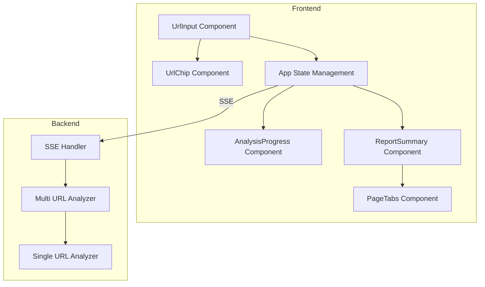
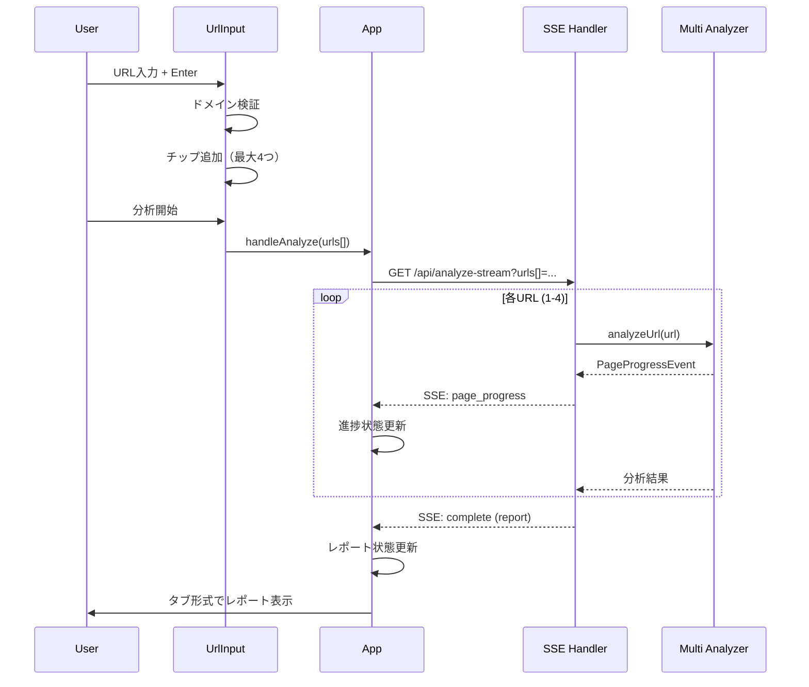
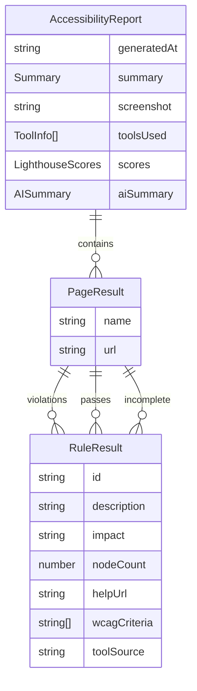

# Design Document: Multi-URL Analysis

## Overview

**Purpose**: 本機能は、アクセシビリティチェッカーを拡張し、1回の分析で最大4つのURLを同時に入力・分析できるようにする。これにより、ユーザーは同一ドメイン内の複数ページを効率的に一括分析できる。

**Users**: Webサイト管理者、QAエンジニア、アクセシビリティ担当者が、サイト全体のWCAG準拠状況を確認するワークフローで利用する。

**Impact**: 現在の単一URL入力→単一レポート出力のフローを、複数URL入力→複数レポート（タブ切り替え表示）に拡張する。既存の単一URL分析ワークフローは維持される。

### Goals

- 最大4つのURLを1回の操作で分析可能にする
- 分析結果をタブ形式で切り替え表示し、ページ間の比較を容易にする
- 同一ドメイン制約により、認証情報の適用範囲を明確化する
- 単一URL分析時の既存ワークフローを維持する

### Non-Goals

- 4つを超えるURLの同時分析（将来の拡張として検討）
- 並列分析による高速化（認証共有のため順次分析を採用）
- 異なるドメイン間での分析（認証情報の共有が不可能）
- レポートの比較ビュー（タブ切り替えによる個別表示のみ）

## Architecture

### Existing Architecture Analysis

本機能は既存アーキテクチャを拡張する形で実装する。

**Current Architecture Patterns**:
- フロントエンド: React + MUI、Hooks による状態管理
- バックエンド: Express + Playwright、SSE によるストリーミング
- データ構造: `AccessibilityReport.pages: PageResult[]` は既に配列構造

**Integration Points**:
- `UrlInput`: URL入力UI（拡張対象）
- `AnalysisProgress`: 分析中画面（拡張対象）
- `ReportSummary`: レポート表示（拡張対象）
- `App.tsx`: 状態管理（拡張対象）
- `server/sse-handler.ts`: SSEストリーミング（拡張対象）
- `server/analyzer.ts`: 分析ロジック（ラップ関数追加）

**Technical Debt Addressed**:
- なし（新規機能追加）

### Architecture Pattern & Boundary Map



**Architecture Integration**:
- **Selected pattern**: ハイブリッド拡張 - 既存コンポーネントを拡張しつつ、小規模な新規コンポーネント（UrlChip, PageTabs）を追加
- **Domain boundaries**: UI層（入力・表示）、API層（SSE通信）、分析層（Playwright実行）の3層を維持
- **Existing patterns preserved**: MUIコンポーネント使用、Hooks状態管理、SSEストリーミング
- **New components rationale**: UrlChipはチップ表示のテスト容易性のため分離、PageTabsはタブ切り替えロジックの再利用性のため分離
- **Steering compliance**: フロントエンド・バックエンド分離構成を維持、既存の命名規約に従う

### Technology Stack

| Layer | Choice / Version | Role in Feature | Notes |
|-------|------------------|-----------------|-------|
| Frontend | React 19 + MUI | URL入力UI、レポートタブ表示 | 既存スタック継続 |
| Backend | Express 5 + Node.js | SSEストリーミング、複数URL処理 | 既存スタック継続 |
| Testing | Playwright + Vitest | 統合テスト、ユニットテスト | 既存スタック継続 |

**新規依存**: なし（全てMUI既存コンポーネントで対応可能）

## System Flows

### 複数URL分析フロー



**Key Decisions**:
- 順次分析を採用（認証状態共有のため同一ブラウザインスタンス使用）
- 各URL分析開始時に`page_progress`イベント送信
- 全URL完了後に単一`complete`イベントで全レポート送信

## Requirements Traceability

| Requirement | Summary | Components | Interfaces | Flows |
|-------------|---------|------------|------------|-------|
| 1.1 | URLチップ変換 | UrlInput, UrlChip | - | - |
| 1.2 | 入力欄クリア | UrlInput | - | - |
| 1.3 | 最大4URL制限 | UrlInput | - | - |
| 1.4 | 4URL時の入力無効化 | UrlInput | - | - |
| 1.5 | カウンター表示 | UrlInput | - | - |
| 1.6 | チップ削除 | UrlChip | - | - |
| 1.7 | プレースホルダー表示 | UrlInput | - | - |
| 2.1 | ドメイン検証 | UrlInput | - | - |
| 2.2 | エラーメッセージ表示 | UrlInput | - | - |
| 2.3 | ホスト名比較 | UrlInput | - | - |
| 2.4 | 全削除時のリセット | UrlInput | - | - |
| 3.1 | 分析中URL/タイトル表示 | AnalysisProgress | - | 複数URL分析フロー |
| 3.2 | 全体進捗表示 | AnalysisProgress | - | 複数URL分析フロー |
| 3.3 | 固定幅レイアウト | AnalysisProgress | - | - |
| 3.4 | 完了ページの視覚区別 | AnalysisProgress | - | - |
| 4.1 | タブ形式表示 | ReportSummary, PageTabs | - | - |
| 4.2 | ページタイトルタブ | PageTabs | - | - |
| 4.3 | タイトル省略表示 | PageTabs | - | - |
| 4.4 | タブクリック切り替え | PageTabs | - | - |
| 4.5 | 違反数バッジ | PageTabs | - | - |
| 4.6 | 単一URL時の後方互換 | ReportSummary | - | - |
| 5.1 | 複数URL配列受付 | - | MultiAnalyzeRequest | 複数URL分析フロー |
| 5.2 | 順次分析・SSE通知 | SSE Handler, MultiAnalyzer | PageProgressEvent | 複数URL分析フロー |
| 5.3 | 配列レスポンス | - | AccessibilityReport | - |
| 5.4 | 認証共通適用 | MultiAnalyzer | - | - |
| 5.5 | 部分失敗時の継続 | MultiAnalyzer | - | - |
| 5.6 | ページタイトル取得 | Analyzer | - | - |
| 6.1 | 複数レポート管理 | App | - | - |
| 6.2 | URL/タイトル保持 | App | AnalysisState | - |
| 6.3 | 分析状態初期化 | App | - | - |
| 6.4 | アクティブタブ管理 | App | - | - |

## Components and Interfaces

### Summary

| Component | Domain/Layer | Intent | Req Coverage | Key Dependencies | Contracts |
|-----------|--------------|--------|--------------|------------------|-----------|
| UrlInput | UI | 複数URL入力・チップ表示 | 1.1-1.7, 2.1-2.4 | UrlChip (P0), MUI (P1) | State |
| UrlChip | UI | 単一URLチップ表示・削除 | 1.1, 1.6 | MUI Chip (P1) | - |
| AnalysisProgress | UI | 分析進捗表示（複数ページ対応） | 3.1-3.4 | MUI (P1) | State |
| PageTabs | UI | ページ切り替えタブ | 4.1-4.5 | MUI Tabs (P1) | - |
| ReportSummary | UI | レポート表示（タブ統合） | 4.1, 4.6 | PageTabs (P0) | - |
| App | State | 複数URL・レポート状態管理 | 6.1-6.4 | UrlInput, AnalysisProgress, ReportSummary | State |
| SSE Handler | API | 複数URL対応SSE | 5.1, 5.2 | MultiAnalyzer (P0) | API, Event |
| MultiAnalyzer | Backend | 複数URL順次分析 | 5.2-5.6 | Analyzer (P0) | Service |

### UI Layer

#### UrlInput

| Field | Detail |
|-------|--------|
| Intent | 複数URLの入力、チップ表示、ドメイン検証を行うフォームコンポーネント |
| Requirements | 1.1, 1.2, 1.3, 1.4, 1.5, 1.7, 2.1, 2.2, 2.3, 2.4 |

**Responsibilities & Constraints**
- URLの入力受付とバリデーション
- 複数URLのチップ形式表示管理
- 同一ドメイン制約の検証
- 最大4URL制限の適用

**Dependencies**
- Inbound: App — URL配列状態管理 (P0)
- Outbound: UrlChip — チップ表示委譲 (P0)
- External: MUI InputBase, Paper — UI基盤 (P1)

**Contracts**: State [x]

##### State Management

```typescript
interface UrlInputState {
  /** 入力中のURL文字列 */
  inputValue: string;
  /** 追加済みURLリスト（最大4件） */
  urls: string[];
  /** ドメイン検証エラーメッセージ */
  domainError: string | null;
}

interface UrlInputProps {
  onAnalyze: (urls: string[], auth?: AuthConfig, sessionId?: string, passphrase?: string) => void;
  disabled?: boolean;
  compact?: boolean;
  initialUrls?: string[];
  showSessionManager?: boolean;
  isDevelopment?: boolean;
}
```

- State model: `urls`配列で複数URLを管理、`inputValue`で入力中テキストを管理
- Persistence: なし（ローカル状態のみ）
- Concurrency: React単一スレッド

**Implementation Notes**
- Integration: 既存の`onAnalyze`シグネチャを`(url: string, ...)` → `(urls: string[], ...)`に拡張。後方互換のため、呼び出し側で単一URLの場合は配列でラップ
- Validation: ドメイン検証は`new URL(url).hostname`で実施、最初のURLのホスト名を基準として後続を検証
- Risks: propsの増加によるインターフェース複雑化。型定義で明確化

#### UrlChip

| Field | Detail |
|-------|--------|
| Intent | 単一URLをチップ形式で表示し、削除操作を提供する |
| Requirements | 1.1, 1.6 |

**Responsibilities & Constraints**
- URLの省略表示（長いURLはellipsis）
- 削除ボタンのクリックハンドリング
- リンクアイコン表示

**Dependencies**
- Inbound: UrlInput — 表示・削除イベント (P0)
- External: MUI Chip — UI基盤 (P1)

**Contracts**: なし（presentationalコンポーネント）

```typescript
interface UrlChipProps {
  url: string;
  onDelete: () => void;
  disabled?: boolean;
}
```

**Implementation Notes**
- URL表示は最大30文字でtruncate
- MUI Chip の`onDelete`プロパティを使用

#### AnalysisProgress

| Field | Detail |
|-------|--------|
| Intent | 分析進捗を表示し、複数ページ分析時は現在のページ情報を明示する |
| Requirements | 3.1, 3.2, 3.3, 3.4 |

**Responsibilities & Constraints**
- 現在分析中のURL・ページタイトル表示
- 全体進捗（ページ2/4）と各ページ内進捗の表示
- 固定幅レイアウト（最小600px）の維持
- 完了ページの視覚的区別

**Dependencies**
- Inbound: App — 進捗状態 (P0)
- External: MUI Card, LinearProgress — UI基盤 (P1)

**Contracts**: State [x]

##### State Management

```typescript
interface AnalysisProgressProps {
  logs?: LogEntry[];
  currentStep?: number;
  totalSteps?: number;
  stepName?: string;
  /** 複数URL分析時の追加props */
  currentPageIndex?: number;
  totalPages?: number;
  currentPageUrl?: string;
  currentPageTitle?: string;
  completedPages?: number[];
}
```

**Implementation Notes**
- Integration: 既存propsに複数ページ用propsを追加（オプショナル）
- 単一URL分析時はcurrentPageIndex等が未設定で、既存表示を維持
- `minWidth: 600px`を適用し、ステータステキスト変化による幅変動を防止

#### PageTabs

| Field | Detail |
|-------|--------|
| Intent | 複数ページのレポートをタブ形式で切り替え表示する |
| Requirements | 4.1, 4.2, 4.3, 4.4, 4.5 |

**Responsibilities & Constraints**
- ページタイトルをタブラベルに表示
- 長いタイトルの省略表示
- 違反数バッジ表示
- タブ切り替えイベントハンドリング

**Dependencies**
- Inbound: ReportSummary — ページ情報、切り替えイベント (P0)
- External: MUI Tabs, Tab, Badge — UI基盤 (P1)

**Contracts**: なし（presentationalコンポーネント）

```typescript
interface PageTabsProps {
  pages: Array<{
    title: string;
    url: string;
    violationCount: number;
  }>;
  activeIndex: number;
  onChange: (index: number) => void;
}
```

**Implementation Notes**
- タイトルは最大20文字でtruncate
- 違反数はMUI Badgeで表示
- MUI Tabsの`value`/`onChange`を使用

#### ReportSummary

| Field | Detail |
|-------|--------|
| Intent | 分析レポートを表示し、複数ページ時はタブ切り替えを統合する |
| Requirements | 4.1, 4.6 |

**Responsibilities & Constraints**
- 既存のレポート表示機能を維持
- 複数ページ時はPageTabsを上部に表示
- 単一ページ時はPageTabsを非表示（後方互換）

**Dependencies**
- Inbound: App — レポートデータ (P0)
- Outbound: PageTabs — タブ表示委譲 (P0)

**Contracts**: なし（既存コンポーネントの拡張）

**Implementation Notes**
- `report.pages.length > 1`の場合のみPageTabsを表示
- アクティブページのインデックスを内部状態で管理

### State Layer

#### App State Management

| Field | Detail |
|-------|--------|
| Intent | 複数URL入力と複数レポートの状態を管理する |
| Requirements | 6.1, 6.2, 6.3, 6.4 |

**Responsibilities & Constraints**
- 入力されたURLリストの保持
- 分析進捗状態の管理
- レポートとアクティブタブの管理

**Contracts**: State [x]

##### State Management

```typescript
interface AnalysisState {
  /** 分析対象URLリスト */
  targetUrls: string[];
  /** 現在分析中のページインデックス（0-based） */
  currentPageIndex: number;
  /** 分析完了済みページインデックス配列 */
  completedPageIndexes: number[];
  /** 現在分析中のページタイトル */
  currentPageTitle: string;
}

// App.tsxの状態拡張
const [analysisState, setAnalysisState] = useState<AnalysisState | null>(null);
const [activeReportTab, setActiveReportTab] = useState(0);
```

- State model: 既存の`report`状態は維持し、追加で`analysisState`と`activeReportTab`を管理
- Persistence: なし（セッション内のみ）
- Concurrency: React単一スレッド

### API Layer

#### SSE Handler

| Field | Detail |
|-------|--------|
| Intent | 複数URL分析のSSEストリーミングを処理する |
| Requirements | 5.1, 5.2 |

**Responsibilities & Constraints**
- 複数URLのクエリパラメータ解析
- 各URL分析の進捗イベント送信
- 部分失敗時のエラー継続

**Dependencies**
- Inbound: Frontend — SSE接続 (P0)
- Outbound: MultiAnalyzer — 分析実行 (P0)

**Contracts**: API [x] / Event [x]

##### API Contract

| Method | Endpoint | Request | Response | Errors |
|--------|----------|---------|----------|--------|
| GET | /api/analyze-stream | MultiAnalyzeRequest (query) | SSE stream | 400 (invalid URL) |

```typescript
interface MultiAnalyzeRequest {
  /** URL配列（1-4件） */
  urls: string[];
  /** 認証設定（オプション） */
  authType?: AuthType;
  authUsername?: string;
  authPassword?: string;
  authToken?: string;
  authCookies?: string;
  /** セッション認証（オプション） */
  sessionId?: string;
  passphrase?: string;
}
```

##### Event Contract

```typescript
/** ページ分析開始/進捗イベント（新規） */
interface PageProgressEvent {
  type: 'page_progress';
  pageIndex: number;
  totalPages: number;
  pageUrl: string;
  pageTitle: string;
  status: 'started' | 'analyzing' | 'completed' | 'failed';
}

/** 既存イベントは変更なし */
type SSEEvent =
  | LogEvent
  | ProgressEvent
  | ViolationEvent
  | CompleteEvent
  | ErrorEvent
  | SessionExpiredEvent
  | PageProgressEvent;  // 追加
```

- Published events: `page_progress`, `log`, `progress`, `violation`, `complete`, `error`
- Ordering: 各ページ開始時に`page_progress`を送信、その後既存イベントを順次送信
- Delivery guarantees: SSE標準（再接続時は最初から）

### Backend Layer

#### MultiAnalyzer

| Field | Detail |
|-------|--------|
| Intent | 複数URLを順次分析し、結果を集約する |
| Requirements | 5.2, 5.3, 5.4, 5.5, 5.6 |

**Responsibilities & Constraints**
- 複数URLの順次分析
- 認証情報の全URL共通適用
- 部分失敗時の継続処理
- ページタイトルの取得

**Dependencies**
- Inbound: SSE Handler — 分析要求 (P0)
- Outbound: Analyzer (analyzeUrl) — 単一URL分析 (P0)
- External: Playwright — ブラウザ操作 (P0)

**Contracts**: Service [x]

##### Service Interface

```typescript
interface MultiAnalyzerService {
  analyzeMultipleUrls(
    urls: string[],
    authConfig?: AuthConfig,
    onProgress?: MultiProgressCallback,
    storageState?: StorageState
  ): Promise<AccessibilityReport>;
}

type MultiProgressCallback = (event: SSEEvent | PageProgressEvent) => void;
```

- Preconditions: `urls.length >= 1 && urls.length <= 4`、全URLが有効なURL形式
- Postconditions: `report.pages.length === urls.length`（失敗ページもエラー情報付きで含む）
- Invariants: 認証情報は全URL分析で共通適用

**Implementation Notes**
- Integration: 既存の`analyzeUrl`関数をループで呼び出し、結果を`pages`配列に集約
- Validation: URL数の上限チェック（4以下）
- Risks: 1つのURLが長時間かかる場合の全体タイムアウト。20分のタイムアウト設定で対応

## Data Models

### Domain Model

既存の`AccessibilityReport`構造を活用し、`pages`配列に複数ページを格納する。



**Key Changes**:
- `PageResult.name`: 従来はホスト名、新規ではページタイトル（`document.title`）を格納
- 複数ページ時は`pages`配列に複数の`PageResult`が格納される

### Data Contracts & Integration

**API Data Transfer**:
- Request: クエリパラメータ`urls[]=url1&urls[]=url2`形式
- Response: 既存の`AccessibilityReport`構造（`pages`配列が複数要素）

**Frontend State**:
```typescript
interface AnalysisState {
  targetUrls: string[];
  currentPageIndex: number;
  completedPageIndexes: number[];
  currentPageTitle: string;
}
```

## Error Handling

### Error Strategy

複数URL分析時は、1つのURLが失敗しても他のURLの分析を継続する。

### Error Categories and Responses

**User Errors (4xx)**:
- 無効なURL形式 → 該当URLをスキップし、エラーをログ出力
- 4URL超過 → 400エラー、フロントエンドで事前検証

**System Errors (5xx)**:
- 分析タイムアウト → 該当ページをエラー扱いし、次のURLへ継続
- ネットワークエラー → 該当ページをエラー扱いし、次のURLへ継続

**Partial Failure Handling**:
```typescript
interface PageResultWithError extends PageResult {
  error?: {
    message: string;
    code: string;
  };
}
```

### Monitoring

- 各ページの分析成功/失敗をログ出力
- 部分失敗時は完了イベントにエラー情報を含める

## Testing Strategy

### Unit Tests

- UrlInput: ドメイン検証ロジック（同一ドメイン許可、異ドメイン拒否）
- UrlInput: 最大4URL制限の適用
- UrlChip: URL省略表示の正確性
- PageTabs: タブ切り替えイベントの発火

### Integration Tests

- 複数URL入力 → SSE接続 → 複数ページレポート受信フロー
- 部分失敗時のエラー継続と結果表示
- 単一URL時の後方互換性（既存動作の維持）

### E2E Tests

- 4URL入力 → 分析完了 → タブ切り替え → 各レポート表示
- 異ドメインURL入力時のエラー表示
- 分析中画面の進捗表示更新

### Performance

- 4URL順次分析の総時間測定（目標: 単一URL × 4 ± 10%）
- SSEイベント送信の遅延測定

## Performance & Scalability

**Target Metrics**:
- 4URL分析の総時間: 単一URL分析時間 × 4（順次実行のため）
- SSEイベント遅延: 100ms以下

**Optimization**:
- ブラウザインスタンスを全URL間で共有（起動オーバーヘッド削減）
- ログエントリの最大1000件制限を維持（メモリ効率）

**Timeout Adjustment**:
- 全体タイムアウト: 20分（5分/URL × 4）
