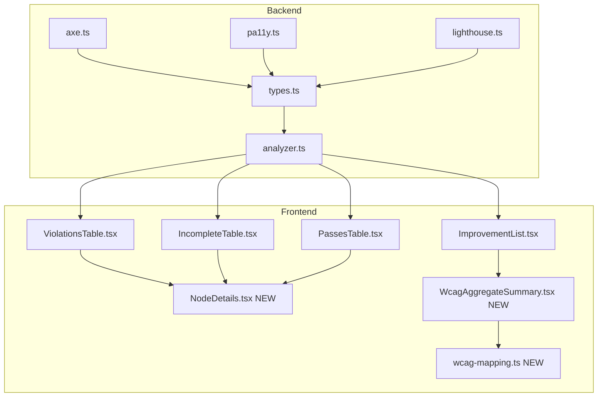
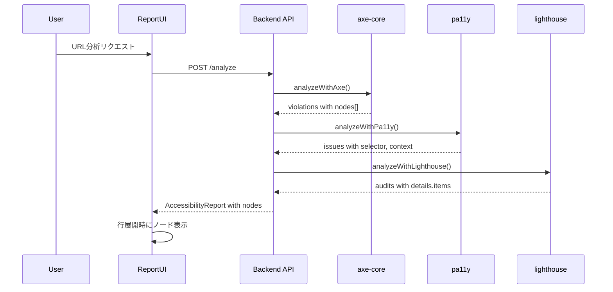
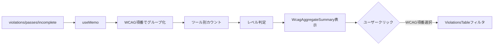

# Design Document: report-enhancement

## Overview

**Purpose**: アクセシビリティレポートの品質向上を実現し、開発者がより効率的にWCAG違反を特定・修正できるようにする。

**Users**: 開発者、QAエンジニア、アクセシビリティ担当者がレポートを利用して具体的な修正箇所を特定し、WCAG準拠に向けた優先順位付けを行う。

**Impact**: 既存のレポートUIに対して、ノード情報の展開表示、WCAG集約サマリー、Lighthouse分類改善、タブ間構造統一を追加する。

### Goals

- 違反箇所の具体的なHTML要素情報（CSSセレクタ、HTML抜粋）をレポートで確認可能にする
- WCAG項番ごとに全ツールの指摘を集約し、対応すべき基準を明確化する
- Lighthouse「不明」項目を削減し、違反/達成の分類を明確化する
- 違反・達成・不明タブ間でUI構造を統一する

### Non-Goals

- 新規アクセシビリティツールの追加
- レポートのPDF/CSV出力形式の変更
- バックエンドAPIエンドポイントの新規追加
- リアルタイム分析機能

## Architecture

### Existing Architecture Analysis

**Current Patterns**:

- フロントエンド・バックエンド分離構成
- `RuleResult`型がAPI契約として機能
- 各アナライザー（axe、pa11y、lighthouse）が独立して結果を返却
- `analyzer.ts`がオーケストレーション

**Integration Points**:

- `server/analyzers/types.ts`: 共通型定義（拡張対象）
- `server/analyzers/*.ts`: 各ツールのアナライザー（修正対象）
- `frontend/src/components/*Table.tsx`: テーブルコンポーネント（修正対象）
- `frontend/src/components/ImprovementList.tsx`: AI総評セクション（拡張対象）

**Technical Debt**:

- ViolationsTable/IncompleteTable/PassesTable間でコード重複あり
- Lighthouse分類ロジックが`scoreDisplayMode`を活用していない

### Architecture Pattern & Boundary Map



**Architecture Integration**:

- 選択パターン: ハイブリッドアプローチ（バックエンド先行、共通コンポーネント追加後に統合）
- ドメイン境界: バックエンド（データ抽出・分類）とフロントエンド（表示・集約）の責務分離
- 既存パターン維持: `RuleResult`型拡張、MUIコンポーネント使用
- 新規コンポーネント: `NodeDetails`（ノード展開）、`WcagAggregateSummary`（WCAG集約）、`wcag-mapping.ts`（レベルマッピング）
- Steering準拠: TypeScript型安全性、フロントエンド・バックエンド分離

### Technology Stack

| Layer | Choice / Version | Role in Feature | Notes |
|-------|------------------|-----------------|-------|
| Frontend | React 19 + MUI 7.3.6 | UI表示、WCAG集約計算 | 既存スタック維持 |
| Backend | Express 5 + Node.js | ノード情報抽出、分類ロジック | 既存スタック維持 |
| Accessibility | axe-core 4.11, pa11y 9.0, lighthouse 12.0 | ノード情報取得元 | 既存バージョン維持 |

## System Flows

### ノード情報取得フロー



### WCAG集約フロー



## Requirements Traceability

| Requirement | Summary | Components | Interfaces | Flows |
|-------------|---------|------------|------------|-------|
| 1.1 | 違反テーブル行展開でノードセレクタ表示 | NodeDetails, ViolationsTable | NodeInfo | ノード情報取得 |
| 1.2 | ノード選択時HTML抜粋表示 | NodeDetails | NodeInfo.html | ノード情報取得 |
| 1.3 | バックエンドでノード情報返却 | axe.ts, pa11y.ts, lighthouse.ts | RuleResult.nodes | ノード情報取得 |
| 1.4 | 10件超時に「さらに表示」 | NodeDetails | - | - |
| 1.5 | 不明・達成タブでもノード表示 | IncompleteTable, PassesTable, NodeDetails | NodeInfo | - |
| 2.1 | AI総評にWCAG項番別サマリー | WcagAggregateSummary, ImprovementList | WcagSummaryItem | WCAG集約 |
| 2.2 | ツール別検出件数表示 | WcagAggregateSummary | WcagSummaryItem.toolCounts | - |
| 2.3 | 違反件数順ソート | WcagAggregateSummary | - | - |
| 2.4 | WCAG項番クリックでフィルタ | WcagAggregateSummary, ViolationsTable | onWcagFilter callback | WCAG集約 |
| 2.5 | WCAGレベル表示 | WcagAggregateSummary, wcag-mapping.ts | getWcagLevel() | - |
| 2.6 | バックエンドでWCAG集約データ返却 | - | - | フロントエンド集約に変更 |
| 3.1 | scoreDisplayModeでnotApplicable除外 | lighthouse.ts | - | - |
| 3.2 | 0.5閾値で違反/達成分類 | lighthouse.ts | - | - |
| 3.3 | scoreDisplayMode確認 | lighthouse.ts | audit.scoreDisplayMode | - |
| 3.4 | 不明理由表示 | IncompleteTable | RuleResult.classificationReason | - |
| 3.5 | 生スコアと分類理由返却 | lighthouse.ts | RuleResult.rawScore, classificationReason | - |
| 4.1 | 不明タブにWCAG別AIボタン | IncompleteTable | AIChatButton props | - |
| 4.2 | 達成タブにWCAG別AIボタン | PassesTable | AIChatButton props | - |
| 4.3 | 全タブで同一カラム構成 | ViolationsTable, IncompleteTable, PassesTable | - | - |
| 4.4 | 達成タブに影響度カラム | PassesTable | ImpactBadge | - |
| 4.5 | 全タブでノード展開機能 | NodeDetails | NodeInfo | - |
| 5.1 | 展開100ms以内 | NodeDetails | - | パフォーマンス |
| 5.2 | API応答時間+10%以内 | axe.ts, pa11y.ts, lighthouse.ts | - | パフォーマンス |
| 5.3 | 100件以上でページネーション | NodeDetails | - | - |
| 5.4 | モバイル対応 | 全UIコンポーネント | MUI responsive props | - |
| 5.5 | エラー時グレースフルデグラデーション | NodeDetails | - | エラーハンドリング |

## Components and Interfaces

### Component Summary

| Component | Domain/Layer | Intent | Req Coverage | Key Dependencies | Contracts |
|-----------|--------------|--------|--------------|------------------|-----------|
| RuleResult (拡張) | Backend/Types | ノード情報を含む結果型 | 1.3, 3.5 | - | Type |
| NodeInfo (新規) | Backend/Types | 個別ノード情報型 | 1.1, 1.2 | - | Type |
| axe.ts (修正) | Backend/Analyzer | ノード情報抽出追加 | 1.3 | axe-core (P0) | - |
| pa11y.ts (修正) | Backend/Analyzer | ノード情報抽出追加 | 1.3 | pa11y (P0) | - |
| lighthouse.ts (修正) | Backend/Analyzer | 分類ロジック改善、ノード抽出 | 1.3, 3.1-3.5 | lighthouse (P0) | - |
| NodeDetails (新規) | Frontend/UI | ノード情報展開表示 | 1.1, 1.2, 1.4, 1.5, 4.5, 5.1, 5.3, 5.5 | MUI Collapse (P1) | State |
| WcagAggregateSummary (新規) | Frontend/UI | WCAG項番別集約表示 | 2.1-2.5 | wcag-mapping (P1) | State |
| wcag-mapping.ts (新規) | Frontend/Utils | WCAGレベル判定 | 2.5 | - | Service |
| ViolationsTable (修正) | Frontend/UI | NodeDetails統合 | 1.1, 4.5 | NodeDetails (P1) | - |
| IncompleteTable (修正) | Frontend/UI | WCAG AIボタン、NodeDetails統合 | 3.4, 4.1, 4.5 | NodeDetails (P1), AIChatButton (P1) | - |
| PassesTable (修正) | Frontend/UI | 影響度カラム、WCAG AIボタン、NodeDetails統合 | 4.2, 4.3, 4.4, 4.5 | NodeDetails (P1), ImpactBadge (P1) | - |
| ImprovementList (修正) | Frontend/UI | WcagAggregateSummary統合 | 2.1 | WcagAggregateSummary (P1) | - |

### Backend / Types

#### NodeInfo (新規)

| Field | Detail |
|-------|--------|
| Intent | 個別DOM要素のアクセシビリティ違反情報を表現 |
| Requirements | 1.1, 1.2 |

**Type Definition**

```typescript
interface NodeInfo {
  /** CSSセレクタ（要素を一意に特定） */
  target: string;
  /** HTML抜粋（最大200文字） */
  html: string;
  /** 失敗理由のサマリー（axe-coreのみ） */
  failureSummary?: string;
}
```

#### RuleResult (拡張)

| Field | Detail |
|-------|--------|
| Intent | 既存のRuleResult型にノード情報と分類情報を追加 |
| Requirements | 1.3, 3.5 |

**Type Definition (追加フィールド)**

```typescript
interface RuleResult {
  // 既存フィールド省略...

  /** ノード情報配列（オプショナル、後方互換性維持） */
  nodes?: NodeInfo[];

  /** Lighthouse生スコア（0-1、Lighthouseのみ） */
  rawScore?: number | null;

  /** 分類理由（Lighthouseのincomplete項目のみ） */
  classificationReason?: 'manual-review' | 'insufficient-data' | 'partial-support';
}
```

### Backend / Analyzers

#### axe.ts (修正)

| Field | Detail |
|-------|--------|
| Intent | axe-core結果からノード情報を抽出 |
| Requirements | 1.3 |

**Responsibilities & Constraints**

- `scanResults.violations[].nodes`から`NodeInfo`配列を生成
- `target`配列を単一文字列に結合（` > `セパレータ）
- `html`は200文字に切り詰め

**Implementation Notes**

- 変更箇所: `analyzeWithAxe()`関数内のマッピング処理
- 既存の`nodeCount`は維持（後方互換性）

#### pa11y.ts (修正)

| Field | Detail |
|-------|--------|
| Intent | Pa11y結果からノード情報を抽出 |
| Requirements | 1.3 |

**Responsibilities & Constraints**

- `issue.selector`と`issue.context`から`NodeInfo`を生成
- Pa11yは1イシュー=1ノードのため、`nodes`配列は常に1要素

**Implementation Notes**

- 変更箇所: `analyzeWithPa11y()`関数内のマッピング処理

#### lighthouse.ts (修正)

| Field | Detail |
|-------|--------|
| Intent | Lighthouse分類ロジック改善とノード情報抽出 |
| Requirements | 1.3, 3.1, 3.2, 3.3, 3.4, 3.5 |

**Responsibilities & Constraints**

- `audit.scoreDisplayMode === 'notApplicable'`の場合はスキップ
- `score === null`かつ`scoreDisplayMode !== 'notApplicable'`の場合のみincomplete
- `0 < score < 0.5`は違反、`0.5 <= score < 1`は達成に分類
- `audit.details.items`からノード情報を抽出
- `rawScore`と`classificationReason`を結果に含める

**Implementation Notes**

- 変更箇所: 分類条件の書き換え（186-209行目付近）
- `details.type === 'table'`と`details.type === 'list'`で抽出方法が異なる

### Frontend / Utils

#### wcag-mapping.ts (新規)

| Field | Detail |
|-------|--------|
| Intent | WCAG項番からレベル（A/AA/AAA）を判定 |
| Requirements | 2.5 |

**Service Interface**

```typescript
type WcagLevel = 'A' | 'AA' | 'AAA' | 'unknown';

interface WcagCriterionInfo {
  criterion: string;
  level: WcagLevel;
  name: string;
}

function getWcagLevel(criterion: string): WcagLevel;
function getWcagInfo(criterion: string): WcagCriterionInfo | null;
function getAllWcagCriteria(): WcagCriterionInfo[];
```

**Implementation Notes**

- WCAG 2.1の78基準を静的マッピングテーブルとして保持
- Level A: 30基準、Level AA: 21基準、Level AAA: 27基準

### Frontend / UI Components

#### NodeDetails (新規)

| Field | Detail |
|-------|--------|
| Intent | ノード情報の展開表示コンポーネント |
| Requirements | 1.1, 1.2, 1.4, 1.5, 4.5, 5.1, 5.3, 5.5 |

**Dependencies**

- Inbound: ViolationsTable, IncompleteTable, PassesTable — ノード表示 (P1)
- External: MUI Collapse, Box, Typography — UI表示 (P1)

**Contracts**: State [x]

**Props Interface**

```typescript
interface NodeDetailsProps {
  /** ノード情報配列 */
  nodes: NodeInfo[];
  /** 展開状態 */
  expanded: boolean;
  /** 展開トグルコールバック */
  onToggle: () => void;
  /** 初期表示件数（デフォルト: 10） */
  initialDisplayCount?: number;
}
```

**State Management**

- `showAll: boolean` - 全件表示フラグ
- 10件超の場合は「さらに表示」ボタンで残りを展開

**Implementation Notes**

- MUI Collapseで展開アニメーション
- HTML抜粋は`<code>`タグでモノスペース表示
- エラー時は「ノード情報を取得できませんでした」を表示

#### WcagAggregateSummary (新規)

| Field | Detail |
|-------|--------|
| Intent | WCAG項番別の集約サマリー表示 |
| Requirements | 2.1, 2.2, 2.3, 2.4, 2.5 |

**Dependencies**

- Inbound: ImprovementList — サマリー表示 (P1)
- Outbound: wcag-mapping — レベル判定 (P1)
- External: MUI Chip, Box, Typography — UI表示 (P1)

**Contracts**: State [x]

**Props Interface**

```typescript
interface WcagSummaryItem {
  criterion: string;
  level: WcagLevel;
  totalCount: number;
  toolCounts: {
    'axe-core': number;
    'pa11y': number;
    'lighthouse': number;
  };
}

interface WcagAggregateSummaryProps {
  /** 全違反結果 */
  violations: RuleResult[];
  /** WCAG項番クリック時のコールバック */
  onWcagFilter?: (criterion: string) => void;
}
```

**State Management**

- `summaryItems: WcagSummaryItem[]` - useMemoで計算
- 違反件数降順でソート

**Implementation Notes**

- 各ツールのChipを色分け表示（既存パターン踏襲）
- レベルバッジ（A: success, AA: primary, AAA: secondary）

#### ViolationsTable (修正)

| Field | Detail |
|-------|--------|
| Intent | NodeDetails統合による行展開機能追加 |
| Requirements | 1.1, 4.5 |

**Implementation Notes**

- 各行に展開アイコン（IconButton）追加
- 展開状態は`expandedRows: Set<string>`で管理
- NodeDetailsを展開行として表示

#### IncompleteTable (修正)

| Field | Detail |
|-------|--------|
| Intent | WCAG別AIボタン追加、NodeDetails統合、分類理由表示 |
| Requirements | 3.4, 4.1, 4.5 |

**Implementation Notes**

- ViolationsTableのWCAG列実装をコピー
- `classificationReason`をTooltipで表示

#### PassesTable (修正)

| Field | Detail |
|-------|--------|
| Intent | 影響度カラム追加、WCAG別AIボタン追加、NodeDetails統合 |
| Requirements | 4.2, 4.3, 4.4, 4.5 |

**Implementation Notes**

- 影響度カラム追加（`impact`がundefinedの場合は「-」表示）
- ImpactBadgeコンポーネントを使用（既存）

#### ImprovementList (修正)

| Field | Detail |
|-------|--------|
| Intent | WcagAggregateSummary統合 |
| Requirements | 2.1 |

**Implementation Notes**

- AI総評セクション内にWcagAggregateSummaryを追加
- 「WCAG項番別サマリー」セクションとして表示

## Data Models

### Domain Model

**NodeInfo Aggregate**

- 値オブジェクト: 不変、ツールからの抽出結果を表現
- `target`（識別子）、`html`（コンテンツ）、`failureSummary`（メタデータ）

**RuleResult Extension**

- 既存の`RuleResult`エンティティを拡張
- `nodes`はオプショナル（後方互換性）
- `rawScore`、`classificationReason`はLighthouse固有

### Logical Data Model

**RuleResult with NodeInfo**

```
RuleResult (1) -----> (0..N) NodeInfo
    |
    +-- id: string
    +-- description: string
    +-- impact: ImpactLevel?
    +-- nodeCount: number
    +-- helpUrl: string
    +-- wcagCriteria: string[]
    +-- toolSource: ToolSource
    +-- nodes?: NodeInfo[]        [NEW]
    +-- rawScore?: number         [NEW, Lighthouse only]
    +-- classificationReason?: string [NEW, Lighthouse incomplete only]
```

### Data Contracts & Integration

**API Response Schema (変更後)**

```typescript
// AccessibilityReport.pages[].violations[]
{
  id: "color-contrast",
  description: "Elements must have sufficient color contrast",
  impact: "serious",
  nodeCount: 3,
  helpUrl: "https://...",
  wcagCriteria: ["1.4.3"],
  toolSource: "axe-core",
  // 新規フィールド
  nodes: [
    {
      target: "html > body > main > p:nth-child(2)",
      html: "<p style=\"color: #777\">Low contrast text...</p>",
      failureSummary: "Fix any of the following: Element has insufficient color contrast..."
    }
  ]
}
```

## Error Handling

### Error Strategy

- ノード情報抽出失敗時: 空配列を返却、`nodeCount`は維持
- WCAG集約計算失敗時: サマリーセクション非表示、他機能に影響なし
- Lighthouse詳細取得失敗時: `nodes`は空、基本情報は維持

### Error Categories and Responses

**User Errors**: なし（表示専用機能）

**System Errors**:

- ノード情報抽出エラー → 空配列返却、ログ記録
- WCAG集約エラー → try-catchでセクション非表示

**Business Logic Errors**: なし

### Monitoring

- `nodes`配列が空の違反をカウント（ログレベル: warn）
- Lighthouse `scoreDisplayMode`の分布をログ

## Testing Strategy

### Unit Tests

- `wcag-mapping.ts`: 全78基準のレベル判定
- `NodeInfo`抽出ロジック（各アナライザー）
- WCAG集約計算ロジック
- Lighthouse分類条件

### Integration Tests

- axe-core → RuleResult.nodes 変換
- Pa11y → RuleResult.nodes 変換
- Lighthouse → RuleResult.nodes + 分類改善
- フロントエンド型との互換性

### E2E/UI Tests

- 違反テーブル行展開でノード表示
- WCAG項番クリックでフィルタ動作
- 10件超ノードの「さらに表示」動作
- タブ切り替え時のUI一貫性

### Performance

- ノード展開100ms以内（Requirement 5.1）
- API応答時間+10%以内（Requirement 5.2）
- 100件ノードでのレンダリングパフォーマンス

## Performance & Scalability

### Target Metrics

- ノード展開: 100ms以内
- API応答: 現行比+10%以内
- 初期レンダリング: 現行維持

### Optimization Techniques

- ノード情報の遅延展開（Collapseで初期非表示）
- WCAG集約はuseMemoでメモ化
- HTML抜粋は200文字制限でペイロード削減
- 10件ページネーションで大量データ対応
