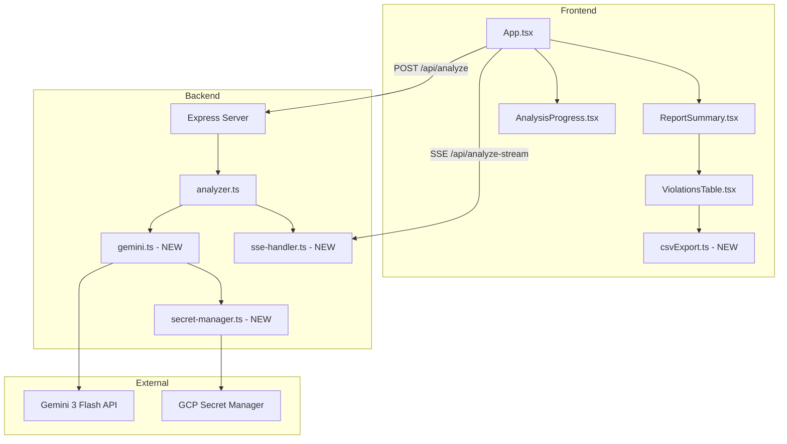
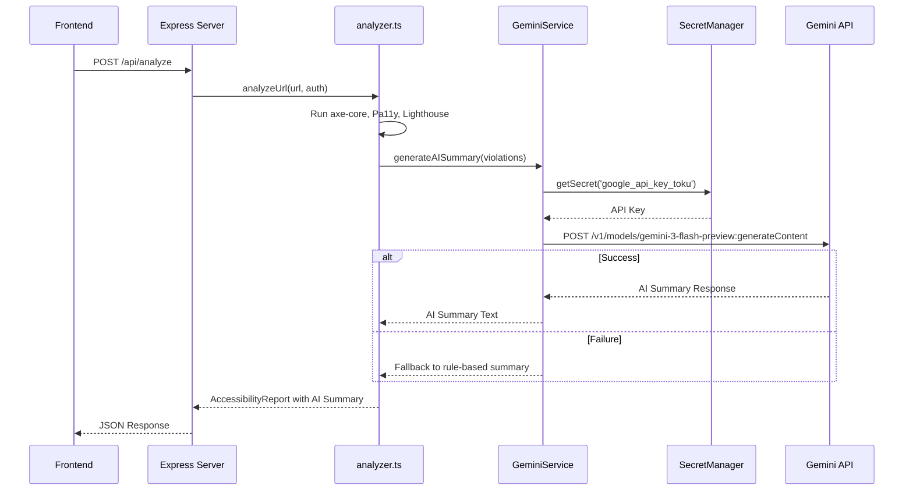
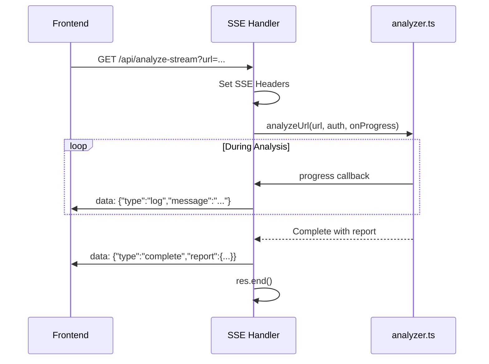
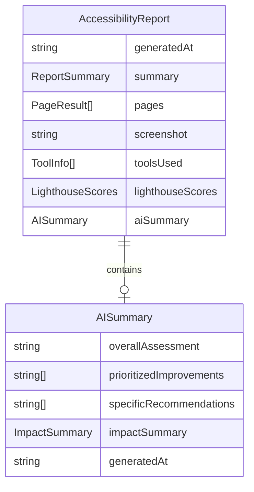

# Design Document: report-ux-enhancements

## Overview

**Purpose**: レポート画面のユーザビリティ向上により、アクセシビリティ分析結果の確認・活用・共有を効率化する。

**Users**: 開発者、QAエンジニア、アクセシビリティ監査担当者が、分析結果の確認、エクスポート、改善優先順位の把握に活用する。

**Impact**: フロントエンドのレイアウト変更、CSVエクスポート機能追加、バックエンドへのGemini API統合とSSEストリーミング追加。

### Goals

- レポート画面の横スクロールを排除し、詳細結果の可読性を向上
- 分析結果をCSV形式でエクスポートし、外部ツールでの活用を可能に
- Gemini 3 Flash APIを統合し、具体的で優先度付きのAI総評を生成
- 分析中のPlaywrightログをリアルタイムでストリーミング表示

### Non-Goals

- レポートのPDF出力（将来検討）
- 複数URL一括分析（現行の単一URL分析を維持）
- AI総評のカスタマイズ設定UI
- ログの永続化・履歴表示

---

## Architecture

### Existing Architecture Analysis

- **現行パターン**: React SPA + Express API のモノリシック構成
- **既存制約**:
  - `ReportSummary.tsx` の `maxWidth: 900px` がレイアウトを制約
  - `analyzer.ts` の `console.log()` はサーバーサイドのみ
  - `api.ts` は単純なfetchで非ストリーミング
- **維持すべき統合ポイント**:
  - MUIコンポーネント体系
  - TypeScript型定義の集約 (`types/accessibility.ts`)
  - 既存の認証フロー (AuthManager)

### Architecture Pattern & Boundary Map



**Architecture Integration**:
- **選択パターン**: 既存Express + SSE拡張（ハイブリッド）
- **ドメイン境界**: フロントエンド（表示・エクスポート） / バックエンド（分析・AI生成・ストリーミング）
- **既存パターン維持**: MUIコンポーネント、useState状態管理、TypeScript型システム
- **新規コンポーネント理由**:
  - `csvExport.ts`: CSV生成ロジックの分離
  - `gemini.ts`: 外部API統合の隔離
  - `secret-manager.ts`: シークレット取得の抽象化
  - `sse-handler.ts`: ストリーミングエンドポイント分離

### Technology Stack

| Layer | Choice / Version | Role in Feature | Notes |
|-------|------------------|-----------------|-------|
| Frontend | React 19 + MUI | レイアウト最適化、CSV生成UI | 既存維持 |
| Backend | Express 5 + Node.js | API・SSEエンドポイント | 既存維持 |
| External API | Gemini 3 Flash (`gemini-3-flash-preview`) | AI総評生成 | 新規統合 |
| Secrets | `@google-cloud/secret-manager` | APIキー取得 | 新規追加 |
| Streaming | Native SSE (Express) | ログストリーミング | 新規実装 |

---

## System Flows

### AI総評生成フロー



### ログストリーミングフロー



---

## Requirements Traceability

| Requirement | Summary | Components | Interfaces | Flows |
|-------------|---------|------------|------------|-------|
| 1.1, 1.2, 1.3, 1.4 | レポート画面レイアウト最適化 | ReportSummary, ViolationsTable | - | - |
| 2.1, 2.2, 2.3, 2.4, 2.5 | CSVダウンロード機能 | ViolationsTable, csvExport | exportViolationsToCsv() | - |
| 3.1, 3.2, 3.3, 3.4, 3.5, 3.6 | AI総評機能 (Gemini Flash) | GeminiService, SecretManager, ImprovementList | GeminiService, SecretManagerService | AI総評生成フロー |
| 4.1, 4.2, 4.3, 4.4, 4.5, 4.6 | リアルタイムログ表示 | AnalysisProgress, SSEHandler | SSEEndpoint, EventSource | ログストリーミングフロー |

---

## Components and Interfaces

### Component Summary

| Component | Domain/Layer | Intent | Req Coverage | Key Dependencies | Contracts |
|-----------|--------------|--------|--------------|------------------|-----------|
| ReportSummary | Frontend/UI | レポート表示コンテナ（横幅拡大） | 1.1, 1.2 | ViolationsTable (P0) | - |
| ViolationsTable | Frontend/UI | 違反テーブル + CSVボタン | 1.2, 2.1, 2.2 | csvExport (P1) | - |
| csvExport | Frontend/Utils | CSV生成・ダウンロード | 2.2, 2.3, 2.4, 2.5 | - | Service |
| ImprovementList | Frontend/UI | AI総評表示 | 3.3, 3.6 | - | - |
| AnalysisProgress | Frontend/UI | ログ表示UI | 4.1, 4.3, 4.4, 4.6 | EventSource (P0) | - |
| GeminiService | Backend/Service | Gemini API統合 | 3.1, 3.2, 3.3, 3.4, 3.5 | SecretManager (P0), Gemini API (P0) | Service |
| SecretManagerService | Backend/Service | APIキー取得 | 3.1 | GCP Secret Manager (P0) | Service |
| SSEHandler | Backend/API | ログストリーミング | 4.2, 4.5 | analyzer.ts (P0) | API |

---

### Frontend Layer

#### ReportSummary (既存拡張)

| Field | Detail |
|-------|--------|
| Intent | レポート表示コンテナ、横幅最適化 |
| Requirements | 1.1, 1.2, 1.3, 1.4 |

**Responsibilities & Constraints**
- カードコンテナの最大幅を900pxから1400pxに拡張
- レスポンシブブレークポイントでの適切な表示維持

**Implementation Notes**
- 変更箇所: `<Card sx={{ maxWidth: 900 }}>` → `<Card sx={{ maxWidth: 1400 }}>`
- テーブルカラム幅の自動調整はViolationsTableで対応

---

#### ViolationsTable (既存拡張)

| Field | Detail |
|-------|--------|
| Intent | 違反テーブル表示 + CSVエクスポートボタン追加 |
| Requirements | 1.2, 2.1, 2.2 |

**Responsibilities & Constraints**
- 8カラムテーブルのレイアウト最適化
- CSVダウンロードボタンの配置

**Dependencies**
- Outbound: csvExport — CSV生成呼び出し (P1)

**Implementation Notes**
- ダウンロードボタンは `<DownloadIcon>` + テキストでテーブル上部に配置
- ボタンクリック時に `exportViolationsToCsv()` 呼び出し

---

#### csvExport (新規)

| Field | Detail |
|-------|--------|
| Intent | 違反データをCSV形式でエクスポート |
| Requirements | 2.2, 2.3, 2.4, 2.5 |

**Responsibilities & Constraints**
- UTF-8 BOM付きでCSV生成
- ファイル名に対象URLと日時を含める
- カンマ・改行を含むフィールドの適切なエスケープ

**Contracts**: Service [x]

##### Service Interface

```typescript
interface CsvExportService {
  exportViolationsToCsv(
    violations: ViolationWithPage[],
    targetUrl: string
  ): void;
}

interface ViolationWithPage {
  toolSource: string;
  pageName: string;
  pageUrl: string;
  id: string;
  description: string;
  impact: string;
  nodeCount: number;
  wcagCriteria: string[];
  helpUrl: string;
}
```

- Preconditions: violations配列が存在すること
- Postconditions: CSVファイルがダウンロードされる
- Invariants: BOM付きUTF-8エンコーディング

**Implementation Notes**
- Blob + URL.createObjectURL でブラウザダウンロード
- ファイル名形式: `accessibility-report_{domain}_{YYYY-MM-DD}.csv`

---

#### AnalysisProgress (既存拡張)

| Field | Detail |
|-------|--------|
| Intent | 分析中のログリアルタイム表示 |
| Requirements | 4.1, 4.3, 4.4, 4.6 |

**Responsibilities & Constraints**
- SSEからのログメッセージをリアルタイム表示
- 自動スクロールで最新ログを表示
- エラーメッセージを赤色ハイライト

**Dependencies**
- External: EventSource API — SSE受信 (P0)

**Contracts**: State [x]

##### State Management

```typescript
interface AnalysisProgressState {
  logs: LogEntry[];
  status: 'idle' | 'analyzing' | 'completed' | 'error';
  currentStep: number;
  totalSteps: number;
}

interface LogEntry {
  timestamp: string;
  type: 'info' | 'progress' | 'violation' | 'error' | 'complete';
  message: string;
}
```

**Implementation Notes**
- `useRef` でログ表示エリアの自動スクロール制御
- 最大表示行数を制限（例: 1000行）でメモリ管理

---

### Backend Layer

#### GeminiService (新規)

| Field | Detail |
|-------|--------|
| Intent | Gemini 3 Flash APIを使用したAI総評生成 |
| Requirements | 3.1, 3.2, 3.3, 3.4, 3.5 |

**Responsibilities & Constraints**
- 違反情報をGemini APIに送信し、総評を生成
- API失敗時はルールベース総評にフォールバック
- 日本語で総評を生成

**Dependencies**
- Outbound: SecretManagerService — APIキー取得 (P0)
- External: Gemini 3 Flash API — AI生成 (P0)

**Contracts**: Service [x]

##### Service Interface

```typescript
interface GeminiService {
  generateAISummary(
    violations: RuleResult[],
    scores: ScoreResult
  ): Promise<Result<AISummary, GeminiError>>;
}

interface AISummary {
  overallAssessment: string;
  prioritizedImprovements: string[];
  specificRecommendations: string[];
  impactSummary: {
    critical: number;
    serious: number;
    moderate: number;
    minor: number;
  };
  generatedAt: string;
}

type GeminiError =
  | { type: 'api_error'; message: string; statusCode: number }
  | { type: 'timeout'; message: string }
  | { type: 'rate_limit'; message: string; retryAfter: number };
```

- Preconditions: violations配列と scores が有効であること
- Postconditions: AISummary または GeminiError を返す
- Invariants: 5秒以内のレスポンス目標

**Implementation Notes**
- モデル: `gemini-3-flash-preview`
- `thinking_level: 'low'` で高速応答
- プロンプトは日本語で構築し、構造化出力を要求

---

#### SecretManagerService (新規)

| Field | Detail |
|-------|--------|
| Intent | GCP Secret Managerからシークレット取得 |
| Requirements | 3.1 |

**Responsibilities & Constraints**
- Cloud Runではサービスアカウント経由で自動認証
- ローカル開発時は環境変数フォールバック

**Dependencies**
- External: GCP Secret Manager — シークレットストレージ (P0)

**Contracts**: Service [x]

##### Service Interface

```typescript
interface SecretManagerService {
  getSecret(secretName: string): Promise<Result<string, SecretError>>;
}

type SecretError =
  | { type: 'not_found'; message: string }
  | { type: 'permission_denied'; message: string }
  | { type: 'network_error'; message: string };
```

- Preconditions: シークレット名が有効であること
- Postconditions: シークレット値またはエラーを返す
- Invariants: APIキーをログに出力しない

**Implementation Notes**
- パッケージ: `@google-cloud/secret-manager`
- シークレット名: `projects/itgproto/secrets/google_api_key_toku/versions/latest`
- キャッシュ: 初回取得後はメモリにキャッシュ（再起動まで有効）

---

#### SSEHandler (新規)

| Field | Detail |
|-------|--------|
| Intent | 分析ログのSSEストリーミング |
| Requirements | 4.2, 4.5 |

**Responsibilities & Constraints**
- SSE形式でログをリアルタイム送信
- 分析完了時にレポートを送信して接続終了
- エラー発生時に適切なエラーイベント送信

**Dependencies**
- Inbound: Express Router — HTTPリクエスト受信 (P0)
- Outbound: analyzer.ts — 分析実行・進捗コールバック (P0)

**Contracts**: API [x]

##### API Contract

| Method | Endpoint | Request | Response | Errors |
|--------|----------|---------|----------|--------|
| GET | /api/analyze-stream | url, auth (query/body) | SSE Events | 400, 500 |

**SSE Event Types**:

```typescript
type SSEEvent =
  | { type: 'log'; message: string; timestamp: string }
  | { type: 'progress'; step: number; total: number; stepName: string }
  | { type: 'violation'; rule: string; impact: string; count: number }
  | { type: 'complete'; report: AccessibilityReport }
  | { type: 'error'; message: string; code: string };
```

**Implementation Notes**
- ヘッダー: `Content-Type: text/event-stream`, `Cache-Control: no-cache`, `Connection: keep-alive`
- CORSヘッダーも明示的に設定
- Cloud Runタイムアウト: 最大5分（既存の分析タイムアウトと整合）

---

## Data Models

### Domain Model



### Data Contracts & Integration

**AccessibilityReport拡張**:

```typescript
interface AccessibilityReport {
  // 既存フィールド
  generatedAt: string;
  summary: ReportSummary;
  pages: PageResult[];
  screenshot?: string;
  toolsUsed?: ToolInfo[];
  lighthouseScores?: LighthouseScores;

  // 新規追加
  aiSummary?: AISummary;
}
```

---

## Error Handling

### Error Strategy

| Error Category | Response | Recovery |
|----------------|----------|----------|
| Gemini API失敗 | ルールベース総評を使用 | フォールバック自動適用 |
| Secret Manager接続エラー | 環境変数からフォールバック | ログ警告、分析は継続 |
| SSE接続切断 | クライアント側で再接続 | EventSource自動再接続 |
| CSVエクスポート失敗 | エラートースト表示 | ユーザーに再試行促す |

### Monitoring

- Gemini API呼び出しの成功率・レスポンス時間をログ出力
- SSE接続数・平均接続時間を監視
- フォールバック発生回数を記録

---

## Testing Strategy

### Unit Tests

- `csvExport.ts`: CSV生成ロジック（BOM、エスケープ、ファイル名生成）
- `GeminiService`: プロンプト生成、レスポンスパース、フォールバック
- `SecretManagerService`: シークレット取得、キャッシュ動作

### Integration Tests

- AI総評生成フロー（Mock Gemini API）
- SSEストリーミング（接続確立、イベント受信、切断処理）
- CSV含む全フィールドのエクスポート検証

### E2E Tests

- レポート画面の横スクロール不発生確認
- CSVダウンロードボタンクリック → ファイル生成確認
- 分析開始 → ログ表示 → 完了遷移フロー

---

## Security Considerations

- **APIキー保護**: GCP Secret Managerで管理、環境変数にフォールバック
- **クライアントサイド非露出**: Gemini API呼び出しはサーバーサイドのみ
- **SSE認証**: 既存のCORS設定を適用、必要に応じてトークン検証追加

---

## Performance & Scalability

- **AI総評**: 5秒以内目標（Gemini 3 Flashは高速）
- **SSEレイテンシ**: 500ms以内目標
- **CSVエクスポート**: クライアントサイド生成で即時ダウンロード

---

_Generated at: 2025-12-20T10:50:00+09:00_
