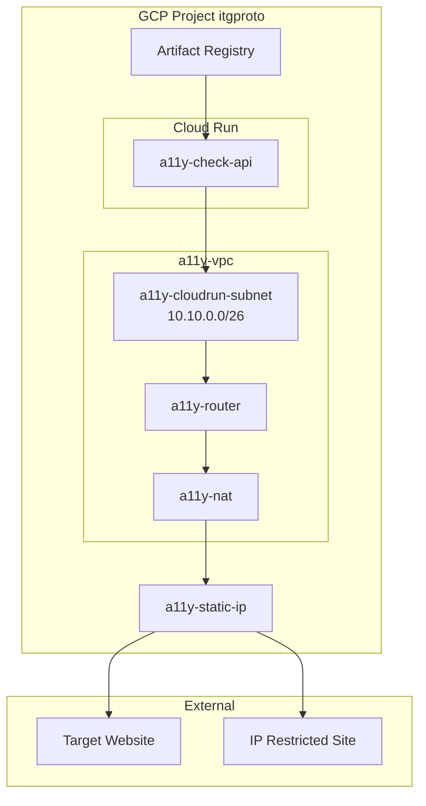
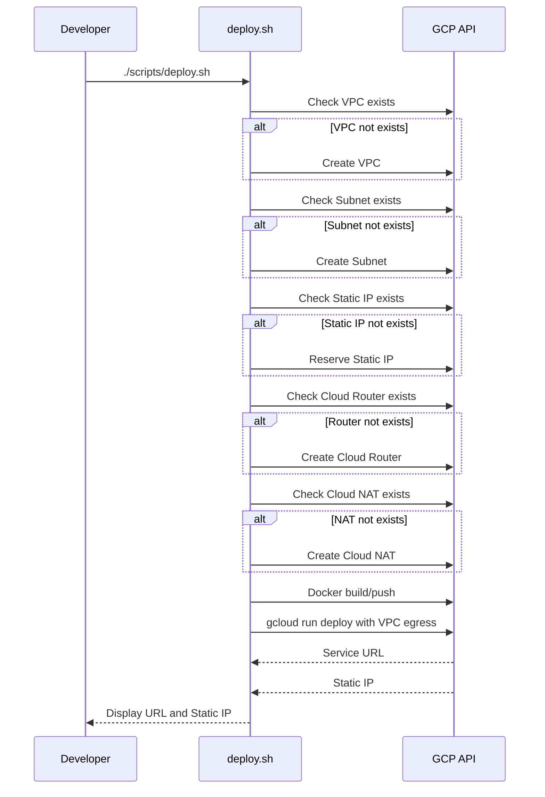

# Technical Design Document: Static IP Egress

## Overview

**Purpose**: Cloud Runからの外向き通信に固定IPアドレスを使用し、IPアドレス制限のある社内ツールのアクセシビリティチェックを可能にする。

**Users**: 開発者がdeploy.shを実行してデプロイし、エンドユーザーがIP制限サイトのアクセシビリティ分析を実行する。

**Impact**: 既存のCloud Runデプロイにvpc + Cloud NAT構成を追加。デプロイスクリプトを拡張。

### Goals
- Cloud Runからの外向き通信に固定IPアドレスを使用
- VPC + Cloud NATによるDirect VPC egress構成の実装
- デプロイスクリプトの冪等性確保

### Non-Goals
- 複数固定IPアドレスの管理（将来検討）
- VPCファイアウォールルールのカスタマイズ
- Private Google Accessの設定

## Architecture

### Existing Architecture Analysis

現在のCloud Run構成：
- サービス名: a11y-check-api
- リージョン: asia-northeast1
- VPC接続: なし（パブリックエグレス）
- IPアドレス: 動的

既存パターン：
- `scripts/deploy.sh`によるデプロイ自動化
- gcloudコマンドでのリソース作成（存在チェック後）
- エラー時即終了（set -e）

### Architecture Pattern & Boundary Map



**Architecture Integration**:
- **Selected Pattern**: Direct VPC egress + Cloud NAT
- **Domain Boundaries**: インフラ構成はdeploy.shで管理、アプリケーションコードは変更なし
- **Existing Patterns Preserved**: gcloudコマンド、冪等性、エラーハンドリング
- **New Components**: VPC、サブネット、Cloud Router、Cloud NAT、静的IP
- **Steering Compliance**: 既存のデプロイパターンを踏襲

### Technology Stack

| Layer | Choice / Version | Role in Feature | Notes |
|-------|------------------|-----------------|-------|
| Infrastructure | Google Cloud VPC | プライベートネットワーク | カスタムモード |
| Infrastructure | Cloud NAT | NAT変換 | 手動IP割り当てモード |
| Infrastructure | Cloud Router | NATゲートウェイ用 | asia-northeast1 |
| Compute | Cloud Run | サーバーレスコンテナ | Direct VPC egress |
| Deploy Tool | gcloud CLI | インフラ作成・デプロイ | 既存パターン踏襲 |

## System Flows

### デプロイフロー



## Requirements Traceability

| Requirement | Summary | Components | Interfaces | Flows |
|-------------|---------|------------|------------|-------|
| 1.1, 1.2, 1.3, 1.4, 1.5 | VPCネットワーク構成 | deploy.sh | gcloud compute networks/subnets | Deploy |
| 2.1, 2.2, 2.3, 2.4 | 固定IPアドレス割り当て | deploy.sh | gcloud compute addresses | Deploy |
| 3.1, 3.2, 3.3, 3.4, 3.5, 3.6 | Cloud NAT構成 | deploy.sh | gcloud compute routers/nats | Deploy |
| 4.1, 4.2, 4.3, 4.4 | Cloud Run Direct VPC Egress | deploy.sh | gcloud run deploy | Deploy |
| 5.1, 5.2, 5.3, 5.4 | デプロイスクリプト拡張 | deploy.sh | Shell | Deploy |
| 6.1, 6.2, 6.3 | 動作確認 | curl | HTTP | - |

## Components and Interfaces

| Component | Domain/Layer | Intent | Req Coverage | Key Dependencies | Contracts |
|-----------|--------------|--------|--------------|------------------|-----------|
| deploy.sh | Infrastructure | VPCインフラ作成とCloud Runデプロイ | 1.1-6.3 | gcloud CLI (P0) | Shell |

### Infrastructure

#### deploy.sh（拡張）

| Field | Detail |
|-------|--------|
| Intent | VPCインフラストラクチャとCloud Runを一括デプロイ |
| Requirements | 1.1-1.5, 2.1-2.4, 3.1-3.6, 4.1-4.4, 5.1-5.4 |

**Responsibilities & Constraints**
- VPCネットワーク、サブネット、静的IP、Cloud Router、Cloud NATの作成
- 各リソースの存在チェックによる冪等性確保
- Cloud RunへのDirect VPC egress設定
- デプロイ完了時のサービスURLと固定IP表示

**Dependencies**
- External: gcloud CLI — GCPリソース操作 (P0)
- External: docker CLI — イメージビルド (P0)

**Contracts**: Service [ ] / API [ ] / Event [ ] / Batch [ ] / State [ ]

##### Shell Script Structure

```bash
#!/bin/bash
set -e

# 設定変数
PROJECT_ID="itgproto"
REGION="asia-northeast1"
SERVICE_NAME="a11y-check-api"
VPC_NAME="a11y-vpc"
SUBNET_NAME="a11y-cloudrun-subnet"
SUBNET_RANGE="10.10.0.0/26"
ROUTER_NAME="a11y-router"
NAT_NAME="a11y-nat"
STATIC_IP_NAME="a11y-static-ip"

# VPC作成（存在チェック付き）
# gcloud compute networks describe で存在確認
# 存在しなければ gcloud compute networks create

# サブネット作成（存在チェック付き）
# gcloud compute networks subnets describe で存在確認
# 存在しなければ gcloud compute networks subnets create

# 静的IP予約（存在チェック付き）
# gcloud compute addresses describe で存在確認
# 存在しなければ gcloud compute addresses create

# Cloud Router作成（存在チェック付き）
# gcloud compute routers describe で存在確認
# 存在しなければ gcloud compute routers create

# Cloud NAT作成（存在チェック付き）
# gcloud compute routers nats describe で存在確認
# 存在しなければ gcloud compute routers nats create

# Docker build/push（既存ロジック）

# Cloud Runデプロイ（VPC egress追加）
# --network, --subnet, --vpc-egress=all-traffic オプション追加

# 結果表示
# サービスURLと固定IPアドレスを表示
```

##### gcloud Commands

**VPCネットワーク作成**:
```bash
gcloud compute networks create ${VPC_NAME} \
    --project=${PROJECT_ID} \
    --subnet-mode=custom
```

**サブネット作成**:
```bash
gcloud compute networks subnets create ${SUBNET_NAME} \
    --project=${PROJECT_ID} \
    --network=${VPC_NAME} \
    --region=${REGION} \
    --range=${SUBNET_RANGE}
```

**静的IP予約**:
```bash
gcloud compute addresses create ${STATIC_IP_NAME} \
    --project=${PROJECT_ID} \
    --region=${REGION}
```

**Cloud Router作成**:
```bash
gcloud compute routers create ${ROUTER_NAME} \
    --project=${PROJECT_ID} \
    --network=${VPC_NAME} \
    --region=${REGION}
```

**Cloud NAT作成**:
```bash
gcloud compute routers nats create ${NAT_NAME} \
    --project=${PROJECT_ID} \
    --router=${ROUTER_NAME} \
    --region=${REGION} \
    --nat-custom-subnet-ip-ranges=${SUBNET_NAME} \
    --nat-external-ip-pool=${STATIC_IP_NAME}
```

**Cloud Runデプロイ（VPC egress付き）**:
```bash
gcloud run deploy ${SERVICE_NAME} \
    --image ${REGISTRY}/${IMAGE_NAME}:latest \
    --region ${REGION} \
    --platform managed \
    --allow-unauthenticated \
    --memory 2Gi \
    --timeout 300 \
    --min-instances 0 \
    --max-instances 10 \
    --network=${VPC_NAME} \
    --subnet=${SUBNET_NAME} \
    --vpc-egress=all-traffic \
    --set-env-vars "NODE_ENV=production"
```

**Implementation Notes**
- 存在チェック: `gcloud describe` コマンドの終了コードで判定
- 冪等性: `2>/dev/null || true` または明示的な存在チェック
- エラー表示: `set -e` により即時終了、エラーメッセージはgcloud出力に依存

## Error Handling

### Error Strategy
デプロイスクリプトは`set -e`で即時終了し、エラー箇所を明確化。

### Error Categories and Responses

**GCP API Errors**:
- 認証エラー → `gcloud auth login`を案内
- 権限不足 → IAM権限の確認を案内
- リソース作成失敗 → gcloudエラーメッセージを表示

**Network Errors**:
- サブネットCIDR競合 → 別のCIDRレンジを検討
- IP予約失敗 → リージョンのIP割り当て制限を確認

### Monitoring
- Cloud NATログ: `--enable-logging`オプションで有効化可能
- 固定IP確認: api.ipify.org等で外部IP確認

## Testing Strategy

### Unit Tests
- deploy.shのシンタックスチェック
- 設定変数の検証

### Integration Tests
- VPCインフラの作成確認
- Cloud Runデプロイ成功確認
- 固定IPアドレスの動作確認（api.ipify.orgへのアクセス）

### E2E Tests
- デプロイ後のヘルスチェック（/api/health）
- 分析API動作確認（/api/analyze）

## Security Considerations

- **VPCファイアウォール**: デフォルトで外向き通信許可
- **未認証アクセス**: 既存設定を維持（--allow-unauthenticated）
- **固定IPの共有**: 社内ツール管理者にIPを通知し許可リストに追加

## Performance & Scalability

- **レイテンシ**: Cloud NATはコントロールプレーンのみ、追加ホップなし
- **スループット**: Cloud Runインスタンスあたり最大1Gbps
- **スケーリング**: 単一固定IPで開始、必要に応じて複数IP対応
- **コールドスタート**: VPC接続確立で若干の増加（数秒程度）

---

_参考: [Direct VPC egress | Cloud Run](https://docs.cloud.google.com/run/docs/configuring/vpc-direct-vpc), [Static outbound IP | Cloud Run](https://docs.cloud.google.com/run/docs/configuring/static-outbound-ip)_
