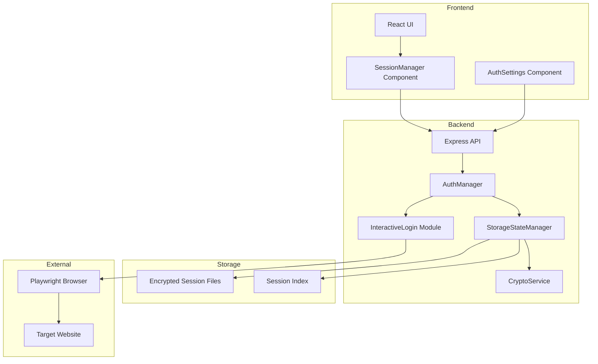
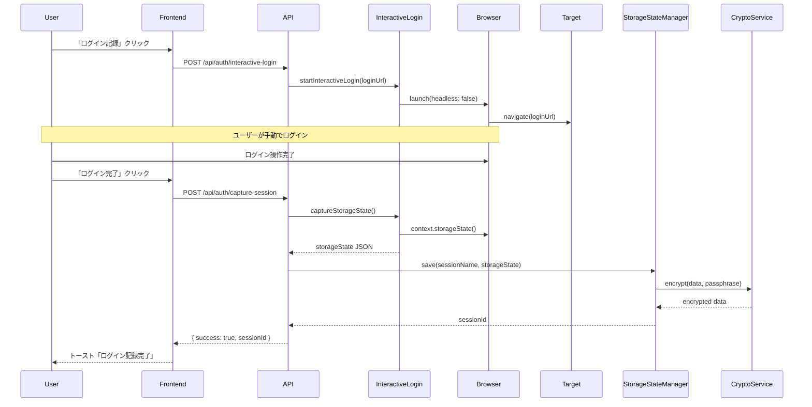
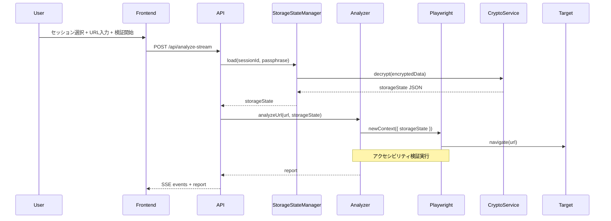
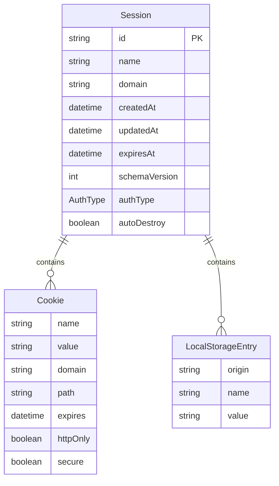

# Design Document: userauth

## Overview

**Purpose**: 本機能は、ユーザーが認証情報を手動で調査・入力する現行方式を改善し、ブラウザ上で直接認証を行ってセッション状態を自動キャプチャする仕組みを提供する。これにより、セキュリティリスクの低減と認証済みページのアクセシビリティ検証UXの向上を実現する。

**Users**: 開発者、QAエンジニア、アクセシビリティ監査担当者が、認証が必要なWebアプリケーションのアクセシビリティ検証に利用する。

**Impact**: 現行のAuthManagerを拡張し、storageState永続化・暗号化機能を追加。フロントエンドにセッション管理UIを新規追加。

### Goals

- セキュアなストレージステート永続化（AES-256-GCM暗号化）
- 複数認証セッションの保存・切り替え機能
- 既存AuthManager/AuthConfigとの後方互換性維持
- 段階的な機能拡張を可能にするモジュラー設計

### Non-Goals

- Electronデスクトップアプリの開発（将来オプション）
- ブラウザ拡張機能の開発（将来オプション）
- 全IdPのOAuth/SSO対応（主要IdPに限定）
- リアルタイムトークンリフレッシュの自動化（Phase 1では手動再ログイン）

## Architecture

### Existing Architecture Analysis

現行システムの認証フロー:
- `AuthManager`がFactory/Strategyパターンで認証方式を抽象化
- `storageState()`はPlaywrightコンテキストから取得済み（フォームログイン時）
- 認証情報はクエリパラメータ経由で送信（セキュリティリスク）
- Secret Manager統合は既に存在（GCP環境）

**技術的制約**:
- Cloud Run環境ではheadedブラウザ表示不可
- keytarライブラリはメンテナンス停止

### Architecture Pattern & Boundary Map



**Architecture Integration**:
- **Selected pattern**: レイヤードアーキテクチャ + Strategy（認証方式の抽象化を継続）
- **Domain boundaries**:
  - `auth/` ドメインに新規モジュールを追加
  - フロントエンドはAPI経由でのみバックエンドと通信
- **Existing patterns preserved**: AuthManager、SSE通信、MUIコンポーネント
- **New components rationale**:
  - `StorageStateManager`: 永続化・暗号化の責務分離
  - `CryptoService`: 暗号化ロジックの再利用性確保
  - `SessionManager`: セッション管理UIの独立性
- **Steering compliance**: TypeScript型安全性、関心の分離、日本語コメント

### Technology Stack

| Layer | Choice / Version | Role in Feature | Notes |
|-------|------------------|-----------------|-------|
| Frontend | React 19 + MUI | セッション管理UI | 既存スタック継続 |
| Backend | Express 5 + Node.js 22 | APIエンドポイント | 既存スタック継続 |
| Data / Storage | JSON Files (encrypted) | セッション永続化 | AES-256-GCM |
| Crypto | Node.js crypto (built-in) | 暗号化・復号化 | 外部依存なし |
| Browser Automation | Playwright 1.52+ | インタラクティブログイン | 既存依存 |

## System Flows

### インタラクティブログインフロー（開発環境）



### セッション再利用による検証フロー



## Requirements Traceability

| Requirement | Summary | Components | Interfaces | Flows |
|-------------|---------|------------|------------|-------|
| 1.1 | ログイン記録ボタンでブラウザ起動 | InteractiveLogin, SessionManagerUI | InteractiveLoginService | インタラクティブログイン |
| 1.2 | ガイダンスバナー表示 | InteractiveLogin | - | インタラクティブログイン |
| 1.3 | ログイン完了後セッションキャプチャ | InteractiveLogin | InteractiveLoginService | インタラクティブログイン |
| 1.4 | 暗号化してストレージステート保存 | StorageStateManager, CryptoService | StorageStateService | インタラクティブログイン |
| 1.5 | 生パスワード非保存 | CryptoService | - | - |
| 2.1 | ストレージステート復号化・読み込み | StorageStateManager | StorageStateService | セッション再利用 |
| 2.2 | 認証済み状態で検証実行 | Analyzer (既存拡張) | - | セッション再利用 |
| 2.3 | 復号化失敗時エラー表示 | StorageStateManager, Frontend | ErrorTypes | - |
| 2.4 | 401/403エラー時再ログイン促進 | Analyzer, Frontend | SSEEvent拡張 | セッション再利用 |
| 2.5 | 同一プロファイルで再起動 | InteractiveLogin | - | インタラクティブログイン |
| 3.1 | Basic認証ダイアログ | AuthSettings (既存) | AuthConfig | - |
| 3.2 | Authorizationヘッダー注入 | AuthManager (既存) | - | - |
| 3.3 | フォーム認証でログイン記録 | InteractiveLogin | - | インタラクティブログイン |
| 3.4 | OAuth localhostコールバック | OAuthHandler (Phase 3) | - | 将来実装 |
| 3.5 | 企業SSOセッションキャプチャ | InteractiveLogin | - | 将来実装 |
| 3.6 | OAuth トークンのみ保存 | StorageStateManager | SessionMetadata | - |
| 4.1 | AES-256暗号化 | CryptoService | EncryptionResult | - |
| 4.2 | OSキーチェーン取得 | KeychainAdapter (オプション) | - | 将来実装 |
| 4.3 | localhost経由のみ | InteractiveLogin | - | - |
| 4.4 | 自己破棄オプション | StorageStateManager | SessionOptions | - |
| 4.5 | 環境変数からシークレット読み込み | SecretManager (既存) | - | - |
| 4.6 | メモリ内シークレット保持 | CryptoService | - | - |
| 5.1 | セッション名指定保存 | StorageStateManager | SessionMetadata | - |
| 5.2 | セッション一覧ドロップダウン | SessionManagerUI | - | - |
| 5.3 | セッション選択で読み込み | SessionManagerUI | SessionListItem | - |
| 5.4 | ロックアイコン・メタデータ表示 | SessionManagerUI | SessionMetadata | - |
| 5.5 | セッション削除 | StorageStateManager | - | - |
| 6.1 | スキーマバージョン・タイムスタンプ | SessionMetadata | - | - |
| 6.2 | サイレントリフレッシュ | - | - | Phase 3以降 |
| 6.3 | リフレッシュ失敗エラー | Frontend | ErrorTypes | - |
| 6.4 | 並列ワーカー分離 | Analyzer | - | 既存パターン活用 |
| 6.5 | 検証後クリーンアップ | Analyzer | - | 既存パターン活用 |
| 7.1 | ワンクリックログイン記録ボタン | SessionManagerUI | - | - |
| 7.2 | ブラウザ前面表示 | InteractiveLogin | - | - |
| 7.3 | トースト通知 | Frontend (既存Snackbar) | - | - |
| 7.4 | 認証状態視覚表示 | SessionManagerUI | AuthStatus | - |
| 7.5 | 認証方式選択 | AuthSettings (既存拡張) | - | - |
| 7.6 | 再認証ボタン | SessionManagerUI | - | - |

## Components and Interfaces

### Component Summary

| Component | Domain/Layer | Intent | Req Coverage | Key Dependencies | Contracts |
|-----------|--------------|--------|--------------|------------------|-----------|
| CryptoService | Backend/Auth | AES-256-GCM暗号化・復号化 | 4.1, 4.6, 1.5 | Node.js crypto (P0) | Service |
| StorageStateManager | Backend/Auth | セッション永続化・管理 | 1.4, 2.1, 5.1-5.5, 6.1 | CryptoService (P0), fs (P0) | Service, State |
| InteractiveLogin | Backend/Auth | headedブラウザでのログインキャプチャ | 1.1-1.3, 2.5, 3.3, 4.3 | Playwright (P0) | Service |
| SessionManagerUI | Frontend/Components | セッション管理UI | 5.2-5.4, 7.1, 7.4, 7.6 | MUI (P0), api.ts (P1) | State |
| AuthSettings | Frontend/Components | 認証設定ダイアログ（拡張） | 3.1, 7.5 | MUI (P0) | - |

### Backend / Auth Domain

#### CryptoService

| Field | Detail |
|-------|--------|
| Intent | AES-256-GCM暗号化・復号化とPBKDF2鍵導出を提供 |
| Requirements | 4.1, 4.6, 1.5 |

**Responsibilities & Constraints**
- ストレージステートJSONの暗号化・復号化
- パスフレーズからの安全な鍵導出（PBKDF2-SHA256、310,000反復）
- 暗号化データのフォーマット管理（IV + ciphertext + authTag）
- 生パスワードをログ・ファイルに出力しない

**Dependencies**
- External: Node.js crypto — 暗号化プリミティブ (P0)

**Contracts**: Service [x] / API [ ] / Event [ ] / Batch [ ] / State [ ]

##### Service Interface

```typescript
interface CryptoService {
  encrypt(data: string, passphrase: string): EncryptionResult;
  decrypt(encryptedData: Buffer, passphrase: string): Result<string, DecryptionError>;
  deriveKey(passphrase: string, salt: Buffer): Buffer;
}

interface EncryptionResult {
  data: Buffer;      // IV (12 bytes) + ciphertext + authTag (16 bytes)
  salt: Buffer;      // PBKDF2 salt (64 bytes)
}

type DecryptionError =
  | { type: 'invalid_passphrase'; message: string }
  | { type: 'corrupted_data'; message: string }
  | { type: 'unsupported_version'; message: string };
```

- Preconditions: passphrase は空文字列でないこと
- Postconditions: 暗号化データは復号化可能、復号化データは元のデータと一致
- Invariants: 同一passphrase + saltで同一keyが導出される

**Implementation Notes**
- Integration: Node.js crypto の `createCipheriv('aes-256-gcm')` を使用
- Validation: 復号化時にauthTagを検証、改ざん検出
- Risks: PBKDF2反復回数が将来不足する可能性 → 設定可能にする

---

#### StorageStateManager

| Field | Detail |
|-------|--------|
| Intent | 暗号化されたセッションファイルの永続化・読み込み・管理 |
| Requirements | 1.4, 2.1, 5.1-5.5, 6.1 |

**Responsibilities & Constraints**
- セッションファイルの暗号化保存・復号化読み込み
- セッションインデックスの管理（メタデータのみ）
- セッションの作成・更新・削除・一覧取得
- ファイルシステムへの安全なアクセス

**Dependencies**
- Inbound: API routes — セッション操作リクエスト (P0)
- Outbound: CryptoService — 暗号化・復号化 (P0)
- External: Node.js fs — ファイル操作 (P0)

**Contracts**: Service [x] / API [ ] / Event [ ] / Batch [ ] / State [x]

##### Service Interface

```typescript
interface StorageStateManager {
  save(
    sessionName: string,
    storageState: PlaywrightStorageState,
    passphrase: string,
    options?: SessionOptions
  ): Result<SessionMetadata, SaveError>;

  load(
    sessionId: string,
    passphrase: string
  ): Result<PlaywrightStorageState, LoadError>;

  list(): SessionMetadata[];

  delete(sessionId: string): Result<void, DeleteError>;

  getMetadata(sessionId: string): SessionMetadata | null;
}

interface SessionOptions {
  autoDestroy?: boolean;      // 検証後に自動削除
  expiresAt?: string;         // ISO 8601 有効期限
}

interface SessionMetadata {
  id: string;
  name: string;
  domain: string;
  createdAt: string;
  updatedAt: string;
  expiresAt?: string;
  schemaVersion: number;
  authType: AuthType;
  autoDestroy: boolean;
}

type SaveError =
  | { type: 'encryption_failed'; message: string }
  | { type: 'io_error'; message: string }
  | { type: 'duplicate_name'; message: string };

type LoadError =
  | { type: 'not_found'; message: string }
  | { type: 'decryption_failed'; message: string }
  | { type: 'io_error'; message: string };

type DeleteError =
  | { type: 'not_found'; message: string }
  | { type: 'io_error'; message: string };
```

- Preconditions: sessionNameは1-50文字の有効な文字列
- Postconditions: 保存後はloadで取得可能、削除後はloadでnot_found
- Invariants: インデックスとファイルシステムの整合性を維持

##### State Management

- State model: ファイルシステムベース
  - `server/data/sessions/{session-id}.enc` — 暗号化セッションデータ
  - `server/data/sessions/index.json` — セッションメタデータ一覧
- Persistence: JSONファイル + AES-256-GCM暗号化
- Concurrency: ファイルロック（fs-extra）で排他制御

**Implementation Notes**
- Integration: fs.promises API使用、非同期I/O
- Validation: sessionNameのサニタイズ（パス操作防止）
- Risks: ディスク容量不足 → セッション数上限（20）設定

---

#### InteractiveLogin

| Field | Detail |
|-------|--------|
| Intent | headedブラウザでのユーザー手動ログインとセッションキャプチャ |
| Requirements | 1.1-1.3, 2.5, 3.3, 4.3 |

**Responsibilities & Constraints**
- headedモードでPlaywrightブラウザを起動
- ユーザーのログイン操作完了を待機
- storageStateのキャプチャ
- ブラウザコンテキストのクリーンアップ
- **制約**: Cloud Run環境では使用不可（開発環境専用）

**Dependencies**
- Inbound: API routes — ログイン開始・完了リクエスト (P0)
- Outbound: StorageStateManager — セッション保存 (P1)
- External: Playwright — ブラウザ自動化 (P0)

**Contracts**: Service [x] / API [ ] / Event [ ] / Batch [ ] / State [x]

##### Service Interface

```typescript
interface InteractiveLoginService {
  startLogin(loginUrl: string, options?: LoginOptions): Result<LoginSession, LoginError>;

  captureSession(
    loginSessionId: string,
    sessionName: string,
    passphrase: string
  ): Result<SessionMetadata, CaptureError>;

  cancelLogin(loginSessionId: string): void;

  getActiveSession(): LoginSession | null;
}

interface LoginSession {
  id: string;
  loginUrl: string;
  startedAt: string;
  status: 'waiting_for_login' | 'ready_to_capture' | 'captured' | 'cancelled';
}

interface LoginOptions {
  timeout?: number;           // ミリ秒、デフォルト300000 (5分)
  browserType?: 'chromium' | 'firefox' | 'webkit';
}

type LoginError =
  | { type: 'browser_launch_failed'; message: string }
  | { type: 'navigation_failed'; message: string }
  | { type: 'headless_environment'; message: string };

type CaptureError =
  | { type: 'session_not_found'; message: string }
  | { type: 'capture_failed'; message: string }
  | { type: 'save_failed'; message: string };
```

- Preconditions: loginUrlは有効なHTTP/HTTPS URL
- Postconditions: captureSession成功後はStorageStateManagerにセッション保存済み
- Invariants: 同時に1つのLoginSessionのみアクティブ

##### State Management

- State model: インメモリ（LoginSession）
- Persistence: なし（ブラウザコンテキストは一時的）
- Concurrency: 単一アクティブセッション制約

**Implementation Notes**
- Integration: `chromium.launch({ headless: false })` でheadedモード
- Validation: 環境変数 `ALLOW_HEADED_BROWSER` でheaded許可を制御
- Risks: Cloud Run環境でのエラー → 環境検出して明確なエラーメッセージ

---

### Frontend / Components

#### SessionManagerUI

| Field | Detail |
|-------|--------|
| Intent | セッション一覧表示・選択・管理のUIコンポーネント |
| Requirements | 5.2-5.4, 7.1, 7.4, 7.6 |

**Responsibilities & Constraints**
- セッション一覧のドロップダウン表示
- セッション選択・削除操作
- 認証状態（未認証/認証済み/期限切れ）の視覚表示
- ログイン記録・再認証ボタンの提供

**Dependencies**
- Inbound: UrlInput — セッション選択状態 (P0)
- Outbound: api.ts — セッションAPI呼び出し (P0)
- External: MUI — UIコンポーネント (P0)

**Contracts**: Service [ ] / API [ ] / Event [ ] / Batch [ ] / State [x]

##### State Management

```typescript
interface SessionManagerState {
  sessions: SessionListItem[];
  selectedSessionId: string | null;
  authStatus: AuthStatus;
  isLoading: boolean;
  error: string | null;
}

interface SessionListItem {
  id: string;
  name: string;
  domain: string;
  authType: AuthType;
  expiresAt?: string;
  isExpired: boolean;
}

type AuthStatus = 'unauthenticated' | 'authenticated' | 'expired';
```

- State model: React useState + useEffect
- Persistence: セッション一覧はAPI経由で取得
- Concurrency: 楽観的UI更新、API失敗時にロールバック

**Implementation Notes**
- Integration: MUI Select, IconButton, Tooltip使用
- Validation: セッション削除時に確認ダイアログ
- Risks: 大量セッション時のパフォーマンス → 仮想スクロール検討

---

### API Contracts

#### Session Management API

| Method | Endpoint | Request | Response | Errors |
|--------|----------|---------|----------|--------|
| GET | /api/sessions | - | SessionMetadata[] | 500 |
| POST | /api/sessions | CreateSessionRequest | SessionMetadata | 400, 409, 500 |
| GET | /api/sessions/:id | - | SessionMetadata | 404, 500 |
| DELETE | /api/sessions/:id | - | void | 404, 500 |
| POST | /api/sessions/:id/load | LoadSessionRequest | StorageStateResponse | 400, 401, 404, 500 |

```typescript
interface CreateSessionRequest {
  name: string;
  storageState: PlaywrightStorageState;
  passphrase: string;
  options?: SessionOptions;
}

interface LoadSessionRequest {
  passphrase: string;
}

interface StorageStateResponse {
  storageState: PlaywrightStorageState;
}
```

#### Interactive Login API（開発環境専用）

| Method | Endpoint | Request | Response | Errors |
|--------|----------|---------|----------|--------|
| POST | /api/auth/interactive-login | StartLoginRequest | LoginSession | 400, 503 |
| POST | /api/auth/capture-session | CaptureSessionRequest | SessionMetadata | 400, 404, 500 |
| DELETE | /api/auth/interactive-login | - | void | 404 |

```typescript
interface StartLoginRequest {
  loginUrl: string;
  options?: LoginOptions;
}

interface CaptureSessionRequest {
  sessionName: string;
  passphrase: string;
}
```

## Data Models

### Domain Model



**Business Rules & Invariants**:
- セッション名はドメイン内で一意
- スキーマバージョンは上位互換性を維持
- 期限切れセッションは警告表示するが削除しない

### Logical Data Model

**Session Index File** (`sessions/index.json`):
```typescript
interface SessionIndex {
  version: number;                    // インデックススキーマバージョン
  sessions: SessionMetadata[];        // セッションメタデータ配列
}
```

**Encrypted Session File** (`sessions/{id}.enc`):
```
[64-byte PBKDF2 salt][12-byte IV][ciphertext][16-byte auth tag]
```

内部構造（復号化後）:
```typescript
interface EncryptedSessionPayload {
  version: number;                    // ペイロードスキーマバージョン
  storageState: PlaywrightStorageState;
}
```

## Error Handling

### Error Strategy

- **Fail Fast**: パスフレーズ検証は即座に実行
- **Graceful Degradation**: セッション読み込み失敗時は手動入力にフォールバック
- **User Context**: 日本語のアクション可能なエラーメッセージ

### Error Categories and Responses

**User Errors (4xx)**:
- 400: パスフレーズが空、セッション名が無効
- 401: パスフレーズが不正（復号化失敗）
- 404: セッションが存在しない
- 409: セッション名が重複

**System Errors (5xx)**:
- 500: ファイルI/Oエラー、暗号化エラー
- 503: headedブラウザ環境が利用不可（Cloud Run）

**Business Logic Errors (422)**:
- セッション数上限超過
- セッション期限切れ（警告のみ）

### Monitoring

- エラーログ: 暗号化失敗、I/Oエラーをconsole.errorで記録
- メトリクス: セッション作成/読み込み/削除の成功/失敗カウント

## Testing Strategy

### Unit Tests

- `CryptoService.encrypt/decrypt`: 暗号化・復号化の往復テスト
- `CryptoService.deriveKey`: PBKDF2鍵導出の決定論的テスト
- `StorageStateManager.save/load`: セッション永続化の整合性テスト
- `SessionMetadata`のスキーマバリデーション

### Integration Tests

- API `/api/sessions` CRUD操作のE2Eテスト
- `InteractiveLogin` + `StorageStateManager`のフロー統合テスト
- 不正パスフレーズでの復号化失敗テスト
- 同時セッション操作の競合テスト

### E2E/UI Tests

- セッション一覧表示・選択・削除のUIフロー
- ログイン記録ボタンのクリック → トースト表示
- 認証状態インジケーターの視覚テスト

## Security Considerations

### Threat Model

- **攻撃対象**: 暗号化セッションファイル、パスフレーズ
- **脅威**: オフライン攻撃によるパスフレーズ推測、メモリダンプ

### Security Controls

- **暗号化**: AES-256-GCM（認証付き暗号化）
- **鍵導出**: PBKDF2-SHA256、310,000反復（ブルートフォース耐性）
- **パスフレーズ**: メモリ内でのみ保持、ログ出力禁止
- **ファイルパーミッション**: セッションファイルは600（所有者のみ読み書き）

### Data Protection

- 生パスワード・クレデンシャルは一切保存しない
- storageStateに含まれるのは認証後のトークン・Cookieのみ
- 自己破棄オプションで検証後にファイル削除可能

## Performance & Scalability

### Target Metrics

- セッション保存: < 500ms
- セッション読み込み: < 300ms
- セッション一覧取得: < 100ms（20件以下）

### Scaling Approach

- セッション数上限: 20（ファイルシステムベースの制約）
- 大規模利用が必要な場合はデータベース移行を検討

## Migration Strategy

### Phase 1: 基盤構築

1. CryptoService実装
2. StorageStateManager実装
3. Session Management API実装
4. SessionManagerUI実装

### Phase 2: インタラクティブログイン

1. InteractiveLogin実装（開発環境専用）
2. Interactive Login API実装
3. フロントエンドUIとの統合

### Phase 3: OAuth/SSO対応（将来）

1. OAuthHandler実装
2. localhostコールバック対応
3. 主要IdP統合テスト

### Rollback Strategy

- 既存AuthSettings/AuthConfigとの後方互換性維持
- 新機能はフィーチャーフラグで制御可能
- セッションファイルは独立したディレクトリに保存（既存機能に影響なし）
