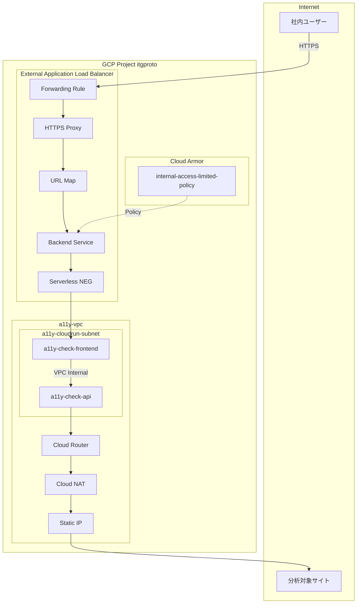
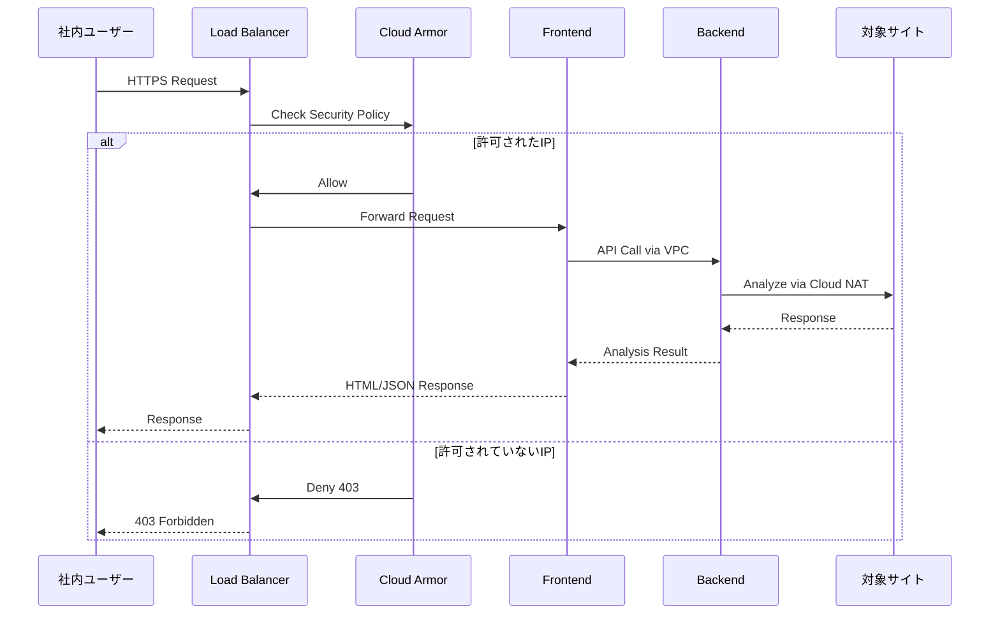
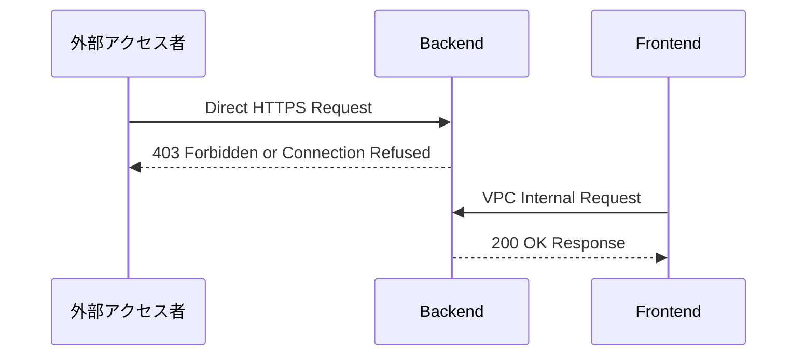
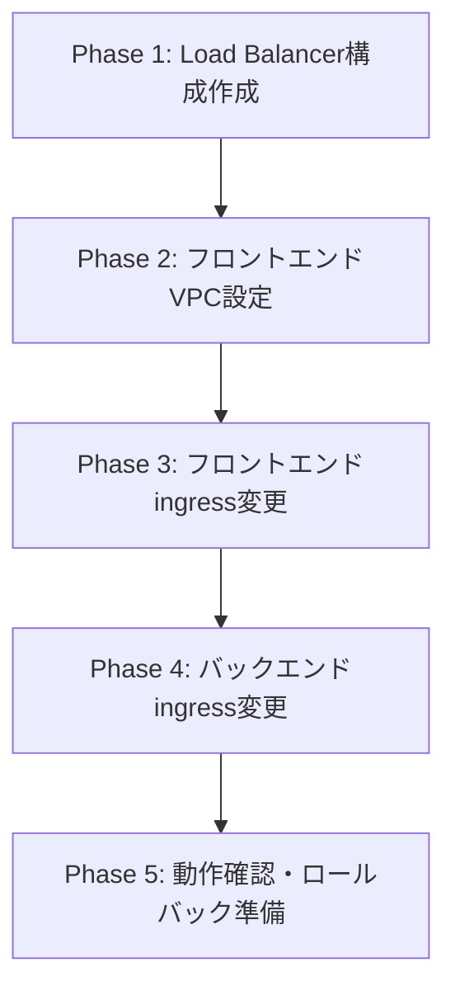

# Technical Design Document

## Overview

**Purpose**: 本フィーチャーは、アクセシビリティチェックツールのセキュリティ強化を目的とする。現在インターネット経由でどこからでもアクセス可能なフロントエンド・バックエンドを、VPCベースのネットワーク分離とCloud Armorによるアクセス制御で保護する。

**Users**: セキュリティ担当者、開発者、システム管理者がインフラ構成を管理し、社内ユーザーがアプリケーションを利用する。

**Impact**: バックエンドへの直接アクセスを遮断し、フロントエンドへのアクセスを社内ネットワークからのみに制限する。

### Goals

- バックエンドAPIへのアクセスをVPC内部からのみに限定
- フロントエンドへのアクセスをCloud Armor経由で社内IPに制限
- バックエンドの外部通信（対象サイト分析用）を既存の静的IPで維持
- 既存機能の完全な動作維持（回帰なし）

### Non-Goals

- ユーザー認証の変更（既存のアプリケーションレベル認証はそのまま）
- バックエンドの外部通信用IP変更
- フロントエンドのUIやバックエンドのAPIロジック変更
- 新規ドメイン名の取得（既存run.appドメインまたはLoad Balancer IPを使用）

## Architecture

### Existing Architecture Analysis

現在のアーキテクチャ:
- **バックエンド（a11y-check-api）**: Direct VPC egress設定済み（a11y-vpc, a11y-cloudrun-subnet）、Cloud NAT経由で外部通信、`ingress=all`で全アクセス許可
- **フロントエンド（a11y-check-frontend）**: VPC設定なし、`ingress=all`で全アクセス許可
- **既存VPCインフラ**: a11y-vpc、a11y-cloudrun-subnet（10.10.0.0/26）、a11y-router、a11y-nat、a11y-static-ip

維持すべきパターン:
- Cloud NAT + 静的IP経由の外部通信
- 決定論的URL形式（SERVICE-PROJECT_NUMBER.REGION.run.app）

### Architecture Pattern & Boundary Map



**Architecture Integration**:
- **Selected pattern**: VPC分離 + External ALB + Cloud Armor（既存VPCインフラを活用したゼロトラストネットワーク）
- **Domain/feature boundaries**:
  - バックエンド: VPC内部からのみアクセス可能（ingress=internal）
  - フロントエンド: Load Balancer経由のみアクセス可能（ingress=internal-and-cloud-load-balancing）
- **Existing patterns preserved**:
  - Cloud NAT経由の外部通信（静的IP維持）
  - Direct VPC egressによるVPC接続
- **New components rationale**:
  - External ALB: Cloud Armor適用に必須
  - Serverless NEG: Cloud RunをLoad Balancerバックエンドにするために必須
- **Steering compliance**: 決定論的URL形式を継続使用

### Technology Stack

| Layer | Choice / Version | Role in Feature | Notes |
|-------|------------------|-----------------|-------|
| Infrastructure | Cloud Run (managed) | アプリケーションホスティング | ingress設定変更 |
| Networking | VPC, Direct VPC egress | 内部ネットワーク通信 | 既存a11y-vpc使用 |
| Load Balancing | External Application Load Balancer | トラフィック分散、Cloud Armor適用ポイント | 新規作成 |
| Security | Cloud Armor | WAF、IPベースアクセス制御 | 既存ポリシー使用 |
| NAT | Cloud NAT | 外部通信の静的IP化 | 既存設定維持 |

## System Flows

### フロントエンドアクセスフロー



### バックエンド直接アクセス拒否フロー



## Requirements Traceability

| Requirement | Summary | Components | Interfaces | Flows |
|-------------|---------|------------|------------|-------|
| 1.1 | 外部からの403応答 | Backend, Cloud Run Ingress | - | バックエンド直接アクセス拒否フロー |
| 1.2 | VPC経由の正常処理 | Backend, Frontend | VPC Internal | フロントエンドアクセスフロー |
| 1.3 | ingress=internal設定 | deploy.sh | gcloud CLI | - |
| 1.4 | 既存VPCコネクタ使用 | Backend | Direct VPC egress | - |
| 2.1 | フロントエンドVPC接続 | Frontend, deploy-frontend.sh | Direct VPC egress | - |
| 2.2 | VPC経由のバックエンド通信 | Frontend, Backend | VPC Internal | フロントエンドアクセスフロー |
| 2.3 | vpc-egress=all-traffic | deploy-frontend.sh | gcloud CLI | - |
| 2.4 | 内部URL使用 | Frontend | API Endpoint | - |
| 3.1 | Cloud Armorポリシー適用 | Load Balancer, Cloud Armor | Backend Service | フロントエンドアクセスフロー |
| 3.2 | 社内IPからの許可 | Cloud Armor | Security Policy | フロントエンドアクセスフロー |
| 3.3 | 非許可IPのブロック | Cloud Armor | Security Policy | フロントエンドアクセスフロー |
| 3.4 | External ALB経由 | Load Balancer | Forwarding Rule | フロントエンドアクセスフロー |
| 4.1 | Cloud NAT経由外部通信 | Backend, Cloud NAT | - | フロントエンドアクセスフロー |
| 4.2 | 既存静的IP使用 | Cloud NAT, Static IP | - | - |
| 4.3 | NATアドレス維持 | Cloud NAT | - | - |
| 4.4 | NAT設定不変 | - | - | - |
| 5.1 | deploy.shにingress追加 | deploy.sh | gcloud CLI | - |
| 5.2 | deploy-frontend.shにVPC追加 | deploy-frontend.sh | gcloud CLI | - |
| 5.3 | 自動適用 | Deploy Scripts | gcloud CLI | - |
| 5.4 | 決定論的URL維持 | Deploy Scripts | URL Format | - |
| 6.1-6.4 | 既存機能維持 | All Components | All Interfaces | 全フロー |

## Components and Interfaces

| Component | Domain/Layer | Intent | Req Coverage | Key Dependencies | Contracts |
|-----------|--------------|--------|--------------|------------------|-----------|
| Backend Ingress Config | Infrastructure | バックエンドのアクセス制御 | 1.1, 1.2, 1.3 | Cloud Run (P0) | Cloud Run Config |
| Frontend VPC Config | Infrastructure | フロントエンドのVPC接続 | 2.1, 2.2, 2.3 | VPC (P0), Subnet (P0) | Cloud Run Config |
| Load Balancer Stack | Infrastructure | フロントエンドへのトラフィック経路 | 3.1, 3.4 | Static IP (P0), SSL Cert (P0) | HTTPS, Backend Service |
| Cloud Armor Integration | Security | IPベースアクセス制御 | 3.1, 3.2, 3.3 | Backend Service (P0) | Security Policy |
| Deploy Scripts | DevOps | 自動化されたインフラ設定 | 5.1, 5.2, 5.3, 5.4 | gcloud CLI (P0) | Shell Script |

### Infrastructure Layer

#### Backend Ingress Config

| Field | Detail |
|-------|--------|
| Intent | バックエンドCloud Runのingress設定をinternalに変更し、VPC内部からのみアクセス可能にする |
| Requirements | 1.1, 1.2, 1.3, 1.4 |

**Responsibilities & Constraints**
- Cloud Runサービスのingress設定を`internal`に設定
- 既存のDirect VPC egress設定（network, subnet, vpc-egress）は維持
- 既存のCloud NAT経由の外部通信は影響を受けない

**Dependencies**
- Inbound: Frontend — VPC経由のAPIリクエスト (P0)
- Outbound: Cloud NAT — 外部サイトへの分析リクエスト (P0)
- External: Cloud Run managed platform — ingress制御 (P0)

**Contracts**: Cloud Run Config [x]

##### Cloud Run Deploy Command

```bash
gcloud run deploy a11y-check-api \
    --region asia-northeast1 \
    --ingress internal \
    --network a11y-vpc \
    --subnet a11y-cloudrun-subnet \
    --vpc-egress all-traffic \
    # ... 他の既存設定
```

**Implementation Notes**
- Integration: `--ingress=internal`フラグの追加のみで設定完了
- Validation: デプロイ後に外部からのアクセス拒否を`curl`で確認
- Risks: 設定変更中の一時的なアクセス不可（リビジョン切り替え時）

#### Frontend VPC Config

| Field | Detail |
|-------|--------|
| Intent | フロントエンドCloud RunをバックエンドとVPC内で接続し、VPC経由でバックエンドAPIを呼び出せるようにする |
| Requirements | 2.1, 2.2, 2.3, 2.4 |

**Responsibilities & Constraints**
- フロントエンドをバックエンドと同一のVPC（a11y-vpc）に接続
- 同一サブネット（a11y-cloudrun-subnet）を使用
- `--vpc-egress=all-traffic`で全送信トラフィックをVPC経由に
- `--ingress=internal-and-cloud-load-balancing`でLoad Balancer経由のアクセスを許可

**Dependencies**
- Inbound: Load Balancer — HTTPSリクエスト (P0)
- Outbound: Backend — VPC経由のAPIリクエスト (P0)
- External: VPC Network — ネットワーク接続 (P0)

**Contracts**: Cloud Run Config [x]

##### Cloud Run Deploy Command

```bash
gcloud run deploy a11y-check-frontend \
    --region asia-northeast1 \
    --ingress internal-and-cloud-load-balancing \
    --network a11y-vpc \
    --subnet a11y-cloudrun-subnet \
    --vpc-egress all-traffic \
    # ... 他の既存設定
```

##### API Endpoint Configuration

フロントエンドからバックエンドへのAPI呼び出しURLは変更不要。Cloud RunのVPC内部通信では、run.app URLがVPC内部で解決される。

**Implementation Notes**
- Integration: サブネットIP範囲（/26=64アドレス）の容量確認が必要
- Validation: フロントエンドからバックエンドへのAPI呼び出しが成功することを確認
- Risks: サブネットIPの枯渇（現在バックエンドのみ使用、フロントエンド追加で問題なし）

#### Load Balancer Stack

| Field | Detail |
|-------|--------|
| Intent | External Application Load Balancerを構成し、Cloud Armor経由でフロントエンドへのアクセスを制御 |
| Requirements | 3.1, 3.4 |

**Responsibilities & Constraints**
- グローバル静的外部IPの予約
- Serverless NEGの作成（Cloud Runサービスをバックエンドとして登録）
- Backend Serviceの作成とCloud Armorポリシーのアタッチ
- URL Map、Target HTTPS Proxy、Forwarding Ruleの構成
- SSL証明書の設定（Google-managed推奨）

**Dependencies**
- Inbound: Internet — ユーザーからのHTTPSリクエスト (P0)
- Outbound: Frontend Cloud Run — Serverless NEG経由 (P0)
- External: Cloud Armor — セキュリティポリシー (P0)

**Contracts**: HTTPS [x], Backend Service [x]

##### Infrastructure Resources

| Resource | Name | Configuration |
|----------|------|---------------|
| Static IP | a11y-frontend-ip | global, external |
| Serverless NEG | a11y-frontend-neg | region: asia-northeast1, cloud-run-service: a11y-check-frontend |
| Backend Service | a11y-frontend-backend | global, security-policy: internal-access-limited-policy |
| URL Map | a11y-frontend-urlmap | default-service: a11y-frontend-backend |
| Target HTTPS Proxy | a11y-frontend-https-proxy | url-map: a11y-frontend-urlmap, ssl-certificates: (managed) |
| Forwarding Rule | a11y-frontend-https-rule | address: a11y-frontend-ip, target: a11y-frontend-https-proxy, port: 443 |

##### gcloud Commands

```bash
# 1. 静的IP予約
gcloud compute addresses create a11y-frontend-ip \
    --global \
    --ip-version=IPV4

# 2. Serverless NEG作成
gcloud compute network-endpoint-groups create a11y-frontend-neg \
    --region=asia-northeast1 \
    --network-endpoint-type=serverless \
    --cloud-run-service=a11y-check-frontend

# 3. Backend Service作成
gcloud compute backend-services create a11y-frontend-backend \
    --global \
    --load-balancing-scheme=EXTERNAL

# 4. NEGをBackend Serviceに追加
gcloud compute backend-services add-backend a11y-frontend-backend \
    --global \
    --network-endpoint-group=a11y-frontend-neg \
    --network-endpoint-group-region=asia-northeast1

# 5. Cloud Armorポリシーをアタッチ
gcloud compute backend-services update a11y-frontend-backend \
    --global \
    --security-policy=internal-access-limited-policy

# 6. URL Map作成
gcloud compute url-maps create a11y-frontend-urlmap \
    --default-service=a11y-frontend-backend

# 7. SSL証明書作成（Google-managed）
gcloud compute ssl-certificates create a11y-frontend-cert \
    --global \
    --domains=a11y-check.itgprototype.com

# 8. Target HTTPS Proxy作成
gcloud compute target-https-proxies create a11y-frontend-https-proxy \
    --url-map=a11y-frontend-urlmap \
    --ssl-certificates=a11y-frontend-cert

# 9. Forwarding Rule作成
gcloud compute forwarding-rules create a11y-frontend-https-rule \
    --global \
    --address=a11y-frontend-ip \
    --target-https-proxy=a11y-frontend-https-proxy \
    --ports=443
```

**Implementation Notes**
- Integration: Load Balancer構成は一度作成すれば、以降のCloud Runデプロイ時には更新不要
- Validation:
  - 社内IPからのアクセス成功を確認
  - 社外IPからの403エラーを確認
- Risks:
  - SSL証明書のドメイン名決定が必要
  - Google-managed証明書はDNS設定が必要

### Security Layer

#### Cloud Armor Integration

| Field | Detail |
|-------|--------|
| Intent | 既存のCloud Armorポリシー（internal-access-limited-policy）をフロントエンドに適用 |
| Requirements | 3.1, 3.2, 3.3 |

**Responsibilities & Constraints**
- 既存ポリシー（internal-access-limited-policy）を使用
- ポリシーはBackend Serviceにアタッチ
- IPベースの許可/拒否ルールは既存ポリシーで定義済み

**Dependencies**
- Inbound: Load Balancer — リクエストの検査対象 (P0)
- External: Cloud Armor Security Policy — ルール定義 (P0)

**Contracts**: Security Policy [x]

##### Security Policy Reference

既存ポリシー: `internal-access-limited-policy`
- Project: `itgproto`
- Console: https://console.cloud.google.com/net-security/securitypolicies/details/internal-access-limited-policy?project=itgproto

##### Security Policy Details

**ポリシー名**: `internal-access-limited-policy`
**プロジェクト**: `itgproto`
**説明**: 社内N/Wからのアクセスのみ許可

| Priority | Action | Source IP Ranges | Description |
|----------|--------|------------------|-------------|
| 10 | allow | 221.116.1.10/32, 221.116.1.32/30, 61.208.159.130/32, 61.208.159.144/30, 27.110.19.112/28, 27.110.26.112/28, 39.110.199.38/32 | 社内ネットワーク許可 |
| 2147483647 | deny(403) | * | デフォルト拒否 |

**追加設定**:
- Layer 7 DDoS Defense: 無効
- JSON Parsing: 無効

**Implementation Notes**
- Integration: `gcloud compute backend-services update --security-policy`でアタッチ
- Validation: 許可IP/拒否IPからのアクセステスト
- Risks: ポリシールールの変更は本設計の範囲外

### DevOps Layer

#### Deploy Scripts

| Field | Detail |
|-------|--------|
| Intent | デプロイスクリプトを更新し、VPCセキュリティ設定を自動適用 |
| Requirements | 5.1, 5.2, 5.3, 5.4 |

**Responsibilities & Constraints**
- `scripts/deploy.sh`: バックエンドに`--ingress=internal`追加
- `scripts/deploy-frontend.sh`: フロントエンドにVPC設定とingress設定追加
- 決定論的URL形式の継続使用
- Load Balancer構成は初回のみ手動/スクリプト実行

**Dependencies**
- External: gcloud CLI — デプロイコマンド (P0)
- External: Cloud Build — イメージビルド (P1)

**Contracts**: Shell Script [x]

##### deploy.sh Changes

```bash
# 既存のgcloud run deployコマンドに追加
gcloud run deploy ${SERVICE_NAME} \
    --image ${REGISTRY}/${IMAGE_NAME}:latest \
    --region ${REGION} \
    --platform managed \
    --allow-unauthenticated \
    --memory 4Gi \
    --timeout 300 \
    --min-instances 0 \
    --max-instances 10 \
    --network=${VPC_NAME} \
    --subnet=${SUBNET_NAME} \
    --vpc-egress=all-traffic \
    --ingress=internal \  # 追加
    --set-secrets="GOOGLE_API_KEY=google_api_key_toku:latest" \
    --set-env-vars "^##^NODE_ENV=production##ALLOWED_ORIGINS=${FRONTEND_ORIGIN}"
```

##### deploy-frontend.sh Changes

```bash
# VPC設定変数を追加
VPC_NAME="a11y-vpc"
SUBNET_NAME="a11y-cloudrun-subnet"

# gcloud run deployコマンドを更新
gcloud run deploy ${SERVICE_NAME} \
    --image ${REGISTRY}/${IMAGE_NAME}:latest \
    --region ${REGION} \
    --platform managed \
    --allow-unauthenticated \
    --memory 256Mi \
    --timeout 60 \
    --min-instances 0 \
    --max-instances 10 \
    --port 8080 \
    --network=${VPC_NAME} \      # 追加
    --subnet=${SUBNET_NAME} \    # 追加
    --vpc-egress=all-traffic \   # 追加
    --ingress=internal-and-cloud-load-balancing  # 追加
```

**Implementation Notes**
- Integration: 既存スクリプトへのフラグ追加のみ
- Validation: デプロイ後の動作確認スクリプトを追加推奨
- Risks: フラグの順序やエスケープに注意

## Data Models

本フィーチャーはインフラストラクチャ設定の変更であり、アプリケーションレベルのデータモデル変更はない。

## Error Handling

### Error Strategy

| Error Type | Detection | Response | Recovery |
|------------|-----------|----------|----------|
| Cloud Armor 403 | Load Balancerログ | ユーザーにアクセス拒否メッセージ表示 | IP許可リストの更新が必要 |
| Backend接続エラー | フロントエンドアプリケーションログ | エラーメッセージ表示 | VPC設定の確認 |
| デプロイ失敗 | gcloud CLIエラー出力 | エラーメッセージ確認 | 設定値の修正後再デプロイ |

### Monitoring

- Cloud Run: リクエスト数、レイテンシ、エラー率
- Cloud Armor: 許可/拒否リクエスト数
- Load Balancer: バックエンドヘルスチェック、レイテンシ
- VPC Flow Logs: ネットワークトラフィック分析（任意）

## Testing Strategy

### Integration Tests

1. **バックエンドingress検証**: 外部IPからバックエンドURLへのcurlリクエストが拒否されることを確認
2. **VPC内部通信検証**: フロントエンドからバックエンドAPIへのリクエストが成功することを確認
3. **Cloud Armor検証（許可IP）**: 社内ネットワークからLoad Balancer経由でアクセス成功を確認
4. **Cloud Armor検証（拒否IP）**: 社外ネットワークからLoad Balancer経由でアクセス拒否を確認
5. **外部通信維持検証**: バックエンドから外部サイトへの分析リクエストが既存静的IPで成功することを確認

### E2E Tests

1. **アクセシビリティ分析E2E**: 社内ネットワークからフロントエンドにアクセスし、URL入力→分析→結果表示の全フローを確認
2. **認証サイト分析E2E**: フォーム認証が必要なサイトの分析が正常に動作することを確認
3. **マルチエンジン分析E2E**: axe-core、Pa11y、Lighthouseの全エンジンが正常に動作することを確認

## Security Considerations

### Threat Modeling

| Threat | Mitigation |
|--------|------------|
| バックエンドAPIへの直接攻撃 | `ingress=internal`で外部アクセス遮断 |
| フロントエンドへの不正アクセス | Cloud ArmorでIPベースのアクセス制御 |
| 中間者攻撃 | HTTPS/TLS暗号化（Load Balancer + Cloud Run） |
| DDoS攻撃 | Cloud Armorの標準DDoS保護 |

### Compliance

- 通信はすべてHTTPS暗号化
- Cloud Audit Logsでアクセス履歴追跡可能
- VPC Service Controlsとの互換性あり（将来的な追加保護）

## Optional Sections

### Performance & Scalability

- **VPC追加による遅延**: < 50ms（Cloud Run Direct VPC egressは低レイテンシ）
- **Load Balancer遅延**: < 10ms（グローバルLoad Balancerは高速）
- **スケーリング**: 既存のCloud Run auto-scaling設定を維持

### Migration Strategy



**Phase 1: Load Balancer構成作成**
- 静的IP、Serverless NEG、Backend Service、URL Map、HTTPS Proxy、Forwarding Rule作成
- Cloud Armorポリシーアタッチ
- この段階ではフロントエンドは直接URLで引き続きアクセス可能

**Phase 2: フロントエンドVPC設定**
- `deploy-frontend.sh`更新
- フロントエンドにVPC設定追加でデプロイ
- ingress設定はまだ変更しない（all）

**Phase 3: フロントエンドingress変更**
- フロントエンドを`--ingress=internal-and-cloud-load-balancing`で再デプロイ
- Load Balancer経由でのアクセス確認
- 直接URLでのアクセスが拒否されることを確認

**Phase 4: バックエンドingress変更**
- `deploy.sh`更新
- バックエンドを`--ingress=internal`で再デプロイ
- フロントエンドからのAPI呼び出し成功を確認
- 外部からの直接アクセス拒否を確認

**Phase 5: 動作確認・ロールバック準備**
- 全機能の動作確認
- ロールバック手順の文書化

**Rollback Triggers**
- フロントエンドからバックエンドへの通信失敗
- Cloud Armorによる正当なアクセスの誤ブロック
- 分析機能の動作不良

**Rollback Procedure**
```bash
# バックエンドingress復元
gcloud run services update a11y-check-api --ingress=all --region=asia-northeast1

# フロントエンドingress復元
gcloud run services update a11y-check-frontend --ingress=all --region=asia-northeast1
```
