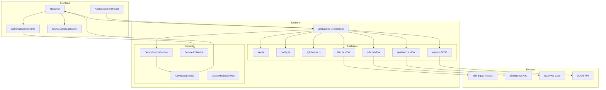
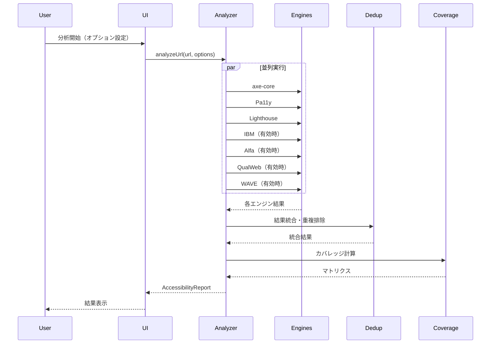
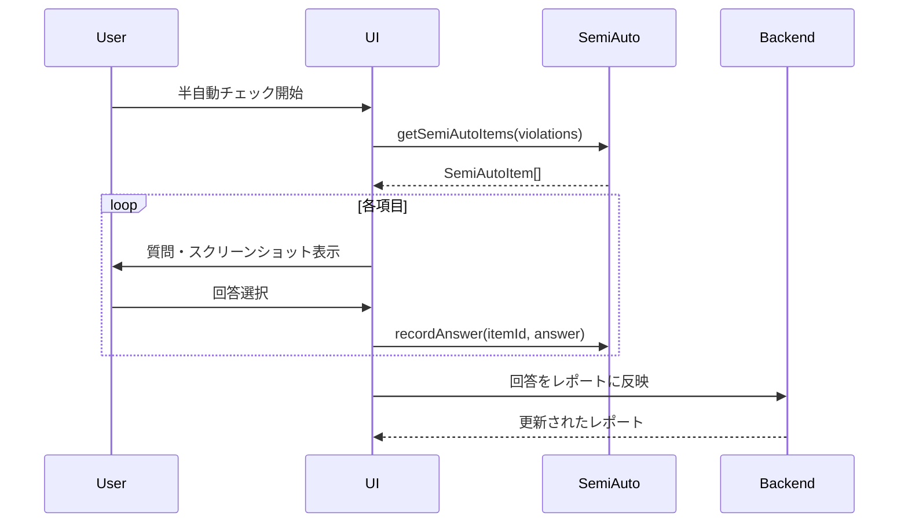
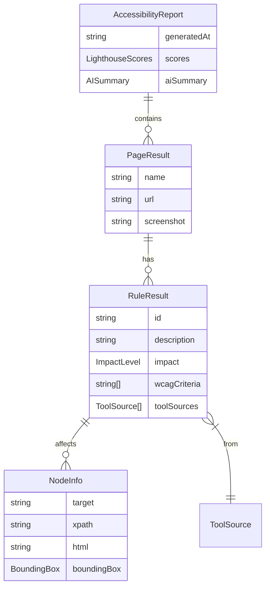

# Technical Design: WCAG Coverage Expansion

## Overview

**Purpose**: WCAGカバレッジを拡大し、より包括的なアクセシビリティテストを提供する。既存の3エンジン（axe-core、Pa11y、Lighthouse）に加え、IBM Equal Access Checker、Siteimprove Alfa、QualWebを統合し、WCAG 2.2対応とオプショナルなWAVE API連携を実現する。

**Users**: アクセシビリティテスター、QAエンジニア、Web開発者がWCAG準拠状況を効率的に確認するために使用。

**Impact**: 現在のWCAGカバレッジ（約30%）を大幅に向上させ、WCAG 2.2の新基準にも対応。半自動チェック機能により、自動テストでは判定できない項目もツール内で確認可能に。

### Goals

- IBM Equal Access Checker、Siteimprove Alfa、QualWebの3エンジンを統合
- WCAG 2.2（2.4.11、2.4.12、2.5.7、2.5.8、3.3.7、3.3.8等）の自動検出
- 複数エンジンの結果を統合し、重複を排除した統一レポート
- ツール内で完結する半自動チェック機能
- WCAGカバレッジマトリクスによるテスト網羅性の可視化

### Non-Goals

- スクリーンリーダーによる実機テスト
- 完全な手動テストの自動化
- 外部ツール（ブラウザ）での操作を必要とするチェック
- WCAG AAA レベルの完全対応（一部のみ）

## Architecture

### Existing Architecture Analysis

現在のシステムは以下の構造を持つ:

- **analyzer.ts**: オーケストレーター。axe-core→Pa11y→Lighthouseの順で実行
- **analyzers/*.ts**: 各エンジンのラッパー。`analyzeWith*`関数をエクスポート
- **analyzers/types.ts**: 共通型定義（`RuleResult`、`AnalyzerResult`等）
- **フロントエンド**: React + MUIで結果を表示

既存パターンを維持しつつ、新エンジンを追加する設計とする。

### Architecture Pattern & Boundary Map



**Architecture Integration**:

- **Selected pattern**: 既存のAnalyzer per fileパターンを継続
- **Domain boundaries**: 各エンジンは独立したファイルで責任を分離
- **Existing patterns preserved**: `analyzeWith*`関数、`AnalyzerResult`インターフェース
- **New components rationale**:
  - DeduplicationService: 複数エンジンの結果統合
  - CoverageService: WCAGカバレッジ計算
  - SemiAutoService: 半自動チェックデータ管理
- **Steering compliance**: TypeScript型安全性、関心の分離を維持

### Technology Stack

| Layer | Choice / Version | Role in Feature | Notes |
|-------|------------------|-----------------|-------|
| Backend / Analyzers | accessibility-checker ^3.1 | IBM Equal Access統合 | Apache-2.0 |
| Backend / Analyzers | @siteimprove/alfa-playwright ^0.88 | Alfa統合 | MIT |
| Backend / Analyzers | @qualweb/core ^1.0 | QualWeb統合 | ISC、Puppeteer依存 |
| Backend / Services | node-fetch ^3.0 | WAVE API呼び出し | 既存依存 |
| Frontend / UI | @mui/material ^6.0 | 半自動チェックUI | 既存依存 |
| Data / Storage | localStorage | 分析オプション保存 | ブラウザ内 |

## System Flows

### 分析実行フロー



### 半自動チェックフロー



## Requirements Traceability

| Requirement | Summary | Components | Interfaces | Flows |
|-------------|---------|------------|------------|-------|
| 1.1 | IBM Equal Access統合 | IBMAnalyzer | analyzeWithIBM | 分析実行 |
| 1.2 | Siteimprove Alfa統合 | AlfaAnalyzer | analyzeWithAlfa | 分析実行 |
| 1.3 | QualWeb統合 | QualWebAnalyzer | analyzeWithQualWeb | 分析実行 |
| 1.4, 6.1-6.5 | 重複排除・統合 | DeduplicationService | deduplicateViolations | 分析実行 |
| 2.1-2.4 | WCAG 2.2対応 | 各Analyzer設定 | AnalysisOptions | 分析実行 |
| 3.1-3.5 | Playwrightテスト拡張 | KeyboardTester, DynamicContentTester | - | 分析実行 |
| 4.1-4.5 | WAVE API統合 | WaveAnalyzer | analyzeWithWave | 分析実行 |
| 5.1-5.6 | 半自動チェック | SemiAutoService, SemiAutoCheckPanel | SemiAutoItem | 半自動チェック |
| 7.1-7.5 | カバレッジマトリクス | CoverageService, WCAGCoverageMatrix | CoverageMatrix | 分析実行 |
| 8.1-8.5 | オプション設定 | AnalysisOptionsPanel | AnalysisOptions | 分析実行 |
| 9.1-9.4 | カスタムルール | CustomRulesService | CustomRule | 分析実行 |
| 10.1-10.5 | ARIAライブリージョン | LiveRegionValidator | LiveRegionResult | 分析実行 |

## Components and Interfaces

| Component | Domain/Layer | Intent | Req Coverage | Key Dependencies | Contracts |
|-----------|--------------|--------|--------------|------------------|-----------|
| IBMAnalyzer | Backend/Analyzers | IBM Equal Access実行 | 1.1, 2.2 | accessibility-checker (P0) | Service |
| AlfaAnalyzer | Backend/Analyzers | Siteimprove Alfa実行 | 1.2, 2.3 | @siteimprove/alfa-* (P0) | Service |
| QualWebAnalyzer | Backend/Analyzers | QualWeb実行 | 1.3 | @qualweb/core (P0) | Service |
| WaveAnalyzer | Backend/Analyzers | WAVE API呼び出し | 4.1-4.5 | WAVE API (P1) | Service, API |
| DeduplicationService | Backend/Services | 結果統合・重複排除 | 1.4, 6.1-6.5 | - | Service |
| CoverageService | Backend/Services | カバレッジ計算 | 7.1-7.5 | - | Service |
| SemiAutoService | Backend/Services | 半自動チェック管理 | 5.1-5.6 | - | Service |
| KeyboardTester | Backend/Testers | キーボードテスト | 3.1 | Playwright (P0) | Service |
| DynamicContentTester | Backend/Testers | 動的コンテンツテスト | 3.2 | Playwright (P0) | Service |
| CustomRulesService | Backend/Services | カスタムルール管理 | 9.1-9.4 | axe-core (P0) | Service |
| LiveRegionValidator | Backend/Testers | ARIAライブリージョン検証 | 10.1-10.5 | Playwright (P0) | Service |
| AnalysisOptionsPanel | Frontend/Components | オプション設定UI | 8.1-8.5 | MUI (P0) | State |
| SemiAutoCheckPanel | Frontend/Components | 半自動チェックUI | 5.1-5.6 | MUI (P0) | State |
| WCAGCoverageMatrix | Frontend/Components | カバレッジ表示 | 7.1-7.5 | MUI (P0) | State |

### Backend / Analyzers

#### IBMAnalyzer

| Field | Detail |
|-------|--------|
| Intent | IBM Equal Access Checkerを使用したアクセシビリティ分析 |
| Requirements | 1.1, 2.2 |

**Responsibilities & Constraints**

- Playwright pageオブジェクトを受け取り、IBM Equal Accessでスキャン
- WCAG 2.2ポリシーを使用（`.achecker.yml`設定）
- 結果を`RuleResult`型に正規化

**Dependencies**

- External: accessibility-checker — IBM Equal Access SDK (P0)
- Inbound: analyzer.ts — オーケストレーターから呼び出し (P0)

**Contracts**: Service [x]

##### Service Interface

```typescript
interface IBMAnalyzerOptions {
  policies?: string[];  // default: ['WCAG_2_2']
  failLevels?: ('violation' | 'potentialviolation')[];
}

interface analyzeWithIBM {
  (page: Page, options?: IBMAnalyzerOptions): Promise<AnalyzerResult>;
}
```

- Preconditions: pageがnavigated状態
- Postconditions: AnalyzerResultにviolations/passes/incompleteが設定
- Invariants: durationは0以上

#### AlfaAnalyzer

| Field | Detail |
|-------|--------|
| Intent | Siteimprove Alfaを使用したACT rules準拠の分析 |
| Requirements | 1.2, 2.3 |

**Responsibilities & Constraints**

- Playwright DocumentHandleをAlfa Pageに変換
- AA levelフィルタでルール実行
- 結果を`RuleResult`型に正規化

**Dependencies**

- External: @siteimprove/alfa-playwright, @siteimprove/alfa-test-utils (P0)
- Inbound: analyzer.ts (P0)

**Contracts**: Service [x]

##### Service Interface

```typescript
interface AlfaAnalyzerOptions {
  levels?: ('A' | 'AA' | 'AAA')[];
  includeIframes?: boolean;
}

interface analyzeWithAlfa {
  (page: Page, options?: AlfaAnalyzerOptions): Promise<AnalyzerResult>;
}
```

#### QualWebAnalyzer

| Field | Detail |
|-------|--------|
| Intent | QualWebを使用した110+ ACT rulesの分析 |
| Requirements | 1.3 |

**Responsibilities & Constraints**

- Playwrightから`page.content()`でHTMLを取得
- QualWebの`html`オプションでスキャン
- Puppeteerクラスタのライフサイクル管理

**Dependencies**

- External: @qualweb/core, @qualweb/act-rules, @qualweb/wcag-techniques (P0)
- Inbound: analyzer.ts (P0)

**Contracts**: Service [x]

##### Service Interface

```typescript
interface QualWebAnalyzerOptions {
  actRules?: boolean;
  wcagTechniques?: boolean;
  levels?: ('A' | 'AA')[];
}

interface analyzeWithQualWeb {
  (html: string, options?: QualWebAnalyzerOptions): Promise<AnalyzerResult>;
}
```

#### WaveAnalyzer

| Field | Detail |
|-------|--------|
| Intent | WAVE REST APIを使用した追加分析 |
| Requirements | 4.1-4.5 |

**Responsibilities & Constraints**

- APIキーを使用してWAVE APIを呼び出し
- レポートタイプ3（XPath含む）を使用
- レート制限を考慮（同時2リクエスト）

**Dependencies**

- External: WAVE API (P1)
- Inbound: analyzer.ts (P0)

**Contracts**: Service [x] / API [x]

##### Service Interface

```typescript
interface WaveAnalyzerOptions {
  apiKey: string;
  reportType?: 1 | 2 | 3 | 4;
}

interface analyzeWithWave {
  (url: string, options: WaveAnalyzerOptions): Promise<AnalyzerResult>;
}
```

##### API Contract

| Method | Endpoint | Request | Response | Errors |
|--------|----------|---------|----------|--------|
| GET | wave.webaim.org/api/request | key, url, reporttype | WaveResponse | 401, 429, 500 |

### Backend / Services

#### DeduplicationService

| Field | Detail |
|-------|--------|
| Intent | 複数エンジンの結果を統合し、重複を排除 |
| Requirements | 1.4, 6.1-6.5 |

**Responsibilities & Constraints**

- CSSセレクタ正規化
- WCAG基準による一致判定
- 違反内容の類似度計算（Levenshtein距離）
- 最高重要度の採用

**Dependencies**

- Inbound: analyzer.ts (P0)

**Contracts**: Service [x]

##### Service Interface

```typescript
interface DeduplicationOptions {
  selectorThreshold?: number;  // default: 0.9
  descriptionThreshold?: number;  // default: 0.8
}

interface DeduplicatedResult {
  violations: RuleResult[];
  passes: RuleResult[];
  incomplete: RuleResult[];
  engineSummary: Record<ToolSource, { violations: number; passes: number }>;
}

interface DeduplicationService {
  deduplicate(results: AnalyzerResult[], options?: DeduplicationOptions): DeduplicatedResult;
}
```

#### CoverageService

| Field | Detail |
|-------|--------|
| Intent | WCAGカバレッジマトリクスを生成 |
| Requirements | 7.1-7.5 |

**Responsibilities & Constraints**

- 全WCAG成功基準（1.1.1〜4.1.3）のマッピング
- 各基準のテスト状態・結果を計算
- 適合レベル別カバレッジ率の算出

**Dependencies**

- Inbound: analyzer.ts (P0)

**Contracts**: Service [x]

##### Service Interface

```typescript
type TestMethod = 'auto' | 'semi-auto' | 'manual' | 'not-tested';
type TestResult = 'pass' | 'fail' | 'needs-review' | 'not-applicable';

interface CriterionStatus {
  criterion: string;  // e.g., "1.1.1"
  level: 'A' | 'AA' | 'AAA';
  method: TestMethod;
  result: TestResult;
  tools: ToolSource[];
}

interface CoverageMatrix {
  criteria: CriterionStatus[];
  summary: {
    levelA: { covered: number; total: number };
    levelAA: { covered: number; total: number };
    levelAAA: { covered: number; total: number };
  };
}

interface CoverageService {
  calculateCoverage(report: AccessibilityReport): CoverageMatrix;
  exportCSV(matrix: CoverageMatrix): string;
}
```

#### SemiAutoService

| Field | Detail |
|-------|--------|
| Intent | 半自動チェック項目の管理 |
| Requirements | 5.1-5.6 |

**Responsibilities & Constraints**

- 自動テストの`incomplete`結果から半自動チェック項目を抽出
- スクリーンショット・HTML抜粋・質問文を生成
- ユーザー回答を記録

**Dependencies**

- Inbound: Frontend SemiAutoCheckPanel (P0)

**Contracts**: Service [x]

##### Service Interface

```typescript
type SemiAutoAnswer = 'appropriate' | 'inappropriate' | 'cannot-determine';

interface SemiAutoItem {
  id: string;
  ruleId: string;
  wcagCriteria: string[];
  question: string;
  screenshot?: string;
  html: string;
  elementDescription: string;
  answer?: SemiAutoAnswer;
}

interface SemiAutoService {
  extractItems(violations: RuleResult[], incomplete: RuleResult[]): SemiAutoItem[];
  recordAnswer(itemId: string, answer: SemiAutoAnswer): void;
  getProgress(): { completed: number; total: number };
}
```

### Backend / Testers

#### KeyboardTester

| Field | Detail |
|-------|--------|
| Intent | キーボードナビゲーションの自動テスト |
| Requirements | 3.1 |

**Responsibilities & Constraints**

- Tab順序の記録
- キーボードトラップの検出
- フォーカスインジケーターのCSS検証

**Dependencies**

- External: Playwright page.keyboard (P0)

**Contracts**: Service [x]

##### Service Interface

```typescript
interface FocusableElement {
  selector: string;
  order: number;
  hasFocusIndicator: boolean;
  focusStyles: { outline: string; boxShadow: string; border: string };
}

interface KeyboardTestResult {
  tabOrder: FocusableElement[];
  traps: { selector: string; description: string }[];
  focusIssues: { selector: string; issue: string }[];
}

interface KeyboardTester {
  testKeyboardNavigation(page: Page): Promise<KeyboardTestResult>;
}
```

#### DynamicContentTester

| Field | Detail |
|-------|--------|
| Intent | 動的コンテンツの状態別テスト |
| Requirements | 3.2 |

**Responsibilities & Constraints**

- モーダル、ドロップダウン、アコーディオン、タブを検出
- 各状態（開/閉）でaxe-coreスキャンを実行

**Dependencies**

- External: Playwright (P0)
- Outbound: axe.ts — 状態別スキャン (P0)

**Contracts**: Service [x]

##### Service Interface

```typescript
type DynamicContentType = 'modal' | 'dropdown' | 'accordion' | 'tab';

interface DynamicContent {
  type: DynamicContentType;
  selector: string;
  trigger: string;
}

interface DynamicContentTester {
  detectDynamicContent(page: Page): Promise<DynamicContent[]>;
  testInAllStates(page: Page, content: DynamicContent): Promise<AnalyzerResult[]>;
}
```

### Frontend / Components

#### AnalysisOptionsPanel

| Field | Detail |
|-------|--------|
| Intent | 分析オプションの設定UI |
| Requirements | 8.1-8.5 |

**Responsibilities & Constraints**

- エンジン選択チェックボックス
- WCAGバージョン選択
- プリセット（クイック/フル）
- localStorageへの設定保存

**Dependencies**

- External: MUI (P0)
- Outbound: localStorage — 設定永続化 (P2)

**Contracts**: State [x]

##### State Management

```typescript
interface AnalysisOptions {
  engines: {
    axeCore: boolean;
    pa11y: boolean;
    lighthouse: boolean;
    ibm: boolean;
    alfa: boolean;
    qualweb: boolean;
  };
  waveApi: {
    enabled: boolean;
    apiKey?: string;
  };
  wcagVersion: '2.0' | '2.1' | '2.2';
  semiAutoCheck: boolean;
  responsiveTest: boolean;
  viewports: ('mobile' | 'tablet' | 'desktop')[];
}

const DEFAULT_OPTIONS: AnalysisOptions = {
  engines: { axeCore: true, pa11y: true, lighthouse: true, ibm: false, alfa: false, qualweb: false },
  waveApi: { enabled: false },
  wcagVersion: '2.1',
  semiAutoCheck: false,
  responsiveTest: false,
  viewports: ['desktop'],
};
```

#### SemiAutoCheckPanel

| Field | Detail |
|-------|--------|
| Intent | 半自動チェックのUI |
| Requirements | 5.1-5.6 |

**Responsibilities & Constraints**

- カード形式で項目を一覧表示
- スクリーンショット・HTML・質問を表示
- 選択肢ボタンで回答

**Dependencies**

- Inbound: SemiAutoService — 項目データ (P0)
- External: MUI (P0)

**Contracts**: State [x]

##### State Management

```typescript
interface SemiAutoCheckState {
  items: SemiAutoItem[];
  currentIndex: number;
  answers: Record<string, SemiAutoAnswer>;
}
```

**Implementation Notes**

- カード形式で効率的な回答が可能
- 進捗バーで完了状況を表示
- 「スキップ」ボタンで後回しが可能

## Data Models

### Domain Model



### Logical Data Model

**ToolSource拡張**

```typescript
// 既存
type ToolSource = 'axe-core' | 'pa11y' | 'lighthouse';

// 拡張後
type ToolSource =
  | 'axe-core'
  | 'pa11y'
  | 'lighthouse'
  | 'ibm'
  | 'alfa'
  | 'qualweb'
  | 'wave'
  | 'custom';
```

**RuleResult拡張**

```typescript
interface RuleResult {
  // 既存フィールド
  id: string;
  description: string;
  impact?: ImpactLevel;
  nodeCount: number;
  helpUrl: string;
  wcagCriteria: string[];
  toolSource: ToolSource;
  nodes?: NodeInfo[];

  // 新規フィールド
  toolSources?: ToolSource[];  // 複数エンジンで検出時
  isExperimental?: boolean;    // WCAG 2.2実験的ルール
}
```

**半自動チェック結果**

```typescript
interface SemiAutoResult {
  itemId: string;
  ruleId: string;
  wcagCriteria: string[];
  answer: SemiAutoAnswer;
  answeredAt: string;
}
```

### Data Contracts & Integration

**AccessibilityReport拡張**

```typescript
interface AccessibilityReport {
  // 既存フィールド
  generatedAt: string;
  summary: { totalViolations: number; totalPasses: number; totalIncomplete: number };
  pages: PageResult[];
  screenshot?: string;
  toolsUsed: ToolInfo[];
  lighthouseScores?: LighthouseScores;
  aiSummary?: AISummary;

  // 新規フィールド
  coverageMatrix?: CoverageMatrix;
  semiAutoResults?: SemiAutoResult[];
  engineSummary?: Record<ToolSource, { violations: number; passes: number }>;
  analysisOptions?: AnalysisOptions;
}
```

## Error Handling

### Error Categories and Responses

**External Engine Errors**

- IBM/Alfa/QualWebのエラー: ログに記録し、他エンジンの結果で継続
- WAVE APIエラー (401): APIキー無効 → ユーザーに再設定を促す
- WAVE APIエラー (429): レート制限 → ローカルエンジン結果のみ使用

**Analysis Timeout**

- 各エンジンに個別タイムアウト設定
- タイムアウト時は部分結果を返す

### Monitoring

- 各エンジンの実行時間をログ
- WAVE API呼び出し数をカウント
- エラー発生率のモニタリング

## Testing Strategy

### Unit Tests

- DeduplicationService: 重複排除ロジック
- CoverageService: カバレッジ計算
- 各Analyzer: 結果正規化

### Integration Tests

- 複数エンジン同時実行
- WAVE API呼び出し（モック）
- 認証状態での分析

### E2E Tests

- AnalysisOptionsPanel: オプション設定と保存
- SemiAutoCheckPanel: 回答フロー
- WCAGCoverageMatrix: マトリクス表示

## Security Considerations

- WAVE APIキーはSecret Managerまたは環境変数で管理
- APIキーをログに出力しない
- フロントエンドにAPIキーを露出しない（バックエンド経由で呼び出し）

## Performance & Scalability

- エンジンは可能な限り並列実行
- QualWebのPuppeteerクラスタは再利用
- 大量の違反がある場合のレンダリング最適化（仮想スクロール検討）
