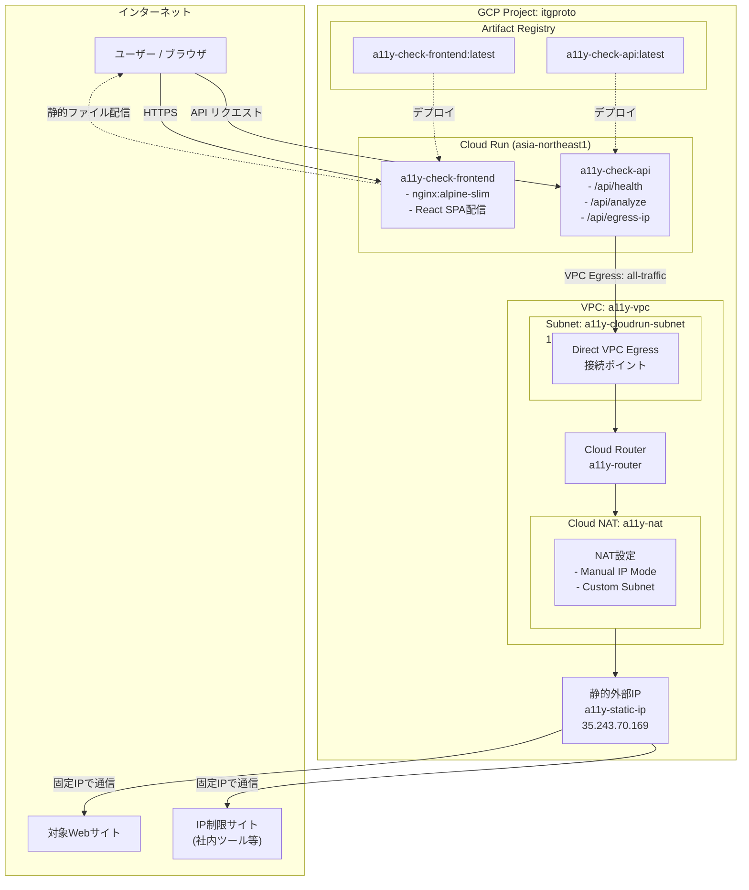
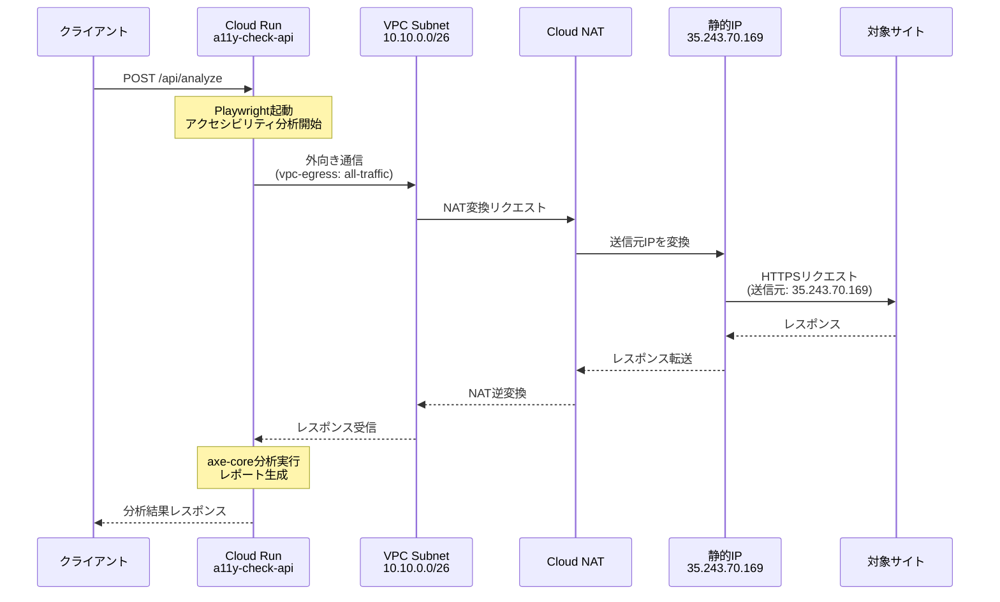
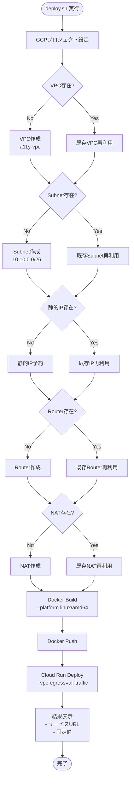

# GCPインフラストラクチャ構成図

## 概要

アクセシビリティチェックツールのCloud Run構成。フロントエンド（React SPA）とバックエンド（Node.js + Playwright）を独立したCloud Runサービスとしてデプロイ。バックエンドは固定IPアドレスによる外向き通信を実現し、IP制限のある社内ツールへのアクセスを可能にする。

## サービスURL

| サービス | URL |
|---------|-----|
| フロントエンド | https://a11y-check-frontend-783872951114.asia-northeast1.run.app |
| バックエンドAPI | https://a11y-check-api-783872951114.asia-northeast1.run.app |
| 固定IP（外向き通信） | 35.243.70.169 |

## アーキテクチャ図



## ネットワークフロー詳細



## リソース一覧

| リソース種別 | リソース名 | リージョン | 詳細 |
|-------------|-----------|-----------|------|
| Cloud Run | a11y-check-frontend | asia-northeast1 | Memory: 256Mi, nginx:alpine-slim |
| Cloud Run | a11y-check-api | asia-northeast1 | Memory: 2Gi, Timeout: 300s, Playwright |
| VPCネットワーク | a11y-vpc | グローバル | カスタムモード |
| サブネット | a11y-cloudrun-subnet | asia-northeast1 | CIDR: 10.10.0.0/26 (64アドレス) |
| 静的外部IP | a11y-static-ip | asia-northeast1 | 35.243.70.169 |
| Cloud Router | a11y-router | asia-northeast1 | VPC: a11y-vpc |
| Cloud NAT | a11y-nat | asia-northeast1 | Router: a11y-router |
| Artifact Registry | cloud-run-source-deploy | asia-northeast1 | Docker形式 |

## デプロイフロー



## API エンドポイント

| エンドポイント | メソッド | 説明 |
|---------------|---------|------|
| `/api/health` | GET | ヘルスチェック |
| `/api/analyze` | POST | アクセシビリティ分析実行 |
| `/api/egress-ip` | GET | 外向き通信の固定IP確認 |

## 固定IPアドレス情報

社内ツールのIP許可リストに追加するIPアドレス:

```
35.243.70.169
```

Cloud Runからの全ての外向き通信（Playwright経由のWebサイトアクセス含む）はこのIPアドレスから発信されます。

## 参考リンク

- [Direct VPC egress | Cloud Run](https://cloud.google.com/run/docs/configuring/vpc-direct-vpc)
- [Static outbound IP | Cloud Run](https://cloud.google.com/run/docs/configuring/static-outbound-ip)
- [Cloud NAT概要](https://cloud.google.com/nat/docs/overview)
